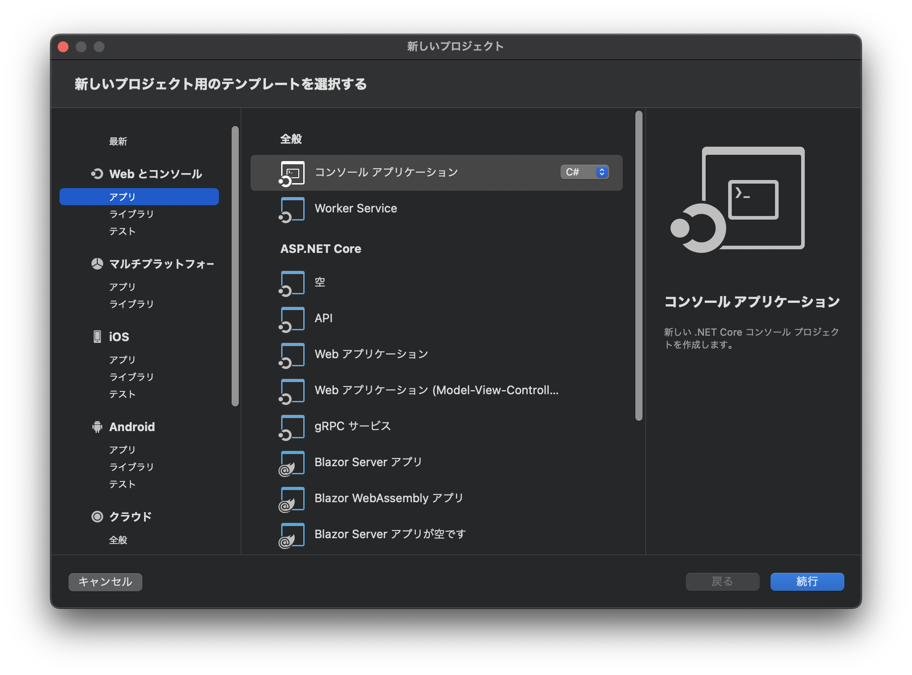

# Unity1:UnityとC#について知ろう

## Unityとは

UnityはC#というプログラミング言語を用いてスマートフォン・PC・ウェブブラウザ・家庭用ゲーム機用のゲームなどを作成することができるツールです。

Unityを使用すると簡単に3D/2Dゲームを作成することができます。

### Unityで作られたゲーム

Unityを使用したゲームは以下のような物があります

- Pokémon GO
- Among Us
- Fall Guys

などなど


## C#とは

UnityではC#と言う言語を使用しますが、C#とはどのような言語なのでしょうか？


C#はMicrosoftが開発する言語でPCソフト・Android/iOSアプリ・Web・IoT・OS開発・Botなどの開発に使用できます。

StaproLauncherもC#で作成されています。

## 今後の流れ

このコースではカリキュラム1から13までC#の基礎を学習し、14回からUnityの基礎を学習していきます。

## 初めてのC#


C#でプログラムを書くためにはエディタや統合開発環境と言われる物を利用する必要があります。
今回はMicrosoftが使用するVisual Studio for Macを使用して開発することを想定して説明していきます。

### プログラムを動かしてみる

まずこのアイコンを押しVisual Studio for Macを起動します。


Visual Studio for Macが起動すると以下ような画面になるので **新規** を押し作成するプロジェクトを指定します。


すると、どのようなプロジェクトを作成するか選択する画面が出てきます。


ここでスマホアプリの作成やPCソフトの作成などを選択できるようになっています。

左の欄から**アプリ**のカテゴリを選択します。


その後**コンソール アプリケーション**を選択した上で**続行**を押してください。


コンソールアプリケーションは文字ベースのアプリケーションで人間とコンピュータの間のデータのやり取りが文字の入出力であるアプリケーションのことを言います。




続いて、ターゲットフレームワークの選択画面が出てきますが、最新のバージョンを選択してください。

また、**最上位レベルのステートメントを使用しない**というチェックボックスがあるのでこれは**必ずチェック**しておいてください。

これを選択できたら続行を押してください。


その後、プロジェクト名・ソリューション名・保存場所を選択する画面が出てきますので、プロジェクト名とソリューション名は「**ConsoleApp1**」をとします。
保存場所はメンターの指示に従い指定してください。

これらの入力が終了すると続行を押してください。


これでプロジェクトの作成は完了です。

プロジェクトを作成すると以下のようなコードが表示されていると思います。

```cs
using System;
namespace ConsoleApp1;
class Program //Programというまとまりを作る
{
    static void Main(string[] args) //Mainという関数作成する。
    {
        Console.WriteLine("Hello, World");//Hello, Worldと表示する。
    }
}

```


### プログラムを動かしてみよう

このコードを実行するには左上の三角形のボタンを押すことで実行することができます。


プログラムを実行すると以下のように下半分の**ターミナル**に「Hello, World」と表示されているのが確認できると思います。


### プログラムの解説


#### Console.WriteLine

このプログラムの最も重要な部分は
```cs
Console.WriteLine("Hello, World");
```
の部分です。

これはコンソール(黒い画面)にHello, Worldと表示するという命令です。

このような命令の一つの塊を文やステートメントと言います。
また、行の末尾にある「;」は文の終わりであることを示しています。


()の中を見てみましょう。
`"Hello, World"`の部分は **"** (ダブルクオーテーション)で囲むことでプログラムではなく文字であることを示しており、「Hello, World」は文字であることを示しています。
なのでこのプログラムでは **"** の間の文字を変えることで任意の文字を表示することができるということです。

#### Main

以下のような`static void Main(string[] args){}`と{}に囲まれた部分に`Console.WriteLine`が書いてあります。

これはLuaやScratchなどで学習した関数とほぼ同じ働きをするものです。

その中でもMainという名前の関数は始まりの関数を表し、当分はMainの{}の中にプログラムを書いていくことになります。

```cs
static void Main(string[] args) //Mainという関数作成する。
{
    
}
```

#### コメント

コメントはCSSやHTMLと同じくプログラムを実行するときには無視される文字のことを言います。
コメントを使用してメモなどを書くことができます。

C#では **/** を二つ書くと **//** 以降の文字はコメントとみなされます。

また複数行にわたってコメントを書きたい場合は以下のように **/\*** から **/\*** の間がコメントとみなされるようになっています

```cs
/*
ここにコメントを書く
*/
```


### プログラムを変えてみよう

では、プログラムを少し変えて「こんにちは、世界」と表示するようにしましょう。

先ほどのプログラムを

```cs
using System;
namespace ConsoleApp1;
class Program //Programというまとまりを作る
{
    static void Main(string[] args) //Mainという関数作成する。
    {
        Console.WriteLine("こんにちは、世界");//Hello, Worldと表示する。
    }
}
```

このように書き換えると「こんにちは、世界」と表示することができます。

では、「こんにちは、世界」二つの命令に分けて書いてみましょう。

```cs
using System;
class Program //Programというまとまりを作る
{
    static void Main(string[] args) //Mainという関数作成する。
    {
        Console.WriteLine("こんにちは、"); //こんにちは、と表示する。
        Console.WriteLine("世界"); // 世界と表示する
    }
}
```

このプログラムを実行すると

```
こんにちは、
世界
```

と二行にわたって表示されたと思います。

先ほど
Console.WriteLineを使うと文字が表示できるといいましたが、実際は文字を表示して改行する命令です。
なので、実行すると二行に表示されてしまいます。

改行されずに表示するには以下のような命令を使います。

```cs
Console.Write("表示したい文字");
```

Console.Write命令を使うと改行なしで文字を表示することができます。

逆にConsole.Write命令で改行する場合は
表示したい文字の中に「\n」を入力することで、「\n」の次の文字で改行することができます。

なので先ほどの「こんにちは、世界」を二行にわたって表示するプログラムを書き換えると以下のように表現することも可能です。


```cs
using System;
namespace ConsoleApp1;
class Program //Programというまとまりを作る
{
    static void Main(string[] args) //Mainという関数作成する。
    {
        Console.WriteLine("こんにちは、\n世界"); //こんにちは、と表示する。
    }
}
```

## コラム:Visual Studio for Macの画面の見方

Visual Studioの画面はこのように分けることができます。


緑色の部分は**ソリューションエクスプローラー**と言われファイルの場所などを管理します。

黄色の部分はコードを書く部分でそれぞれのファイルの中身が表示されます。

赤色の部分は先ほども説明したターミナルです。コンソールアプリケーションの実行した結果が表示されます。

水色の部分でエラーなどを表示することができます。


## 練習問題


#### 1.文字を表示して改行する命令を答えなさい.

<details>
<summary>解答</summary>
Console.WriteLine命令
</details>

#### 2.改行する時に入れる文字二文字を答えなさい.

<details><summary>解答</summary>
\n
</details>


#### 3.Console.Write命令を1つ使って以下の文章を表示せるプログラムを作りなさい.

```
C#
StartProgramming
Unity

```


<details><summary>解答</summary>

```cs
using System;
namespace ConsoleApp1;
class Program //Programというまとまりを作る
{
    static void Main(string[] args) //Mainという関数作成する。
    {
        Console.WriteLine("C#\nStartProgramming\nUnity"); //\nを使用し一つの命令で複数表示する
    }
}
```

</details>