# Unity1:UnityとC#について知ろう

## Unityとは

UnityはC#というプログラミング言語を用いてスマートフォン・PC・ウェブブラウザ・家庭用ゲーム機用のゲームなどを作成することができるツールです。

Unityを使用すると簡単に3D/2Dゲームを作成することができます。

### Unityで作られたゲーム

Unityを使用したゲームは以下のような物があります

- Pokémon GO
- Among Us
- Fall Guys

などなど


## C#とは

UnityではC#と言う言語を使用しますが、C#とはどのような言語なのでしょうか？


C#はMicrosoftが開発する言語でPCソフト・Android/iOSアプリ・Web・IoT・OS開発・Botなどの開発に使用できます。

StaproLauncherもC#で作成されています。

## 今後の流れ

このコースではカリキュラム1から13までC#の基礎を学習し、14回からUnityの基礎を学習していきます。

## 初めてのC#


C#でプログラムを書くためにはエディタや統合開発環境と言われる物を利用する必要があります。
今回はJetBrainsのRiderを使用して開発することを想定して説明していきます。

### 環境構築

それぞれWindowsとMacでプログラムを書くための準備を行います。

<details><summary>Macで行う場合</summary>

以下のサイトにアクセスします
[Rider Download](https://www.jetbrains.com/ja-jp/rider/download/?section=mac)

アクセスできると以下のような画面が開くのでダウンロードボタンをクリックします。

この時自分の使用しているPCが2020年モデルよりも後の場合.dmg()が.dmg(Apple Silicon)となっていることを確認してください。それより前の場合は.dmg(intel)となっていることを確認してください。


ダウンロードが完了すると以下のようなファイルが追加されるのでダブルクリックをして開いてください


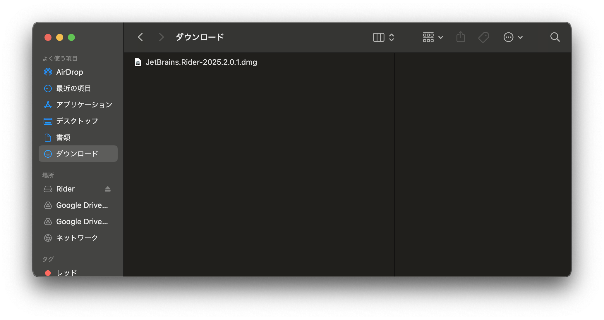

ファイルが開くと以下のような`RD`と書いてあるアイコンをApplicationsにドラッグアンドドロップしてください。


インストールできるとアプリ一覧に以下のように`RD`と書かれたアイコンが表示されます
追加されていることが確認出来たらダブルクリックして起動してください。

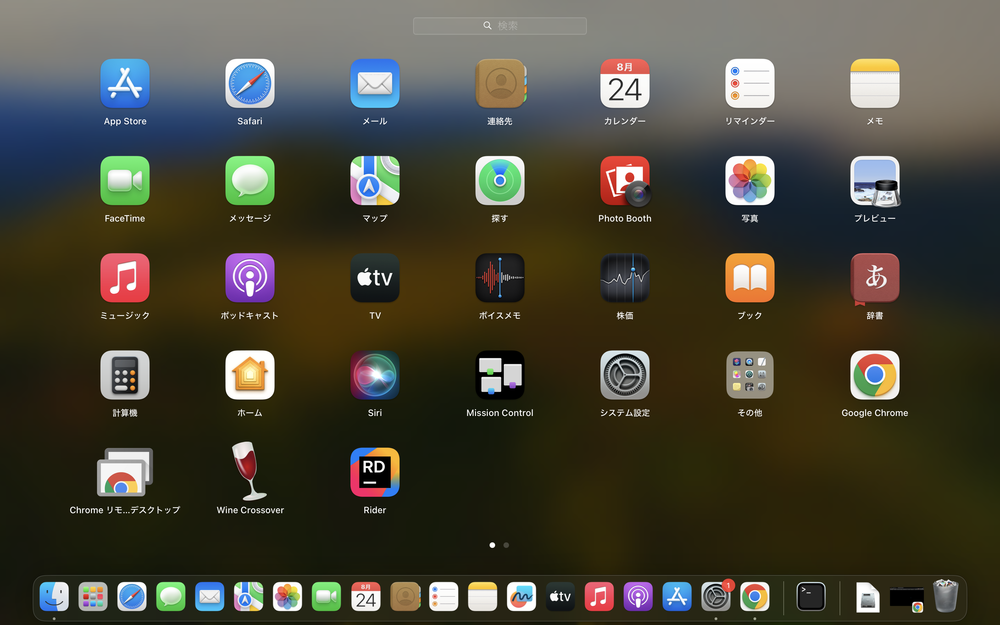

以下のような警告がでることがあるのでその場合は許可をクリックしてください。
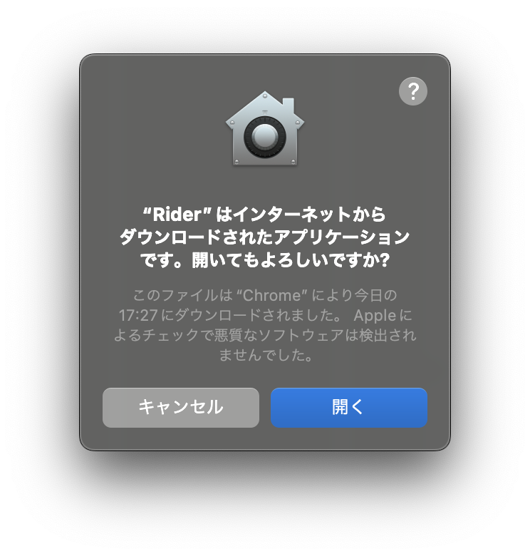

起動すると以下のように言語と地域の設定画面が出ますの日本語とアジア(中国を除く)を選択して次へをクリックしてください。


次へをクリックすると以下のような規約の確認が出てきますので、許諾契約を読んだうえで「本ユーザ使用許諾契約の条項を読み、同意したことを認めます。」のチェックボックスにクリックし続行をクリックして下さい。

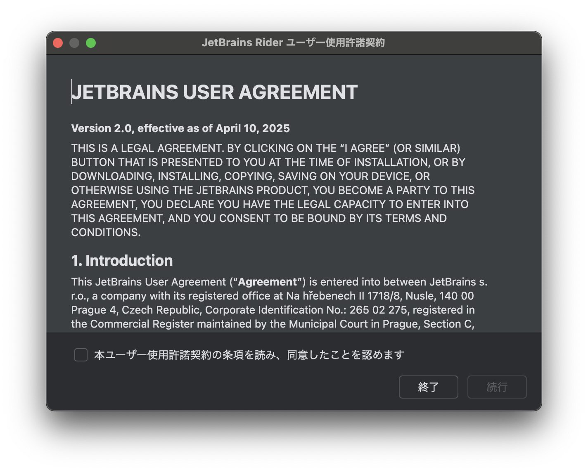

続行をクリックすると以下のような画面を切り替わり統計情報を送信するか聞かれるので**送信しない**をクリックしてください。

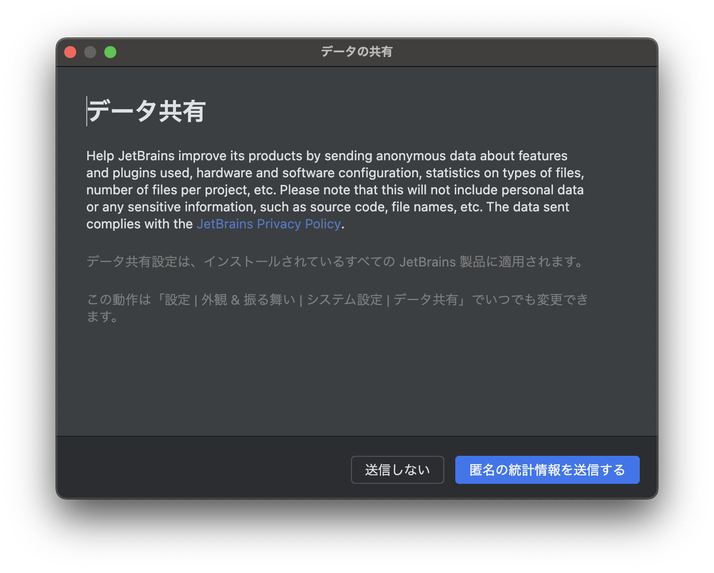

送信しないをクリックすると以下のような画面に切り替わります。

「(無料) 非商用利用」、「有料ライセンス」、「体験版の開始」の三つのタブがあるので非商用のタブをクリックし**非商用ののログイン**をクリックします。


すると以下のような画面が立ち上がるのでGoogleアカウントでログインを行います。


ログインが完了すると以下のような画面に切り替わるので「非商用規約に同意する」のチェックボックスをチェックし**非商用利用の開始をクリックしてください**


正しくできていれば以下のような表示となります。

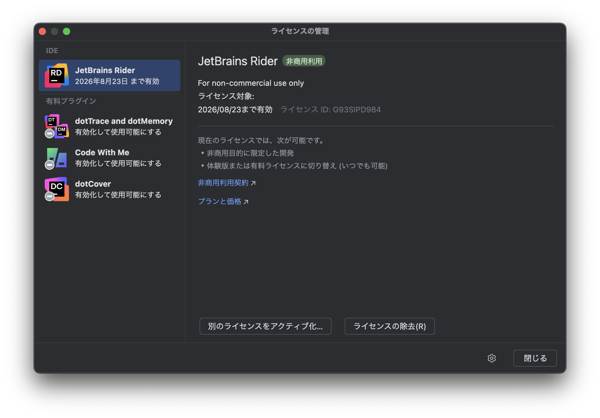

閉じるをクリックすると以下のような画面が表示されます。
以下のような画面が表示されると環境構築は完了なので次のプログラムを動かしてみるに移ってください

</details>
<details><summary>Windowsで行う場合</summary>

下のサイトにアクセスします

[Rider Download](https://www.jetbrains.com/ja-jp/rider/download/?section=windows)

アクセスできると以下のような画面が開くのでダウンロードボタンをクリックします。

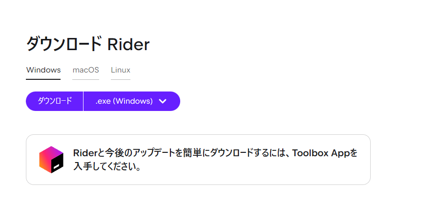

ダウンロードが完了すると以下のようなファイルが追加されるのでダブルクリックをして開いてください


開くときに警告が出るので**OK**を押してください。


すると以下のような画面が開くので次へを押してください

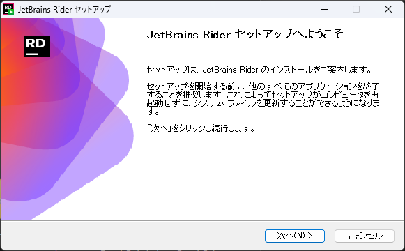

次へを押すとインストール先の指定画面が出てくるので特段指定がない場合はそのまま**次へ**をクリックしてください。


次へを押すと以下のような画面になります。
これは何か動作をしたときにRiderを開くようにできる設定です。

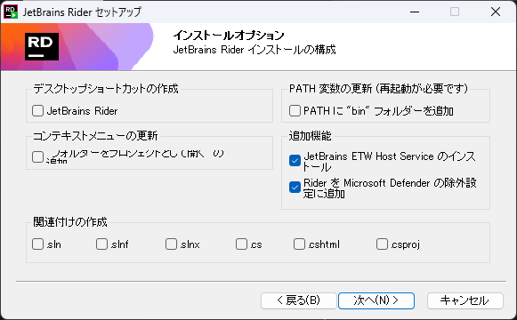


まず、**デスクトップショートカット**の作成の`JetBrains Rider`にチェックを入れます。

また、関連付けの作成の項目では`.sln`と`.slnx`と`.scproj`にチェックを入れることをおすすめします。(設定しなくても問題ありません)

以下がおすすめの設定です。
設定できれば次へをクリックしてください。

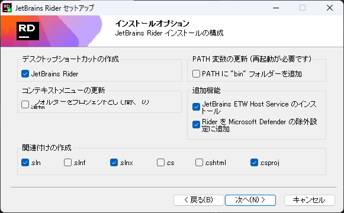

次へをクリックすると以下のような画面になるのでそのまま**インストール**をクリックします

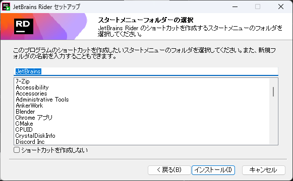

インストールをクリックすると以下のような画面に切り替わるので終了するまで待ってください。


インストールが終了すると以下のような画面に変わります。
画面が変わると完了を押します。


起動すると以下のように言語と地域の設定画面が出ますの日本語とアジア(中国を除く)を選択して次へをクリックしてください。

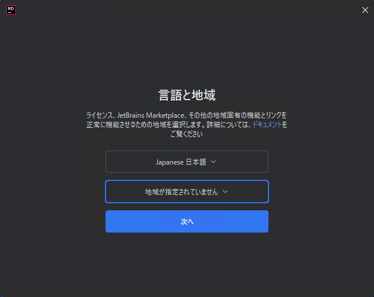

次へをクリックすると以下のような規約の確認が出てきますので、許諾契約を読んだうえで「本ユーザ使用許諾契約の条項を読み、同意したことを認めます。」のチェックボックスにクリックし続行をクリックして下さい。


また、どこかのタイミングで以下のような警告が表示されることがあるので**許可**をクリックしてください。


次にデータ共有という画面が出てくるので**送信しない**をクリックしてください


すると以下のようなが画面が出てくるので一旦右上の×を押して閉じてください


その後再度起動すると以下のような画面が出てくるので

「(無料) 非商用利用」、「有料ライセンス」、「体験版の開始」の三つのタブがあるので非商用のタブをクリックし**非商用ののログイン**をクリックします。


すると以下のような画面が立ち上がるのでGoogleアカウントでログインを行います。


ログインが完了すると以下のような画面に切り替わるので「非商用規約に同意する」のチェックボックスをチェックし**非商用利用の開始をクリックしてください**


正しくできていれば以下のような表示となります。


閉じるをクリックすると以下のような画面が表示されます。
以下のような画面が表示されると環境構築は完了なので次のプログラムを動かしてみるに移ってください


</details>

### プログラムを動かしてみる

まずこのアイコンを押しRiderを起動します。

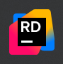


Riderが起動すると以下ような画面になるので **新規ソリューション** を押し作成するプロジェクトを指定します。


すると、どのようなプロジェクトを作成するか選択する画面が出てきます。


ここでスマホアプリの作成やPCソフトの作成などを選択できるようになっています。

左の欄から**コンソール**のカテゴリを選択します。
(選択されていることを確認します。)


**コンソール**を選択するとコンソールアプリケーションというは文字ベースのアプリケーションで人間とコンピュータの間のデータのやり取りが文字の入出力であるアプリケーションのことを言います。

その後以下の画像のように設定します。


注意事項としては`Do not use top-level statements`のチェックボックスに**必ずチェックを入れてください**。
また、`ソリューション辞書(D):`の項目にはあなたのデータを保存しているフォルダーを選択してください。(よくわからなければ先生に聞いてください)

ターゲットフレームワークの項目については`net 9.0`となっていますが、9.0よりも新しいものがある場合はそちらを使用してください

設定ができたら「作成」ボタンをクリックしてください
これでプロジェクトの作成は完了です。

プロジェクトを作成すると以下のようなコードが表示されていると思います。

```cs
namespace ConsoleApp1;
class Program //Programというまとまりを作る
{
    static void Main(string[] args) //Mainという関数作成する。
    {
        Console.WriteLine("Hello, World");//Hello, Worldと表示する。
    }
}

```


### プログラムを動かしてみよう

このコードを実行するには右上の三角ボタンの右の🐞(虫)マークのボタンを押すことで実行することができます。


プログラムを実行すると以下のように下半分の**ターミナル**に「Hello, World」と表示されているのが確認できると思います。


### プログラムの解説


#### Console.WriteLine

このプログラムの最も重要な部分は
```cs
Console.WriteLine("Hello, World");
```
の部分です。

これはコンソール(黒い画面)にHello, Worldと表示するという命令です。

このような命令の一つの塊を文やステートメントと言います。
また、行の末尾にある「;」は文の終わりであることを示しています。


()の中を見てみましょう。
`"Hello, World"`の部分は **"** (ダブルクオーテーション)で囲むことでプログラムではなく文字であることを示しており、「Hello, World」は文字であることを示しています。
なのでこのプログラムでは **"** の間の文字を変えることで任意の文字を表示することができるということです。

#### Main

以下のような`static void Main(string[] args){}`と{}に囲まれた部分に`Console.WriteLine`が書いてあります。

これはLuaやScratchなどで学習した関数とほぼ同じ働きをするものです。

その中でもMainという名前の関数は始まりの関数を表し、当分はMainの{}の中にプログラムを書いていくことになります。

```cs
static void Main(string[] args) //Mainという関数作成する。
{
    
}
```

#### コメント

コメントはCSSやHTMLと同じくプログラムを実行するときには無視される文字のことを言います。
コメントを使用してメモなどを書くことができます。

C#では **/** を二つ書くと **//** 以降の文字はコメントとみなされます。

また複数行にわたってコメントを書きたい場合は以下のように **/\*** から **/\*** の間がコメントとみなされるようになっています

```cs
/*
ここにコメントを書く
*/
```


### プログラムを変えてみよう

では、プログラムを少し変えて「こんにちは、世界」と表示するようにしましょう。

先ほどのプログラムを

```cs
using System;
namespace ConsoleApp1;
class Program //Programというまとまりを作る
{
    static void Main(string[] args) //Mainという関数作成する。
    {
        Console.WriteLine("こんにちは、世界");//Hello, Worldと表示する。
    }
}
```

このように書き換えると「こんにちは、世界」と表示することができます。

では、「こんにちは、世界」二つの命令に分けて書いてみましょう。

```cs
using System;
class Program //Programというまとまりを作る
{
    static void Main(string[] args) //Mainという関数作成する。
    {
        Console.WriteLine("こんにちは、"); //こんにちは、と表示する。
        Console.WriteLine("世界"); // 世界と表示する
    }
}
```

このプログラムを実行すると

```
こんにちは、
世界
```

と二行にわたって表示されたと思います。

先ほど
Console.WriteLineを使うと文字が表示できるといいましたが、実際は文字を表示して改行する命令です。
なので、実行すると二行に表示されてしまいます。

改行されずに表示するには以下のような命令を使います。

```cs
Console.Write("表示したい文字");
```

Console.Write命令を使うと改行なしで文字を表示することができます。

逆にConsole.Write命令で改行する場合は
表示したい文字の中に「\n」を入力することで、「\n」の次の文字で改行することができます。

なので先ほどの「こんにちは、世界」を二行にわたって表示するプログラムを書き換えると以下のように表現することも可能です。


```cs
using System;
namespace ConsoleApp1;
class Program //Programというまとまりを作る
{
    static void Main(string[] args) //Mainという関数作成する。
    {
        Console.WriteLine("こんにちは、\n世界"); //こんにちは、と表示する。
    }
}
```

## コラム:Visual Studio for Macの画面の見方

Visual Studioの画面はこのように分けることができます。


緑色の部分は**ソリューションエクスプローラー**と言われファイルの場所などを管理します。

黄色の部分はコードを書く部分でそれぞれのファイルの中身が表示されます。

赤色の部分は先ほども説明したターミナルです。コンソールアプリケーションの実行した結果が表示されます。

水色の部分でエラーなどを表示することができます。


## 練習問題


#### 1.文字を表示して改行する命令を答えなさい.

<details>
<summary>解答</summary>
Console.WriteLine命令
</details>

#### 2.改行する時に入れる文字二文字を答えなさい.

<details><summary>解答</summary>
\n
</details>


#### 3.Console.Write命令を1つ使って以下の文章を表示せるプログラムを作りなさい.

```
C#
StartProgramming
Unity

```


<details><summary>解答</summary>

```cs
using System;
namespace ConsoleApp1;
class Program //Programというまとまりを作る
{
    static void Main(string[] args) //Mainという関数作成する。
    {
        Console.WriteLine("C#\nStartProgramming\nUnity"); //\nを使用し一つの命令で複数表示する
    }
}
```

</details>