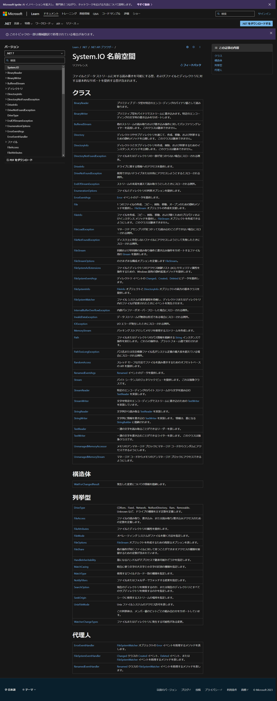
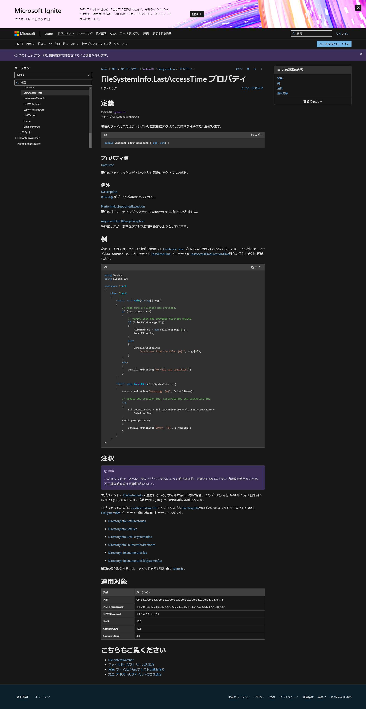
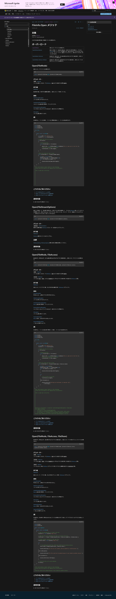
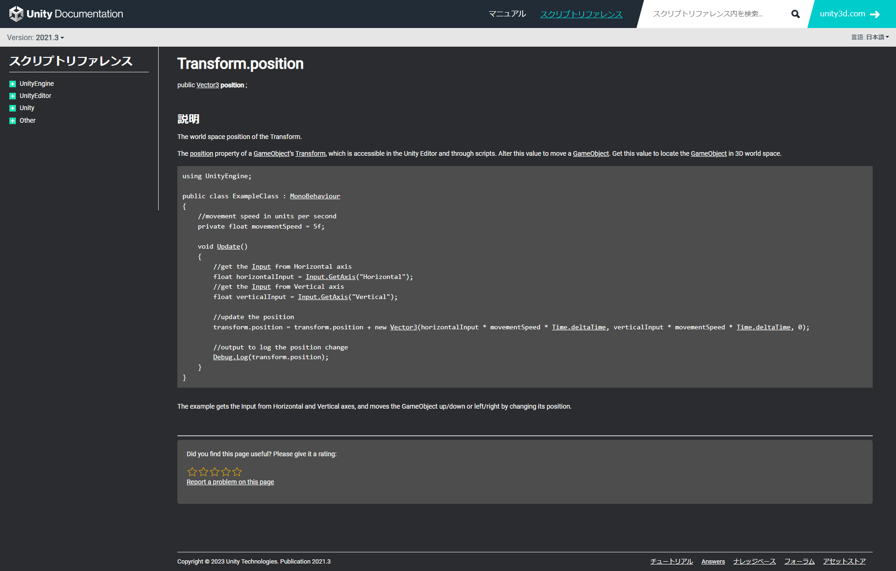

# Unity12:ドキュメントの読み方

ドキュメントとは言語仕様や使用例を示した文書です。
このドキュメントを読めるようになることで、新しい要素を扱う際にも困ることが少なくなります。
少し難しい単語もありますが読めるようになりましょう。

## Microsoftドキュメント

C#はMicrosoft社を中心に開発しています。そのため[C#のドキュメント](https://learn.microsoft.com/ja-jp/dotnet/csharp/)はMicrosoftによって維持されています。基本的なライブラリなどの説明はこちらを見るとこで仕様などを確認することができるようになっています。
また、ライブラリはあらかじめ作られたプログラムの集合体のことを指します。

### ドキュメントの検索方法

C#の標準ライブラリを調べる方法は大きく分けて二つあります。

#### Googleを使って調べる方法

[Google](https://google.co.jp)で「C#ドキュメント 検索したいクラスやネームスペース」と検索することでMicrosoftのドキュメントページにアクセスすることができます。

#### 直接ドキュメントにアクセスする方法

まず[Microsoftドキュメント](https://learn.microsoft.com/ja-jp/docs/)にアクセスします。

その後中央右の検索欄から調べたいクラスやネームスペース、メソッドを入力します。


すると、複数候補が出てきますので最も合うものを選択しましょう。


##### C#ドキュメントのネームスペースの説明について

Microsoftドキュメントページから以下のネームスペースの概要を調べる方法を説明します。

Systemのnamespaceを確認したいため先ほどの検索欄に「 **System.IO 名前空間** 」と入力します。

すると以下のように検索結果が表示されます。


「 **System.IO 名前空間** 」と書かれた項目があると思うのでその部分をクリックします。

ネームスペースのドキュメントのページのトップ画面は以下のようになっています



このページではクラスの同じネームスペースに含まれるクラス名やdelegate名などの一覧が乗っています

こちらの説明から目的の対象にあったクラスを探すことができます。

また、代理人と書いているところはdelegateのことを指しています。

それぞれの説明を見て必要な項目をクリックします。

するとそれぞれのページに飛びます
それぞれのページの説明は以下に続きます。

### C#ドキュメントのクラスの説明について

クラスのドキュメントのページのトップ画面は以下のようになっています。


#### 定義

初めに**定義**の部分でどのようにそのクラスが実装されているかを示しています。
例えばstaticであるかやアクセス修飾子を調べることができます。
また、継承の部分を確認することで何から継承したクラスなのかを確認することも可能です。

#### 例

例の部分で実際にそのクラスを使用した例を示してあります。
この部分はクラスによっては説明がないこともあります。


#### 注釈

**注釈**の部分はクラスの使い方や使用する際の注意点などを記述してあります。
例と合わせて確認すると理解しやすくなっています。

#### コンストラクター

コンストラクターと書いてあるところにはnew するときのコンストラクタの概要について書いてあります。

それぞれ引数によってどのような処理をされるかの概要が記述してあります。

例を確認しつつこちらも確認することで理解しやすくなると思います。

#### フィールド

フィールドはメンバ変数のことを示します。

基本的にはプロパティとして実装されることが多いのであまり記述している物は多くありません

(継承元 ~~~~)と記述されている部分がありますが、そのメンバがどこから継承された物かを示しています。

#### プロパティ

プロパティの部分ではそのメソッドに含まれるプロパティの説明が記述されています。

プロパティ名をクリックすると詳しい説明を見ることができます。

(継承元 ~~~~)と記述されている部分がありますが、そのメンバがどこから継承された物かを示しています。


#### メソッド

メソッドの部分でそのクラスに含まれるメソッドを確認することができます。

それぞれのメソッドの説明を読み使用したいメソッドがあればそのメソッド名をクリックすることで詳しい説明を確認することができます。

また、メソッド名は引数を含んでいるので必要な引数に合わせて確認してください。

(継承元 ~~~~)と記述されている部分がありますが、そのメンバがどこから継承された物かを示しています。


#### 拡張メソッド

拡張メソッドはクラスにメソッドを拡張できる機能ですが、普通のstaticなメソッドとほぼ同じように考えてもらって構いません。

### C#ドキュメントのプロパティの説明について

プロパティの説明画面は以下のようになっています。




#### その他

イベントやdelegateの説明が記述されている場合がありますが、メソッドなどと基本的な見方は同じです。

#### 定義

定義の部分でどのようなプロパティか、名前空間に定義されているか、アクセス修飾子や扱うプロパティの型、getとsetどちらができるかなどを確認することができる

今回であれば
```cs
public DateTime LastAccessTime { get; set; }
```
とあるので

DateTimeという型を使用する値の取得と変更が可能なLastAccessTimeというプロパティであると確認することができる

#### プロパティ値

こちらではどのような型を扱っているかを確認することができる

#### 例外

例外の部分でどのような場面でどのようなエラーが発生するのかを確認することができる

今回であれば

呼び出し元が、無効なアクセス時間を設定しようとすると`ArgumentOutOfRangeException`というエラーが発生するとわかる


#### 例

例の部分はクラスの例と同様どのように使用するかを確認することができます。

#### 注釈

**注釈**の部分はプロパティの使い方や使用する際の注意点などを記述してあります。
例と合わせて確認すると理解しやすくなっています。

### C#ドキュメントのメソッドの説明について

メソッドのドキュメントのページのトップ画面は以下のようになっています。




#### 定義

どのようなメソッドか確認することができます。

#### オーバーロード

同じ名前のメソッドでも引数を変えることができます。

それぞれどのような引数になっており、どのような動作になるか説明されています。

今回は`Open(FileMode)`を確認していきます。

#### オーバーライドのメソッドの説明

今回は先ほど説明したように`Open(FileMode)`の部分を中心に説明していきます。

##### パラメータ

パラメータの部分でどのような引数になっているかを確認することができます。
それぞれパラメータの型名をクリックすることでその型について詳しい説明を確認することができるようになっています。

##### 戻り値


メソッドの戻り値の型と説明が記述されています。

##### 例外

こちらはプロパティの時と同様どのような引数でどのように呼び出した場合にエラーがでるかの説明が記述してあります。

##### 例

例の部分で実際にそのメソッドを使うにはどのようなことを気を付けるべきか説明してあります。


### C#ドキュメントのイベントの説明について

イベントのドキュメントのページのトップ画面は以下のようになっています。


#### 定義

定義の部分でどのようなイベントでどのようなタイミングで呼び出されるかやアクセス修飾子などを確認することができます。

#### 例

実際に使用した例を確認することができます。
例の説明が書いてあるのでそちらを確認してください。

#### 注釈

そのイベントを使用するに際に注意するべき点が書いてあります。


## Unityスクリプティングリファレンス

[Unityスクリプティングリファレンス](https://docs.unity3d.com/ja/2021.3/ScriptReference)はUnityのC#で使用できる命令を調べることのできるドキュメントです。

調べたいこと赤の四角で囲った部分に検索することで調べることができるようになっています。


**Transform**と検索すると以下のように表示されます。


一番初めの項目に
```
Transform
オブジェクトの位置、回転、スケールを扱うクラス
```
と表示されています。

こちらをクリックすると**Transform**クラスの詳しい説明を確認することができます。

### クラスの説明

Transformクラスの説明ページは以下のようになっています。

ページの構成は基本的にMicrosoftドキュメントの構成と近いものになっています。


#### 説明

どのようなクラスでどのように使うかの例を示しています。

#### 変数

Transformに含まれる変数を示します。
この変数の中にはMicrosoftドキュメントがいうプロパティも含まれるので気をつけてください。

#### public 関数

publicな関数の一覧を示します。
どのような動作をするかとメソッド名が表になって示されています。

#### static 関数

staticでpublicな関数の一覧を示します。
どのような動作をするかとメソッド名が表になって示されています。

#### 継承メンバー

それぞれ継承した際に実装された関数や変数を示しています。

内容は先ほどと同様です。

### 変数の説明

以下の画像はTransform内のpositionという変数の説明ページです



`Transform.positon`の部分で、どのクラスのなんという名前のメンバかを示しています。

その次の行に
```
public Vector3 position;
```

とあります。
この部分でどの型を扱うかを確認することができます。


#### 説明

説明の部分では実際にその変数をどのように使うかを示してあります。


### メソッドの説明


以下の画像はTransform内のGetChildというメソッドの説明ページです。


`Transform.GetChild`の部分で、どのクラスのなんという名前のメンバかを示しています。

その次の行に
```
public Tranceform GetChild(int index);
```

とあり、この部分で引数の型や戻り値、メソッド名を確認することができます。

#### パラメータ

パラメータの部分では引数の詳しい説明が記述されてきます。
どのような値を引数として与えるべきかなどを確認することができます。

#### 戻り値

どのような値が帰ってくるかなどを詳しく記述しています。

#### 説明

説明の部分では実際にメソッドをどのように使うか例を交えて記述してあります
