# Unity13:簡単な作品を作ってみよう

過去12回の知識やドキュメントの情報を使用することで基本的な処理はできるようになっていると思います。

その知識を利用して簡単な作品を作っていきましょう。

## UI

UI(ユーザーインターフェース)とはユーザーがアプリに対して操作するための画面や操作のことを指します。

## CUIとGUI

CUI(Character User interface)はUIの中でも文字とキーボードの操作だけでユーザーとやり取りをするUIのことです。
カリキュラム12までの間で作ってきたものはすべてこれになります。

GUI(graphical user interface)はUIの中でもボタンや文字、画像などを使用してユーザーとやり取りをするUIです。
皆さんが使うソフトは基本こちらになると思います。

## AvaloniaUI

AvaloniaUIというUIフレームワークがあります。
AvaloniaUIはHTMLに似たXMLという言語で画面配置を定義することができ、ボタンが押された際の動作などはC#で記述します。

また、AvaloniaUIはWindows/Mac/Linux/Android/iOSの5つのOSに対応しています。

今回はこちらを使用してアプリを作っていきます。

今回作るアプリは以下の3つのアプリから一つ選び作成します。

- テスト計算アプリ
- 問題出題アプリ
- メモ帳

### テスト計算アプリ

テストの合計点を計算するアプリです。
国語・数学・英語・理科・社会の点数を入れることで合計点と平均点を計算することが可能できます。

完成したアプリのイメージ画像は以下の通りです。


計算のボタンを押すことで合計点と平均点が表示されます。

## テスト計算アプリ

### プロジェクトの作成

#### dotnetのインストール

この章はテンプレートのインストールができなかった方のみ行ってください。

[dotnetのインストールリンク](https://dotnet.microsoft.com/ja-jp/download/dotnet)

このページより最新版(プレビューと書かれているものは除外)を選択しインストーラをダウンロードしてください。

その後そのインストーラを実行しインストールしてください。

#### テンプレートのインストール

テンプレートとはプログラムのベースをあらかじめ作っているものを指します。
今回はテンプレートからプログラムを作るのでテンプレートをインストールする必要があります。

テンプレートをインストールするにはまず、terminalを開く必要があります。

Macの場合画面上部に`ターミナル`というメニューがあるので、クリック後メニューが表示されるので`新しいターミナル`をクリックします。

Windowsの場合ウインドウの上部に`表示`というメニューがあるので、クリック後ターミナルをクリックします。

それぞれターミナルが開くと以下の画像のようにウインドウの下のほうに赤い四角で囲まれた部分がターミナルの部分になります。


この部分にコマンドを打ちます。

以下のコマンドをコピー&ペーストしエンターを押してコマンドを実行してください。
```
dotnet new install Avalonia.Templates
```


正しく実行できると以下のように表示されます

```
次のパッケージがインストールされます:
   Avalonia.Templates

成功: Avalonia.Templates::11.0.6により次のテンプレートがインストールされました。
テンプレート名          短い名前                   言語     タグ
----------------------  -------------------------  -------  -----------------------------------------
Avalonia .NET App       avalonia.app               [C#],F#  Desktop/Xaml/Avalonia/Windows/Linux/macOS
Avalonia .NET MVVM App  avalonia.mvvm              [C#],F#  Desktop/Xaml/Avalonia/Windows/Linux/macOS
Avalonia Cross Plat...  avalonia.xplat             [C#],F#  Desktop/Xaml/Avalonia/Web/Mobile
Avalonia Resource D...  avalonia.resource                   Desktop/Xaml/Avalonia/Windows/Linux/macOS
Avalonia Styles         avalonia.styles                     Desktop/Xaml/Avalonia/Windows/Linux/macOS
Avalonia TemplatedC...  avalonia.templatedcontrol  [C#],F#  Desktop/Xaml/Avalonia/Windows/Linux/macOS
Avalonia UserControl    avalonia.usercontrol       [C#],F#  Desktop/Xaml/Avalonia/Windows/Linux/macOS
Avalonia Window         avalonia.window            [C#],F#  Desktop/Xaml/Avalonia/Windows/Linux/macOS
```

バージョン番号などは異なるかもしれませんが、似たように出力されれば大丈夫です。


#### 拡張機能のインストール

まずVisual Studio CodeにAvalonia for VSCodeをインストールします。


赤色の四角で囲まれた部分をクリックし拡張機能を追加する画面に移動します。

その後水色の四角の部分にAvaloniaと入力し検索します。

すると「Avalonia for VSCode」が出てくるのでインストールしてください。


インストール終了後同様の手順でC# Dev Kitをインストールしてください。

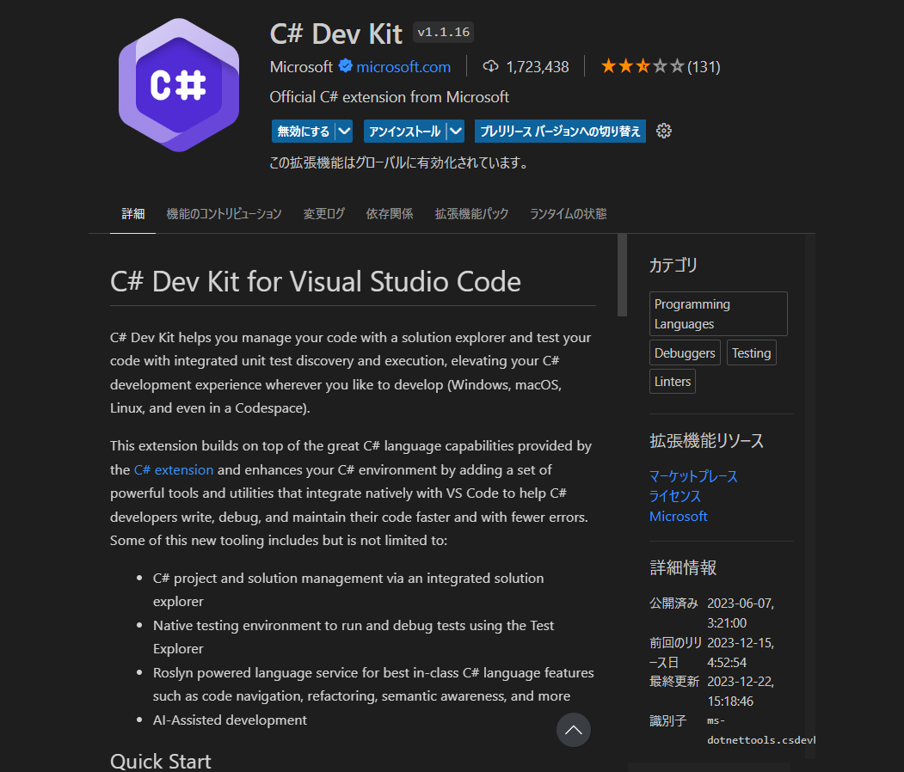

インストールが終了するとVSCodeを再起動してください。

#### プロジェクトの作成

Visual Studio **Code** を開き以下の画像で赤色の四角で囲まれた検索欄に `>` を入力してください。

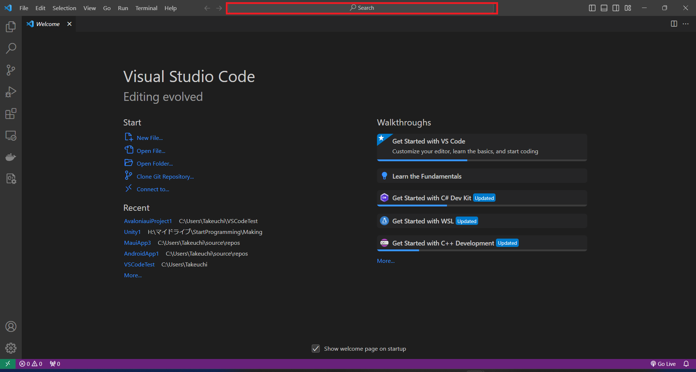

`>`を入力すると以下のような候補が表示されます。


その後 `>` に続いて `avalonia`と入力すると以下のような候補が表示されるので `Avaloniaui:Create a new Avalonia Project` をクリックしてください。 


クリックすると以下の画像のようにプロジェクトの種類を選択できるようになるので、`Avalonia App`を選択します。
`Avalonia Cross Platform App`を選択するとiOSやAndroidといったスマホにも対応することができるのですが、今回はMac/Windows/Linuxのみの対応となります。


その後以下のようにプロジェクト名を指定できるようになるのでプロジェクト名を指定します。
今回は`ExamScore`という名前を入力しエンターします。


すると以下の画像のように保存先フォルダを指定する画面が表示されるので自分のフォルダを選択してください。

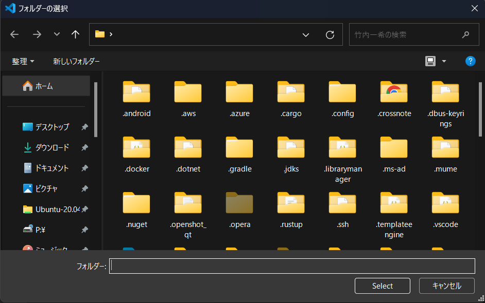

選択後少し待つとVSCodeのウインドウの右下に以下のような通知が表示されるのでOpenをクリックします。


Openボタンを押して少しすると以下のような画面が表示されます。

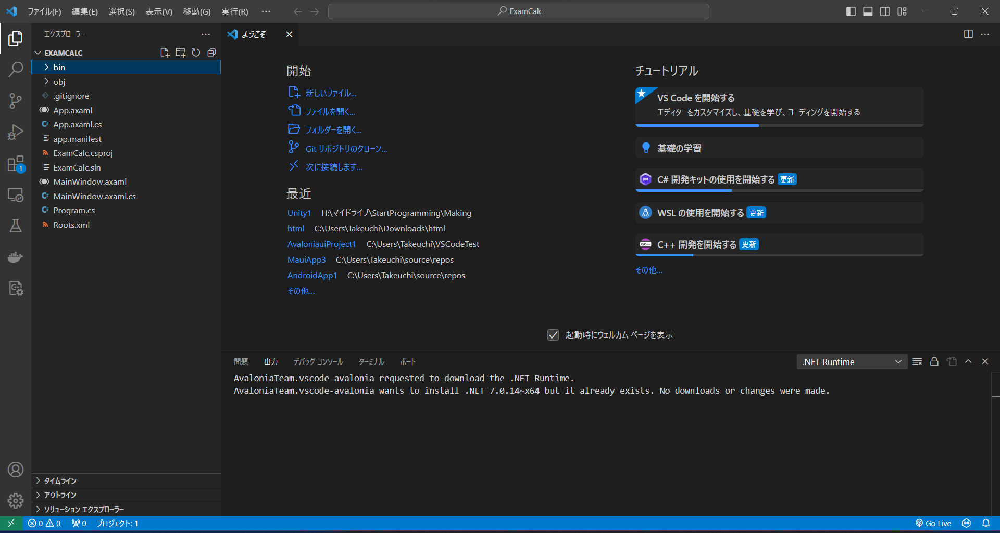

このまま作業してもいいですが、作業する際に使わないファイルなどがたくさん見えており分かりやすくないです。
そのため必要な部分だけ表示するように変更します。


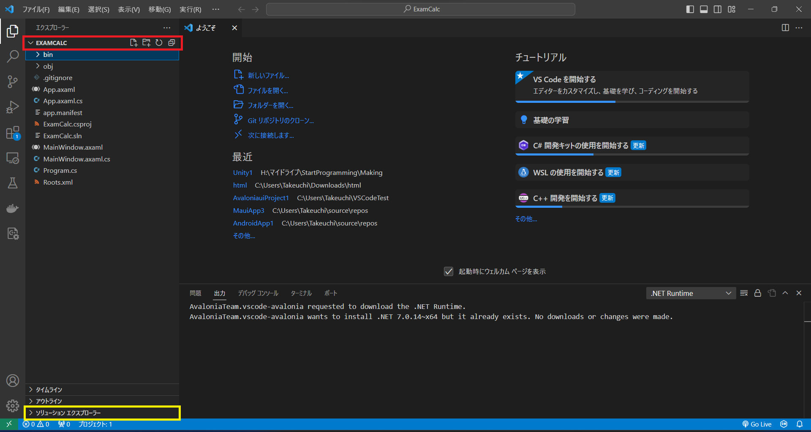

まず赤い四角で囲まれた`EXAMCALC`という部分をクリックしファイル一覧を非表示にします。
その後黄色四角に囲まれた`ソリューションエクスプローラー`というところをクリックすることで以下のような画面になります。

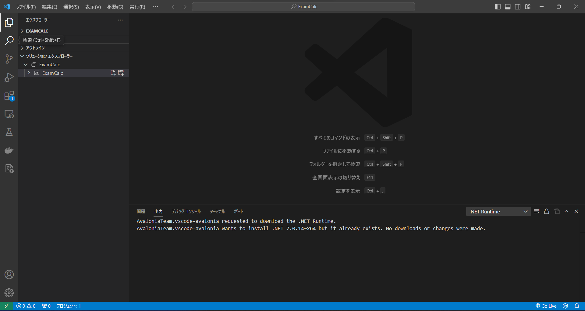

この状態で以下の画像の赤い四角で囲まれた`ExamCalc`の `>` の部分をクリックします。


すると以下の画像のような今まで使用していたVisual Studioの左側にあるソリューションエクスプローラーのような見た目になります。


#### プロジェクトの開き方

まず、Visual Studio Codeを起動します。


その後以下の画像の赤い四角で囲まれた`ファイル`の部分をクリックします。


`ファイル`の部分をクリックすると以下のようなメニューが表示されるので画像中の赤い四角で囲まれた`フォルダーを開く`の部分をクリックしてください。


`フォルダーを開く`を選択すると開くフォルダーを選択する画面が表示されるので`.sln`のファイルがあるフォルダを選択します。
今回は`ExamCalc`というフォルダを選択します。


その後はプロジェクトの作成時の操作と同様です。

#### 実行してみよう

プロジェクトができたので一度動かしてみましょう。

まず以下の画像の赤い四角で囲まれた部分を右クリックします。


するとメニューが表示されるので以下のように`Debug>新しいインスタンスの開始`をクリックします。

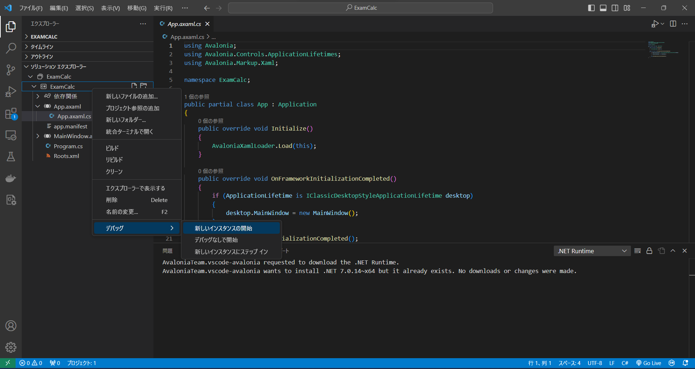


デバッグを開始すると以下のような画面が表示されます。


この画面を変更していきます。

### AvaloniaUIの簡単な使い方

画面を作成する上で始めにXMLファイルを記述します。avaloniaで使用されるXMLファイルを`axaml`ファイルと言います。
XMLファイルはHTMLの親戚のような言語でHTMLと似た形で記述できますが、少しルールが厳しいという特徴があります。

axamlではHTMLとCSSをまとめて記述することが可能になっています。
今回は以下の要素を使用し作成します。

- Label
  - 任意の文字を表示する。
- Button
  - ボタンを表示する。
- Grid
  - 表示空間を分割することができる。
- TextBox
  - 文字を入力することができます。

まず、`MainWindow.xaml`を開きます。
`MainWindow.xaml`はメインの画面を定義する部分です。
このファイルを書き換えて表示していきます。

```xml
<Window xmlns="https://github.com/avaloniaui"
        xmlns:x="http://schemas.microsoft.com/winfx/2006/xaml"
        xmlns:d="http://schemas.microsoft.com/expression/blend/2008"
        xmlns:mc="http://schemas.openxmlformats.org/markup-compatibility/2006"
        mc:Ignorable="d" d:DesignWidth="800" d:DesignHeight="450"
        x:Class="ExamCalc.MainWindow"
        Title="ExamCalc">
    Welcome to Avalonia!
</Window>
```

`<Window ~~~>`から`</window>`の間に先ほどのGridやLabelなどの要素を追加していきます。

#### Label

Labelの書き方は以下の通りです。

```xml
<label Content = "表示する文字" x:Name = "Label1">
```

`content=`の後に`"`で囲った文字を表示します。
`x:name=`の後に`"`で囲んだ文字がそのLabelの名前になります。
これはプログラムから操作する際に使用するので特にプログラムから文字を変えるなどをしない限りは指定する必要はありません。


では先ほどの`MainWindow.axaml`ファイルにLabelを書いてみましょう

以下のように`Welcome to Avalonia!`と書いてある部分を
```xml
<Label Content = "Hello Avalonia"/>
```
と書き換えます。

```xml
<Window xmlns="https://github.com/avaloniaui"
        xmlns:x="http://schemas.microsoft.com/winfx/2006/xaml"
        xmlns:d="http://schemas.microsoft.com/expression/blend/2008"
        xmlns:mc="http://schemas.openxmlformats.org/markup-compatibility/2006"
        mc:Ignorable="d" d:DesignWidth="800" d:DesignHeight="450"
        x:Class="ExamCalc.MainWindow"
        Title="ExamCalc">
    <Label Content = "Hello Avalonia"/>
</Window>
```


その後実行すると以下のように表示されると思います。


ではLabelを二つにするとどうなるでしょうか？
以下のように二つにして実行してみましょう

```xml
<Window xmlns="https://github.com/avaloniaui"
        xmlns:x="http://schemas.microsoft.com/winfx/2006/xaml"
        xmlns:d="http://schemas.microsoft.com/expression/blend/2008"
        xmlns:mc="http://schemas.openxmlformats.org/markup-compatibility/2006"
        mc:Ignorable="d" d:DesignWidth="800" d:DesignHeight="450"
        x:Class="ExamCalc.MainWindow"
        Title="ExamCalc">
    <Label Content = "Hello Avalonia"/>
    <Label Content = "Hello Avalonia1"/>
</Window>
```

これを実行しようとすると`Build失敗`と表示されます。
これはWindowの要素の中には一つの要素しか持つことができません。

これを解決するにはGridという要素を使用します。

#### Grid

Gridは一つの空間を複数に分割し指定の位置にボタンなどを複数配置することができる要素です。

```xml
<Grid>

</Grid>
```
とタグに囲まれた空間に要素を追加することでGrid内に要素があることを示すことができます。

ではGridでは複数の要素を含むことができるのか確認してみましょう。

以下のように`MainWindow.axaml`ファイルのコードを書き換えてください

```xml
<Window xmlns="https://github.com/avaloniaui"
        xmlns:x="http://schemas.microsoft.com/winfx/2006/xaml"
        xmlns:d="http://schemas.microsoft.com/expression/blend/2008"
        xmlns:mc="http://schemas.openxmlformats.org/markup-compatibility/2006"
        mc:Ignorable="d" d:DesignWidth="800" d:DesignHeight="450"
        x:Class="ExamCalc.MainWindow"
        Title="ExamCalc">
        <Grid>
                <Label Content="abc"/>
                <Label Content="def"/>
                <Label Content="ghi"/>
        </Grid>

</Window>
```

書き換えたうえで実行してみると
以下の画像のように表示されると思います。


理想は
```
abc
def
ghi
```
と表示されるのが理想ですがGridでは位置がデフォルトでは座標が(0,0)になっていて、Avaloniaでは左端が(0,0)となっているので左端に集中してしまいます。

```
abc
def
ghi
```

と表示させるのにHTMLのようにmarginを使用することで隙間を空けることができます。

marginのイメージは以下のようになっています。
水色の部分だけ隙間を空けることができます。
画像はLabelになっていますが、ButtonでもGridでも同様です。

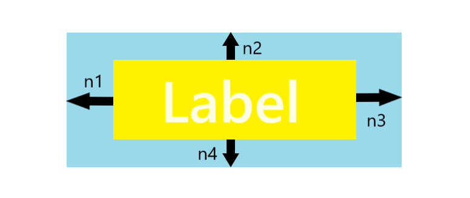

marginを指定するにはLabelの場合以下のように指定できます。
`n1`,`n2`,`n3`,`n4`は画像と対応しており、左、上、右、下の順で指定できます。

```xml
<Label Content="abc" Margin = "n1,n2,n3,n4"/>
```

これを利用して文字が被らないようにしましょう
```xml
<Window xmlns="https://github.com/avaloniaui"
        xmlns:x="http://schemas.microsoft.com/winfx/2006/xaml"
        xmlns:d="http://schemas.microsoft.com/expression/blend/2008"
        xmlns:mc="http://schemas.openxmlformats.org/markup-compatibility/2006"
        mc:Ignorable="d" d:DesignWidth="800" d:DesignHeight="450"
        x:Class="ExamCalc.MainWindow"
        Title="ExamCalc">
        <Grid>
                <Label Content="abc" Margin = "0,0,0,0"/>
                <Label Content="def" Margin = "0,20,0,0"/>
                <Label Content="ghi" Margin = "0,40,0,0"/>
        </Grid>

</Window>
```

ghiと表示するところのMarginが`0,40,0,0`とdefと表示するLabelにクラ寝て二つ目が2倍の40となっていると思います。
このMarginは要素のスタート地点(今回は左上)からの隙間を示しており、同じ20にしてしまうと文字が被ってしまうのでそれを防ぐ目的です。
Grid意外にも複数要素を持つことができる要素がありますが、物によっては上の要素の下がスタート地点になる場合もありますが、今回は扱いません。


##### 空間の分割
このようにして任意の位置に要素を配置することができたと思いますが、Gridには空間を分割する機能があると説明があったと思います。

要素を空間を分割する機能について説明します。

まず縦方向に分割する方法を説明します。　
Gridを縦に分割するにはGridの中に`Grid.RowDefinitions`を書きその中に`RowDefinition`のタグを書くことで分割できます。
では実際にやってみましょう。

`MainWindow.axaml`を以下のように書き換えてください。

```xml
<Window xmlns="https://github.com/avaloniaui"
        xmlns:x="http://schemas.microsoft.com/winfx/2006/xaml"
        xmlns:d="http://schemas.microsoft.com/expression/blend/2008"
        xmlns:mc="http://schemas.openxmlformats.org/markup-compatibility/2006"
        mc:Ignorable="d" d:DesignWidth="800" d:DesignHeight="450"
        x:Class="ExamCalc.MainWindow"
        Title="ExamCalc">
        <Grid>
                <Grid.RowDefinitions>
                        <RowDefinition/>
                        <RowDefinition/>
                        <RowDefinition/>
                </Grid.RowDefinitions>
        </Grid>
</Window>
```

これで縦方向に3分割することができていますが、確認することができません。
そこで以下のように`<Grid`の後に`ShowGridLines="True"`を入れ実行してみてください。

```xml
<Window xmlns="https://github.com/avaloniaui"
        xmlns:x="http://schemas.microsoft.com/winfx/2006/xaml"
        xmlns:d="http://schemas.microsoft.com/expression/blend/2008"
        xmlns:mc="http://schemas.openxmlformats.org/markup-compatibility/2006"
        mc:Ignorable="d" d:DesignWidth="800" d:DesignHeight="450"
        x:Class="ExamCalc.MainWindow"
        Title="ExamCalc">
        <Grid ShowGridLines="True">
                <Grid.RowDefinitions>
                        <RowDefinition/>
                        <RowDefinition/>
                        <RowDefinition/>
                </Grid.RowDefinitions>
        </Grid>
</Window>
```

すると以下のように分割されていることがわかります。


ではここにLabelをそれぞれおいてみましょう

`MainWindow.axaml`を以下のようにコードを書き換えてください。

```xml
<Window xmlns="https://github.com/avaloniaui"
        xmlns:x="http://schemas.microsoft.com/winfx/2006/xaml"
        xmlns:d="http://schemas.microsoft.com/expression/blend/2008"
        xmlns:mc="http://schemas.openxmlformats.org/markup-compatibility/2006"
        mc:Ignorable="d" d:DesignWidth="800" d:DesignHeight="450"
        x:Class="ExamCalc.MainWindow"
        Title="ExamCalc">
        <Grid ShowGridLines="True">
                <Grid.RowDefinitions>
                        <RowDefinition/>
                        <RowDefinition/>
                        <RowDefinition/>
                </Grid.RowDefinitions>
                <Label Content="abc" Grid.Row = "0"/>
                <Label Content="def" Grid.Row = "1"/>
                <Label Content="ghi" Grid.Row = "2"/>
        </Grid>
</Window>
```

これを実行すると以下のように表示されます。


`Grid.Row = ` の後に分割したGridの番号を指定するとその分割した空間に配置されます。
分割した空間に移動するとMarginも分割された空間の左上からの隙間を指定することになります。 

また、Gridで分割するとウインドウの大きさを変えた場合に均等な割合で変更されます。
実際にウインドウを縦方向に小さくした場合以下のようになります。

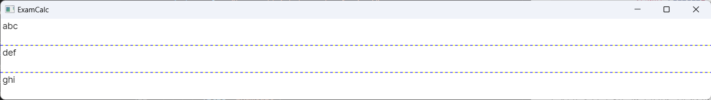

このように全体に応じてサイズを変更することができます。

しかしながらサイズを一定にしたい場合や割合で指定したい場合があります。
実際に固定や分割する方法を試してみましょう。

`MainWindow.axaml`ファイルを以下のように書き換えてください。
このコードはabcと表示するLabelの入っている要素は高さ30で固定、defと表示するLabelの入っている要素とghiと表示するLabelの入っている要素が1:4の割合で表示されるようになっています。

```xml
<Window xmlns="https://github.com/avaloniaui"
        xmlns:x="http://schemas.microsoft.com/winfx/2006/xaml"
        xmlns:d="http://schemas.microsoft.com/expression/blend/2008"
        xmlns:mc="http://schemas.openxmlformats.org/markup-compatibility/2006"
        mc:Ignorable="d" d:DesignWidth="800" d:DesignHeight="450"
        x:Class="ExamCalc.MainWindow"
        Title="ExamCalc">
        <Grid ShowGridLines="True">
                <Grid.RowDefinitions>
                        <RowDefinition Height = "30"/>
                        <RowDefinition Height = "1*"/>
                        <RowDefinition Height = "4*"/>
                </Grid.RowDefinitions>
                <Label Content="abc" Grid.Row = "0"/>
                <Label Content="def" Grid.Row = "1"/>
                <Label Content="ghi" Grid.Row = "2"/>
        </Grid>
</Window>
```

実際に実行すると以下のように表示されます。

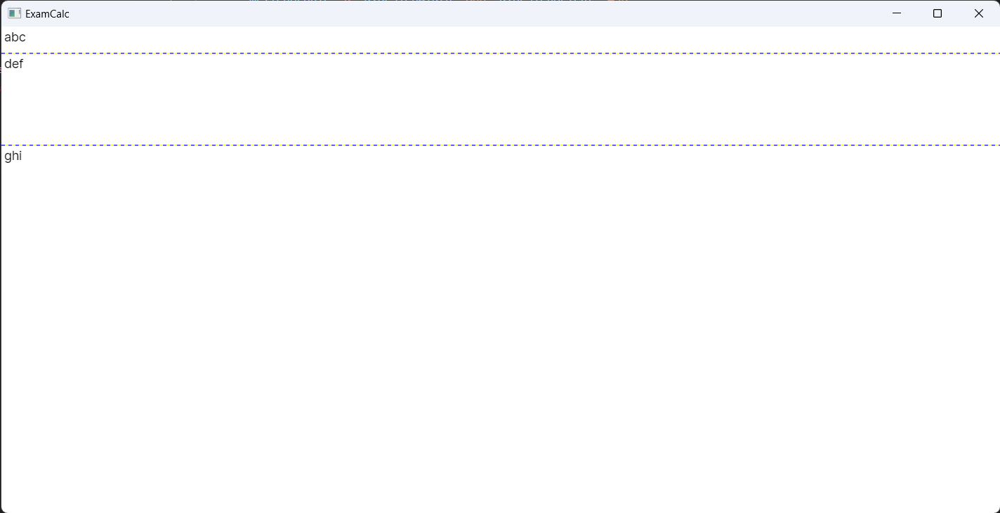


```xml
<RowDefinition/>
```
の部分に

```xml
<RowDefinition Height = "30"/>
```

と指定することで縦方向の大きさを固定することおができます。

一方
```xml
<RowDefinition Height = "4*"/>
<RowDefinition Height = "1*"/>
<RowDefinition Height = "1*"/>
```
のように指定すると4:1:1の割合で分割されるようになっています。

ただし、割合で分割したときに最小の大きさを指定したい場合もあると思います。
その場合は以下のように`MinHeight = `の後に固定値を指定することでそれ以上小さくならなくなっています。最大値も同じように`MaxHeight = `の後に固定値を置くことで指定できます。
```xml
<RowDefinition Height = "4*"/>
<RowDefinition Height = "1*" MinHeight = "40"/>
<RowDefinition Height = "1*"/>
```


次に横方向に分割する方法を説明します。
横方向もほとんど同様でRowがColumになりHeightがWidthになっています。

実際に横方向に3分割するように`MainWindow.axaml`書き換えてみましょう。

```xml
<Window xmlns="https://github.com/avaloniaui"
        xmlns:x="http://schemas.microsoft.com/winfx/2006/xaml"
        xmlns:d="http://schemas.microsoft.com/expression/blend/2008"
        xmlns:mc="http://schemas.openxmlformats.org/markup-compatibility/2006"
        mc:Ignorable="d" d:DesignWidth="800" d:DesignHeight="450"
        x:Class="ExamCalc.MainWindow"
        Title="ExamCalc">
        <Grid ShowGridLines="True">
                <Grid.ColumnDefinitions>
                        <ColumnDefinition/>
                        <ColumnDefinition/>
                        <ColumnDefinition/>
                </Grid.ColumnDefinitions>
        </Grid>
</Window>
```

実際に実行すると以下のようになります。


このように三分割されていることがわかります。


実際にLabelを置いてみましょう。
以下のように`MainWindow.axaml`を書き換えます。

```xml
<Window xmlns="https://github.com/avaloniaui"
        xmlns:x="http://schemas.microsoft.com/winfx/2006/xaml"
        xmlns:d="http://schemas.microsoft.com/expression/blend/2008"
        xmlns:mc="http://schemas.openxmlformats.org/markup-compatibility/2006"
        mc:Ignorable="d" d:DesignWidth="800" d:DesignHeight="450"
        x:Class="ExamCalc.MainWindow"
        Title="ExamCalc">
        <Grid ShowGridLines="True">
                <Grid.ColumnDefinitions>
                        <ColumnDefinition/>
                        <ColumnDefinition/>
                        <ColumnDefinition/>
                </Grid.ColumnDefinitions>

                <Label Content="abc" Grid.Column = "0"/>
                <Label Content="def" Grid.Column = "1"/>
                <Label Content="ghi" Grid.Column = "2"/>
        </Grid>
</Window>
```

実行すると以下のように分割された領域にそれぞれLabelが表示されていることがわかります。

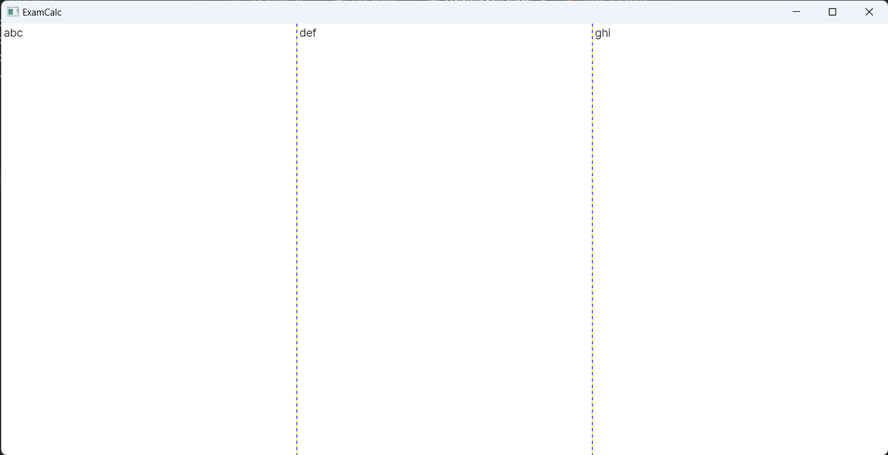


横方向の領域を指定するにはLabelなどに`Grid.Column = `の後に左からゼロから数えて何個目か指定することで指定できます。


割合などの指定方法も縦方向の分割の方法とほぼ同様です。


```xml
<Window xmlns="https://github.com/avaloniaui"
        xmlns:x="http://schemas.microsoft.com/winfx/2006/xaml"
        xmlns:d="http://schemas.microsoft.com/expression/blend/2008"
        xmlns:mc="http://schemas.openxmlformats.org/markup-compatibility/2006"
        mc:Ignorable="d" d:DesignWidth="800" d:DesignHeight="450"
        x:Class="ExamCalc.MainWindow"
        Title="ExamCalc">
        <Grid ShowGridLines="True">
                <Grid.ColumnDefinitions>
                        <ColumnDefinition Width = "50"/>
                        <ColumnDefinition Width = "2*"/>
                        <ColumnDefinition Width = "3*"/>
                </Grid.ColumnDefinitions>

                <Label Content="abc" Grid.Column = "0"/>
                <Label Content="def" Grid.Column = "1"/>
                <Label Content="ghi" Grid.Column = "2"/>
        </Grid>
</Window>
```

一番左の領域だけ50で固定、その後の二つの領域は2:3で分割するように指定することができました。

最大値と最小値を指定する場合も先ほどとほぼ同様で、

```xml
<ColumnDefinition Width = 2* MinWidth = 20 MaxWidth = 400/>
<ColumnDefinition Width = 3*/>
```
のように指定することができるようになっています。


#### Button

次にButtonの使い方を説明します。

Buttonはクリックされたときに一定の処理を行うことができる要素です。

まずボタンは以下のように記述することで描画できます。

```xml
<Button Content = "Click!" x:Name = "Button1" />
```

基本的にはLabelと同様に使用することができます。

ただし`x:Name`はできるだけ指定するようにしてください。
指定がない場合プログラムからの操作が難しくなります。

では実際に動作を確認してみましょう

`MainWindow.axaml`を以下のように記述してください。


```xml
<Window xmlns="https://github.com/avaloniaui"
        xmlns:x="http://schemas.microsoft.com/winfx/2006/xaml"
        xmlns:d="http://schemas.microsoft.com/expression/blend/2008"
        xmlns:mc="http://schemas.openxmlformats.org/markup-compatibility/2006"
        mc:Ignorable="d" d:DesignWidth="800" d:DesignHeight="450"
        x:Class="ExamCalc.MainWindow"
        Title="ExamCalc">
        <Grid>
                <Button x:Name = "Button1" Content = "Click!"/>
        </Grid>
</Window>
```

これを実行すると以下のように表示されていると思います。


##### HorizontalAlignmentとVerticalAlignment

Labelの場合左上に表示されていましたがButtonの場合は左の真ん中に表示されているようになっていると思います。


これには`HorizontalAlignment`と`VerticalAlignment`が深くかかわっています。
`HorizontalAlignment`は縦方向の位置を指定をすることができます。
`HorizontalAlignment`には以下の値を指定することができます。

|値|意味|
|--|----|
|Top|上に配置する|
|Center|真ん中に配置する|
|Bottom|下に配置する|
|Stretch|上から下までの大きさに合わせる|

`VerticalAlignment`は横方向の位置を指定をすることができます。

`VerticalAlignment`には以下の値を指定することができます。

|値|意味|
|--|----|
|Left|左に配置する|
|Center|真ん中に配置する|
|Right|右に配置する|
|Stretch|右から左までの大きさに合わせる|

というように指定することができます。

今回は縦横ともに真ん中に表示させていので以下のようにButtonの部分を書き換えます。

```xml
<Button x:Name = "Button1" Content = "Click!" VerticalAlignment = "Center" HorizontalAlignment = "Center"/>
```

Buttonの部分をに書き換え実行すると以下のように表示されます。


##### Buttonで処理をしよう

この状態ではButtonをクリックしても何も動作しません。

では実際にButtonをクリックするとクリックした回数をカウントするプログラムを追加してみましょう

しかし今まで記述してきた`.axaml`ファイルでは動作を指定することができません。なので`MainWindow.axaml.cs`ファイルを開き動作を記述する必要があります。

`MainWindow.axaml.cs`を開くにはソリューションエクスプローラーの`MainWindow.axaml`の横の`>`ボタンを押すことで`MainWindow.axaml.cs`が表示されるのでそれをクリックしてください。

ファイルを開けると以下のようなコードが表示されます。

```cs
using Avalonia.Controls;

namespace ExamCalc;

public partial class MainWindow : Window
{
    public MainWindow()
    {
        InitializeComponent();
    }
}
```

8行目のコンストラクタ内に記述されている`InitializeComponent()`の部分は先ほど記述した`MainWindow.axaml`内の指定を表示するためのメソッドですので消さないようにしてください。


では動作を指定するためにイベントを登録します。
AvaloniaUIでは`Button`の`Click`イベントにメソッドを登録してクリックされた時の動作を指定する形になっています。
このようなプログラムの書き方を**イベント思考プログラミング**と言います。

実際に`Click`イベントを登録してみましょう

```cs
using Avalonia.Controls;

namespace ExamCalc;

public partial class MainWindow : Window
{
    public MainWindow()
    {
        InitializeComponent();
        Button1.Click += Button1_Click;
    }

    
    private void Button1_Click(object? sender, Avalonia.Interactivity.RoutedEventArgs e)
    {
        
    }
}
```

9行目にある
```
Button1.Click += Button1_Click;
```
は
Button1の部分でButton1という変数を指定していますが、
これは先ほどの`MainWindow.axaml`ファイルで記述した

```xml
<Button x:Name = "Button1" Content = "Click!" VerticalAlignment = "Center" HorizontalAlignment = "Center"/>
```

の要素を指定していることになります。

`x:Name`で記述した名前は`MainWindow.axaml.cs`ファイルでも操作・指定することが可能です。

このButton1という変数の`Click`イベントに14行目で宣言した`Button1_Click`というメソッドを指定していることになっています。

これでボタンが押された時に`Button1_Click`メソッドが実行されるようになりました。

しかしこのままではボタンの文字は変更されないのでボタンの文字をカウントに変えるようにしましょう。


```cs
using Avalonia.Controls;

namespace ExamCalc;

public partial class MainWindow : Window
{
    public MainWindow()
    {
        InitializeComponent();
        Button1.Click += Button1_Click;
    }

    int Count = 0;
    private void Button1_Click(object? sender, Avalonia.Interactivity.RoutedEventArgs e)
    {
        Count = Count + 1;
        Button1.Content = Count.ToString();
    }
}
```

13行目にint型のCountという変数を用意しました。
クリックされるとこのCountという変数の数値が1ずつ上がっていきます。

17行目は`Button1`の`Content`という要素を書き換えています。
`Content`という部分は`.axaml`ファイルで指定したように表示されている文字を指定する変数になっています。
実は`.axaml`ファイルで指定できる要素はC#でも指定できるようになっているので今回のように指定できます。

`変数.ToString`の部分については、変数を無理やり文字列に変更するというものになっています。数値以外のものであれば型の名前に変換されることもあるのでどのような値に変換されるかよく確認して使ってください。

実際に実行して3回クリックすると以下のようになります。


このように3と表示されていたら正しく作成することができています。


##### Text

Text要素は文字を入力できる要素になっています。

基本的な使い方は変わりませんがButtonとLabelとは大きく異なる点があります。
それは表示する文字を指定するプロパティ名です
今までは`Content`でしたがTextは`Text`となっています。

実際に使いながら動作を確認しましょう。


`MainWindow.axaml`を以下のように書き換えてください。

```xml
<Window xmlns="https://github.com/avaloniaui"
        xmlns:x="http://schemas.microsoft.com/winfx/2006/xaml"
        xmlns:d="http://schemas.microsoft.com/expression/blend/2008"
        xmlns:mc="http://schemas.openxmlformats.org/markup-compatibility/2006"
        mc:Ignorable="d" d:DesignWidth="800" d:DesignHeight="450"
        x:Class="ExamCalc.MainWindow"
        Title="ExamCalc">
        <Grid>
                <TextBox x:Name = "TextBox1" VerticalAlignment = "Top" HorizontalAlignment = "Stretch"/>
                <Label x:Name = "Label1" Content = "NoInput" Margin = "0,30,0,0" VerticalAlignment = "Top" HorizontalAlignment = "Left"/>
                <Button x:Name = "Button1" Content = "Click!" Margin = "0,50,0,0" VerticalAlignment = "Top" HorizontalAlignment = "Left"/>
                
        </Grid>
</Window>
```

`MainWindow.axaml.cs`
を以下のように記述します。

```cs
using Avalonia.Controls;

namespace ExamCalc;

public partial class MainWindow : Window
{
    public MainWindow()
    {
        InitializeComponent();
        Button1.Click += Button1_Click;
    }
    
    private void Button1_Click(object? sender, Avalonia.Interactivity.RoutedEventArgs e)
    {
        Label1.Content = TextBox1.Text;
    }
}
```

このプログラムはボタンを押すと一番上のTextBoxに表示された文字をLabelに表示するというプログラムになっています。


```
TextBox1.Text
```
と指定することで値を取得できます。


逆に値を設定することもできるので文字が入力された後TextBoxの中を空にするようにプログラムを修正してみます。

`MainWindow.axaml.cs`を以下のように書き換えます。

```cs
using Avalonia.Controls;

namespace ExamCalc;

public partial class MainWindow : Window
{
    public MainWindow()
    {
        InitializeComponent();
        Button1.Click += Button1_Click;
    }

    private void Button1_Click(object? sender, Avalonia.Interactivity.RoutedEventArgs e)
    {
        Label1.Content = TextBox1.Text;
        TextBox1.Text = "";
    }
}
```

これを実行しTextBoxに値を入力しボタンを押すとLabelにその文字が表示されTextBoxの文字は消えると思います。


### 作品を作る

#### UIの作成

以下に解答例としてファイルがダウンロードできるので実際に動かして同じように動くようにプログラムを作成してみてください。


##### Mac

2019年以前に発売ののMacを使用している場合はMac x64をダウンロードしてくださいそれ以降のMacを使用している方はMac armをダウンロードしてください。

<a href = "./Files/ExamCalcMac_x64.zip" Download="ExamCalc.zip">Download Mac x64</a>

<a href = "./Files/ExamCalcMac_arm64.zip" Download="ExamCalc.zip">Download Mac arm64</a>

##### Windows

基本的にWindows x64をダウンロードしてください。動かない場合はWindows x86それでも動かない場合はWindows arm64をダウンロードしてください。

<a href = "./Files/ExamCalcWindows_x64.zip" Download="ExamCalc.zip">Download Windows x64</a>

<a href = "./Files/ExamCalcWindows_x64.zip" Download="ExamCalc.zip">Download Windows x86</a>

<a href = "./Files/ExamCalcWindows_arm64.zip" Download="ExamCalc.zip">Download Windows arm64</a>

##### Linux

通常のパソコンであればLinux x64をダウンロードしてください。
もし、Raspberry Pi 3以前のRaspberry Piを使用している場合はLunux armをダウンロードしてください。
それ以降のRaspberry Piを使用している場合はLinux arm64をダウンロードしてください。

<a href = "./Files/ExamCalcLinux_x64.zip" Download="ExamCalc.zip">Download Linux x64</a>

<a href = "./Files/ExamCalcLinux_arm.zip" Download="ExamCalc.zip">Download Linux arm</a>

<a href = "./Files/ExamCalcLinux_arm64.zip" Download="ExamCalc.zip">Download Linux arm64</a>


