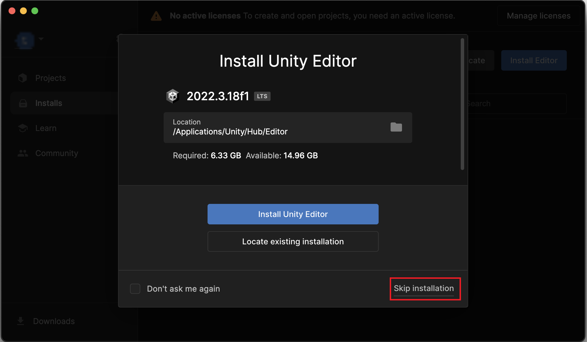
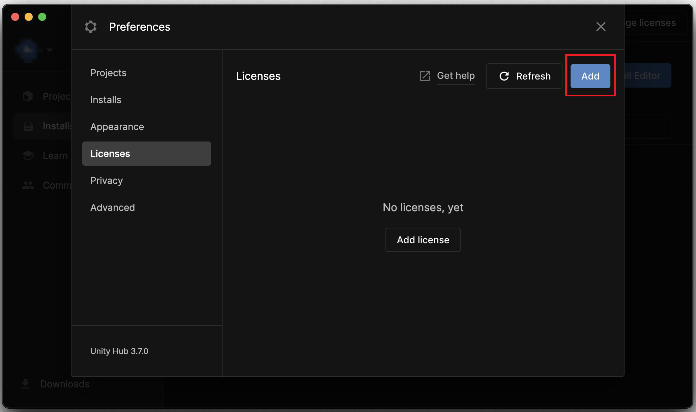
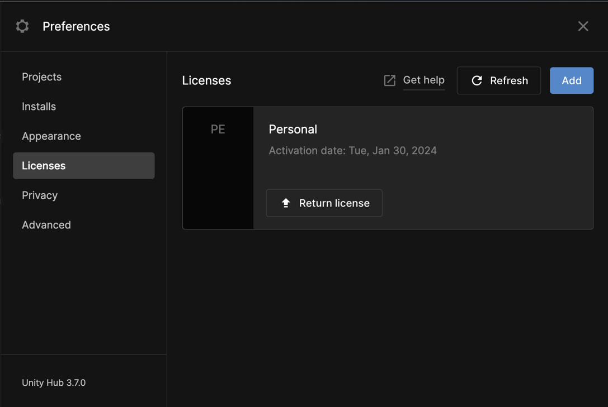
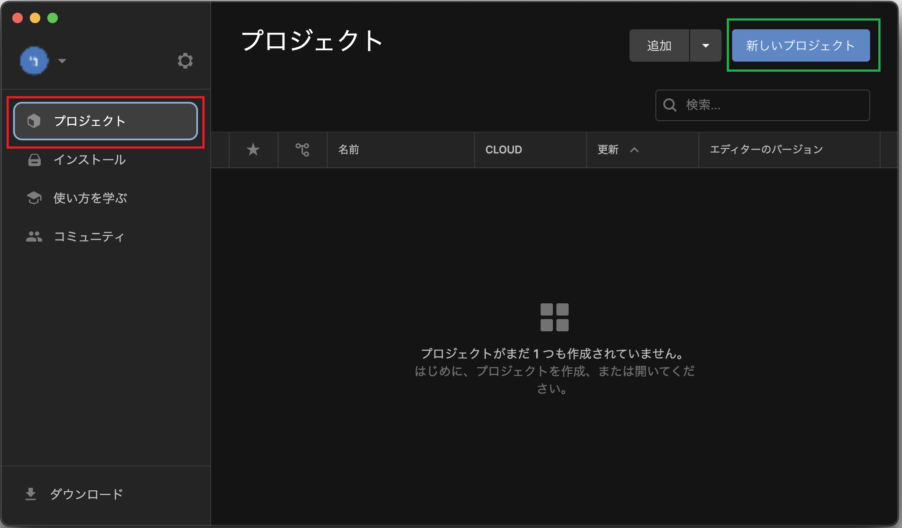
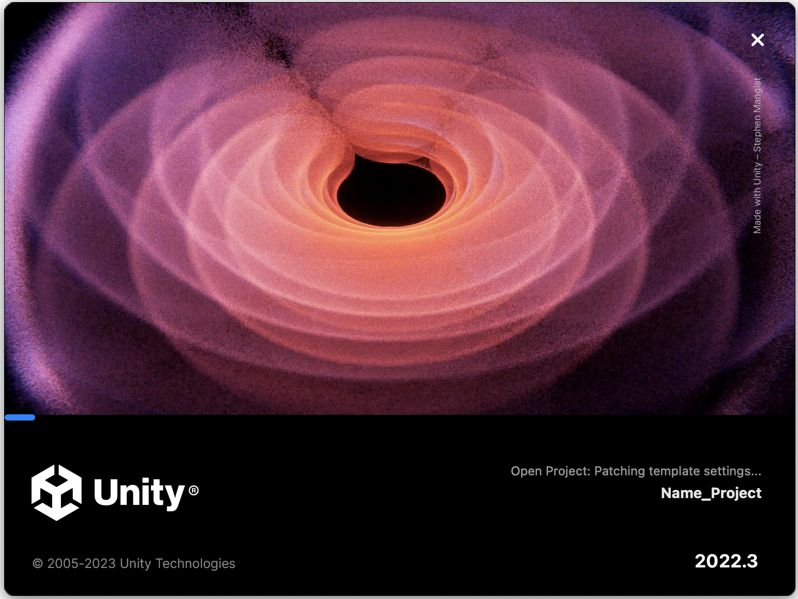
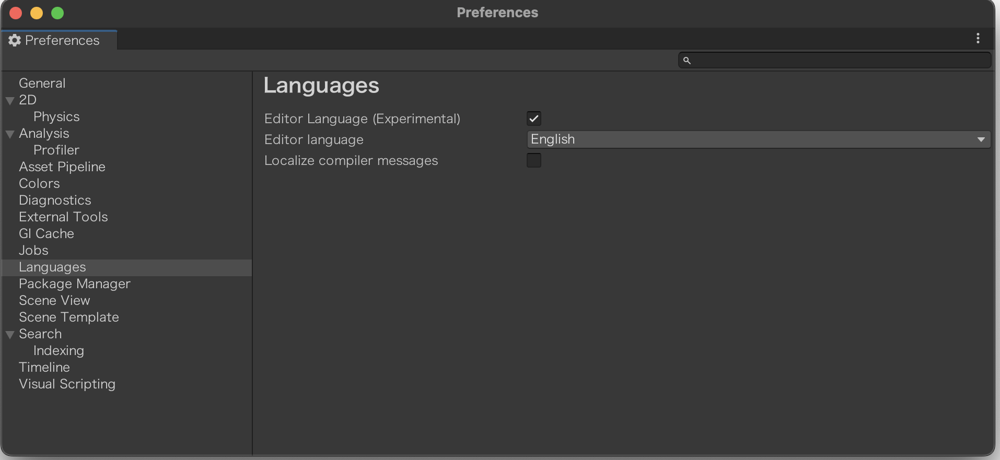
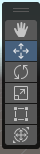
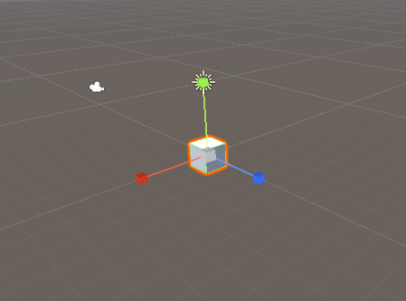
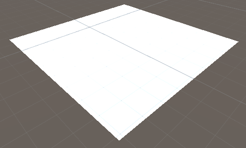

# Unity14:Unity

カリキュラム13までのC#の学習しましたが、それを利用してUnityというゲームエンジンの使い方などを学習していきます。

また最初の**Unity Hubのインストール**と**Unity Hub**の設定については持参のパソコンではない場合読み飛ばして構いません。

## Unity Hubのインストール

Untiy HubとはUnityのプロジェクトを管理したり、Untiyのバージョンを管理するためのソフトです。
そのためUnity Hubのダウンロード・インストール後にUnityのダウンロード・インストールする必要があります。

まずUnityのダウンロードサイトに移動します。

[ダウンロードサイト](https://unity.com/ja/download)

ダウンロードサイトを開きダウンロードボタンを押します。

Macの場合はMac用DLをクリックします

するとファイルがダウンロードされるので、それを実行しインストールします。

## Unity Hubの設定

Unity Hubのインストールが終わるとUnity Hubの設定などを行う必要があります。

### サインインとライセンス認証
Unity Hubをインストール後、起動すると以下のような画面が表示されます。

**Sing in**を押しGoogleアカウントなどでサインインできるのでサインインしてください。

サインインが完了すると以下のような画面が表示されますが
画像の赤い四角で囲まれた**Skip installation**を押してください

その後以下のような画面に変わります。

しかし、Unityはライセンスと呼ばれる許可証がなければいけないのでライセンスを取得します。
上記画像の赤い四角で囲まれた「**Manege lisence**」をクリックします。

クリックすると以下のようにライセンス管理画面が表示されます。

赤い四角で囲まれた「**Add**」ボタンをクリックします。

Addボタンをクリックすると以下のように追加すライセンスの種類を選択する画面が表示されるので赤い四角で囲まれた「Get a free personal license」をクリックします。

すると以下のようにライセンス管理画面に**Personal**というライセンスが追加されているのがわかります。

ライセンス管理画面は使わないので右上のバツボタンをクリックしライセンス管理画面を消します。

### Unity Hubの日本語化

まず日本語化するために設定画面を開きます。

以下の画像の赤い四角で囲んだ部分にある歯車マークをクリックしてください。

歯車マークをクリックすると以下のように表示されます。

そのが赤い四角で囲まれた「**Appearance**」をクリックし、画像の緑の四角で囲まれたLanguageの設定項目を変更し日本語に変更します。

### Unity Editorをダウンロード&インストール

現在のUnityはUnity HubとUnity Editorで分けられています。Unity Editorは実際にゲームを作成するためのツールである一方でUnity HubはUnity Editorのバージョンなどを管理するためにあります。

Unity Editorをインストールするには以下の画像の赤い四角で囲まれた部分をクリックします。

その後、緑の四角で囲まれたエディターを「**インストール**」の部分をクリックします。

「**インストール**」ボタンをクリックすると以下のような画面が表示されるので2022.3から始まるもののインストールボタンを押してください。

インストールを押すと以下のようにどのデバイスに対応させるかが表示されます。

Macの場合は「**Mac Build Support(IL2CPP)**」と言語パックの「日本語」を選択してください。

Windowsの場合は「**Windows Build Support(Mono)**」と言語パックの「日本語」を選択してください。

Linuxの場合は「**Linux Build Support(IL2CPP)**」と言語パックの「日本語」を選択してください。

これらが最低限必要ですが、「Android Build Support」や「iOS Build Support」などをクリックするとそれぞれのデバイスで使用可能になるので選択しておいてもよいかもしれません。ただし、容量が大きいのでその点については注意が必要です。

これらの、選択ができると右下のインストールボタンを押してインストールが終わるのを待ちます。

## Unityプロジェクト

Unityインストールが終わったと思うのでプロジェクトの作成を行います。

### プロジェクトの作成
まず画像で赤く囲われた「プロジェクト」の部分をクリックしプロジェクトの管理画面に移動します。

以下のように表示されるので緑色の四角で囲まれた「新しいプロジェクト」をクリックします。

クリックすると以下のような画面が表示されるので3Dを選択します。

その後右側の欄でプロジェクト名を指定します。
今回は
「自分の名前_Project」
とします。

右側の部分をさらにスクロールし設定を変更します。

保存先は自分のフォルダを選択し、
**「Unity Cloudに接続」と「Unity Version Controlを使用する」のチェックをはずします。**

すべて入力が終わると「プロジェクトを作成」をクリックします。

すると以下のような読み込み画面が表示されます。

少し時間が経ってから以下のようなエディターが表示されます。

次にプロジェクトの開き方について説明するのでUnityを一度終了させてください。

### プロジェクトの開き方

先ほどのようにプロジェクトの作成方法がわかったと思いますが、次にプロジェクトの開き方を説明します。

まず、Unity Hubを開きます。

Unity Hubを開くと以下のように作成したプロジェクトの一覧が表示されます。

その中から開きたいプロジェクトをクリックすると先ほどと同様少し待つとプロジェクトを開くことができるようになります。

## Unityの日本語化

Unity Hubは日本語化しましたが、それぞれのプロジェクトごとに日本語化する必要がありますその方法について説明します。

### Mac 

Macの場合は画面上部のバーからUnity>Settingを選択すると以下のような画面が表示されるので

その後Languagesをクリックします。

すると以下のような画面が表示されるのでEditor languageを「日本語」を選択します

日本語を選択するだけだと表示は変わらないので一度Unityを終了させ再度プロジェクトを開きます。

### Windows 

Windowsの場合は画面上部のバーからEdit>Preferencesを選択すると以下のような画面が表示されるので

その後Languagesをクリックします。

すると以下のような画面が表示されるのでEditor languageを「日本語」を選択します

日本語を選択するだけだと表示は変わらないので一度Unityを終了させ再度プロジェクトを開きます。

## Unityの画面説明

Unityが起動すると以下のような画面が表示されます。

この画面は機能によって以下のように4つに分割することができます。

赤の四角で囲まれた部分はヒエラルキーウィンドウといいゲームオブジェクト(立体や物体)を管理するところになっています。

黄色の四角で囲まれた部分はプロジェクトウインドウとコンソールウインドウです。これらはタブで切替可能でプロジェクトというところをクリックするとファイルの管理をするプロジェクトウインドウが表示され、コンソールというところをクリックするとプログラムからの情報やエラーの表示画面が表示されます。

緑の四角で囲まれた部分はシーンウインドウとゲームウインドウです。
こちらもタブで切替可能になっており、シーンウインドウというところをクリックすると物体の場所などを管理する画面で、物体を選択して移動するなどが可能です。ゲームウインドウというところをクリックすると、実際のゲーム画面が表示されます。

青の四角で囲まれた部分はインスペクターウインドウといい、それぞれのゲームオブジェクトの設定を数値や文字で指定することができる画面です。
シーンウインドウで大まかに動かしその後インスペクターウインドウで微調整するなどの使い方が可能です。

## ゲームオブジェクトとシーンウインドウの操作

Unityはゲームで表示される物体をゲームオブジェクトという単位で管理しています。

ゲームオブジェクトはヒエラルキーウインドウ内で右クリックすることでは以下の画像のようにメニューが表示されそこから追加するオブジェクトを選択するようになっています。

### シーンビューの操作

実際にどのように操作するのか確認するために、3Dオブジェクト内にあるキューブオブジェクトを追加してみましょう。

Cubeオブジェクトを追加すると画面はこのようになると思います。

画面の操作3Dオブジェクトの移動方法などについて説明していきます
左上のほうに操作ツールの一覧が表示されています。

上からビューツール、移動ツール、回転ツール、スケールツール、短形ツール、トランスフォームツールと別れています。
それぞれを選択することで以下の表のような動作をすることができます。

|モード名|機能・動作|
|--------|----------|
|ビューツール|左クリックしている間シーンビュー上を移動することができます。|
|移動ツール|移動ツールの状態でゲームオブジェクトを選択すると画像のようにゲームオブジェクトから見て正面、上部、側面方向に矢印が表示されるのでその矢印をドラッグすることでゲームオブジェクトを移動することができます。|
|回転ツール|回転ツールの状態でゲームオブジェクトを選択すると画像のようにそれぞれx、y、z方向に回転することができるようになっています。|
|スケールツール|スケールツールの状態でゲームオブジェクトを選択すると画像のようにゲームオブジェクトから見て正面、上部、側面方向に矢印が表示されるのでその矢印をドラッグすることでゲームオブジェクトの大きさを変更することが可能です。|
|短形ツール|移動ツールの状態でゲームオブジェクトを選択すると画像のように表示されるます。それぞれの青丸を移動させることで大きさを変更することができます。|
|トランスフォームツール　|　トランスフォームツールの状態でゲームオブジェクトを選択すると以下の画像のように 移動ツールと回転ツールスケールツールを混ぜたようなものになっています。 |

またマウスをスクロールするとズームされます。
マウスの右ボタンを押した状態で視点を回転させることが可能です。
windowsの場合Ctrl+Altキーを押している状態だけビューツールにすることが可能です。

シーンビューや物体の移動などについては以下のページより詳しく確認することができます。

[シーンビューの操作](https://docs.unity3d.com/ja/2020.3/Manual/SceneViewNavigation.html)

[ゲームオブジェクトの配置](https://docs.unity3d.com/ja/2021.1/Manual/PositioningGameObjects.html)

### ゲームオブジェクト
シーンビューの操作がある程度わかったので基本的なゲームオブジェクトをいくつか使ってみましょう

#### Cube(キューブ)

立方体のゲームオブジェクトです。
3Dオブジェクト>キューブで追加できます。

#### Sphere(球体/スフィア)

球体のゲームオブジェクトです。
3Dオブジェクト>スフィアで追加できます。

#### Cupsule(カプセル)

カプセルの形状のゲームオブジェクトです。
3Dオブジェクト>カプセルで追加できます。

#### Cylinder(円柱/シリンダー)

円柱の形状のゲームオブジェクトです。
ヒエラルキーウィンドウを右クリックから3Dオブジェクト>シリンダーで追加できます。

#### Panel(平面)

平面の形状のオブジェクトで10m×10mの大きさの平面のオブジェクトで表と裏があり裏面からだと見えないようになっています。

地面などを作成する際によく使われます。

#### Terrain

Terrainは地形などを作成するオブジェクトです。

#### Directional Light(ディレクショナルライト)

光を照らすゲームオブジェクトです。
ヒエラルキーウィンドウを右クリックからライト>ディレクショナルライトで追加できます。

#### Camera

ゲーム実行時にユーザーの視点になるゲームオブジェクトです。
ヒエラルキーウィンドウを右クリックからカメラで追加できます。

### ゲームオブジェクトのインスペクターウインドウでの移動

ゲームオブジェクトをクリックするとインスペクターウインドウは以下の画像のようになります。

今回注目してもらいたいのはTransformと書いてある部分の中にある

位置と回転、スケールです。

位置はゲームオブジェクトの中心の位置を示しています。
回転はゲームオブジェクトの向きを示しています。
スケールはもともとのゲームオブジェクトの何倍のサイズかを示しています。

これらの数値を変更することで細かく位置などを指定することができます。