# Unity15:物理演算とマテリアル、テクスチャについて理解しよう

今回の教材ではUnityの物理演算を使用して重力などを付ける方法や、ブロックに色を付ける方法を説明します。

## ゲームオブジェクトの配置

前回使ったプロジェクトを開き以下のように平面オブジェクトとキューブオブジェクトを以下のように配置してください。

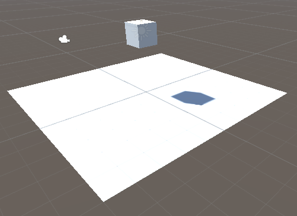

詳細なパラメータとしては以下のようになっています
また、Main Cameraは移動する必要はありませんが念のために記述しておきます。
Directional Lightは位置を移動していますが追加していないので値だけ移動させてください。

|オブジェクト|パラメータ|値|
|:----------:|:--------:|:--:|
|Cube|位置(x,y,z)|(0,3,0)|
|〃|回転(x,y,z)|(0,0,0)|
|〃|スケール(x,y,z)|(1,1,1)|
|Panel|位置(x,y,z)|(0,0,0)|
|〃|回転(x,y,z)|(0,0,0)|
|〃|スケール(x,y,z)|(1,1,1)|
|Main Camera|位置(x,y,z)|(0,1,-10)|
|〃|回転(x,y,z)|(0,0,0)|
|〃|スケール(x,y,z)|(1,1,1)|
|Directional Light|位置(x,y,z)|(0,4,-9)|
|〃|回転(x,y,z)|(0,0,0)|
|〃|スケール(x,y,z)|(1,1,1)|

ここまで配置できたら実行してみましょう

実行するにはシーンビューの上の三角ボタンをクリックすると実行することができます。

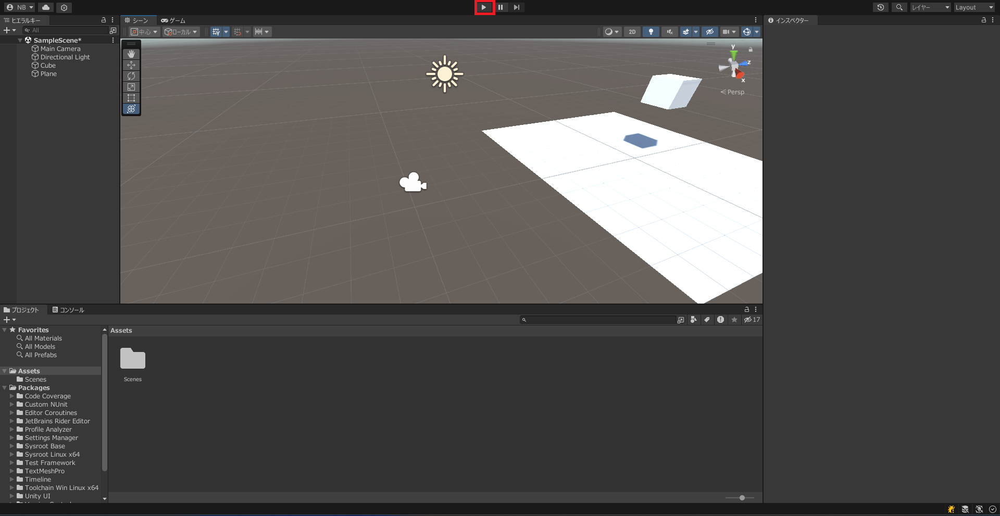

実行するとシーンビューがゲームビューに切り替わりカメラから見た画面に切り替わります。

しかし、ブロックが浮いたままの状態になっていることがわかります。

ゲームの実行状態を削除するには先ほどと同じ三角のボタンを押すことで終了できます。

## ゲームオブジェクトに重力を付ける

ゲームオブジェクトはコンポーネントという単位で動きや値を管理している。

今回はRigidbodyというコンポーネントを追加することで重力を追加することができる。

ゲームオブジェクトに重力を付けるには重力を付けたいオブジェクトのインスペクターウインドウから追加することが可能です。

今回はCubeに重力を付けたいのでCubeを選択してインスペクターウインドウを表示してください。
表示すると以下の画像のようになると思います。

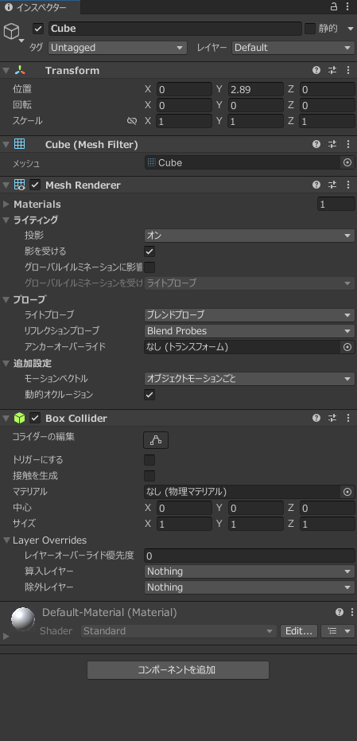

下にある「**コンポーネントを追加**」をクリックします。

コンポーネントを追加をクリックするとコンポーネントの一覧を表示することができる。

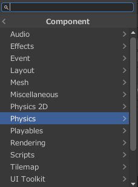

今回はPysicsを選択すると以下のような一覧が表示されます。
Pysicsは物理という意味なので物理演算に関するコンポーネントがまとめてあります。

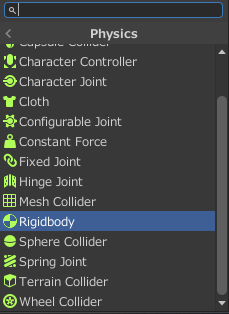

今回はRigidbodyをクリックしてください。
Rigidbodyをクリックすると物理演算を追加することが可能になります。

Rigidbodyを追加するとインスペクターウインドウは以下のようになります。

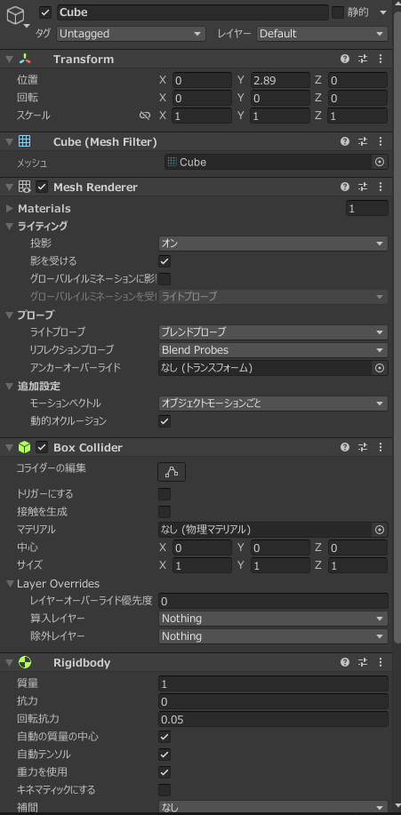

Rigidbodyの中身を詳しくみてみましょう。

Rigidbodyのパラメータはこのようになっています。

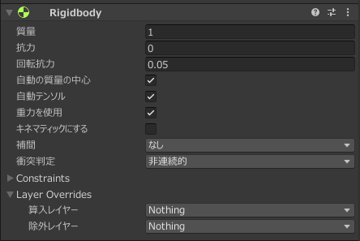

それぞれのパラメータの意味は以下のようになっています(一部抜粋)

|パラメータ名|意味|
|------------|----|
|質量(Mass)|物体の質量(kg単位)|
|効力(Drag)|力によって動く際に影響する空気抵抗|
|回転効力(Angular Drag)|力によって回転する際に影響する空気抵抗|
|重力を使用|重力を与えるかどうかを示す|
|自動の質量の中心|質量の中心地点を自動的に決める。チェックを外すと質量の中心地点をしてすることが可能である。|
|キネマティックにする|物理演算を無効にするか(チャックされていると無効化)|
|Constraints|回転や移動を制限する|

今回は初期値のままにしておいてください。

設定ができたので先ほどのように実行してみてください。

そうするとブロックが下に落下するように変わったと思います。

### ボールのオブジェクトを追加する

スフィアを追加して位置を(x,y,z)を(-0.4,1.5,0)にしてください。

その後先ほどと同様にRigidbodyを追加してください。

その後実行するとボールと四角形がぶつかる様子が見られると思います。

このように物理現象を再現することができるようになっています。

## マテリアル

マテリアルとはゲームオブジェクトの色や光沢などを指定することができるものです。

マテリアルを作成し、そのマテリアルをゲームオブジェクトに指定することで色を変えることが可能になっています。

今回説明しているマテリアルについてですがStandard Shaderについての説明になっています
### マテリアルの作成

プロジェクトウインドウの以下の画像の赤の四角で囲まれたアセットと書かれた部分を右クリックしてください。
アセットとはゲームなどを作る際に使用する部品のことを表しています。

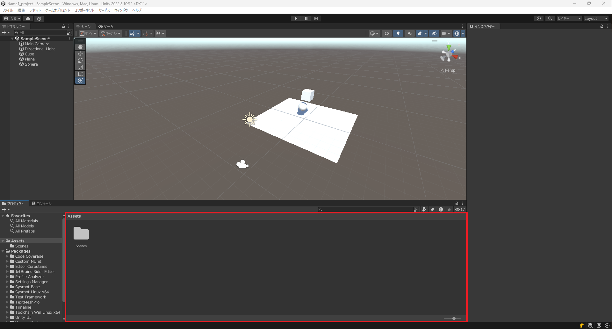

右クリックをすると以下のようなメニューが出るの作成を選択してマテリアルをクリックします。

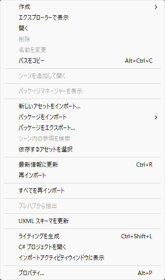

クリックすると以下のようにnew Materialが追加されるのでMaterial1と打って名前を変更してください。もし、名前が固定されてしまった場合には右クリック>名前を変更で名前を変更することが可能です。

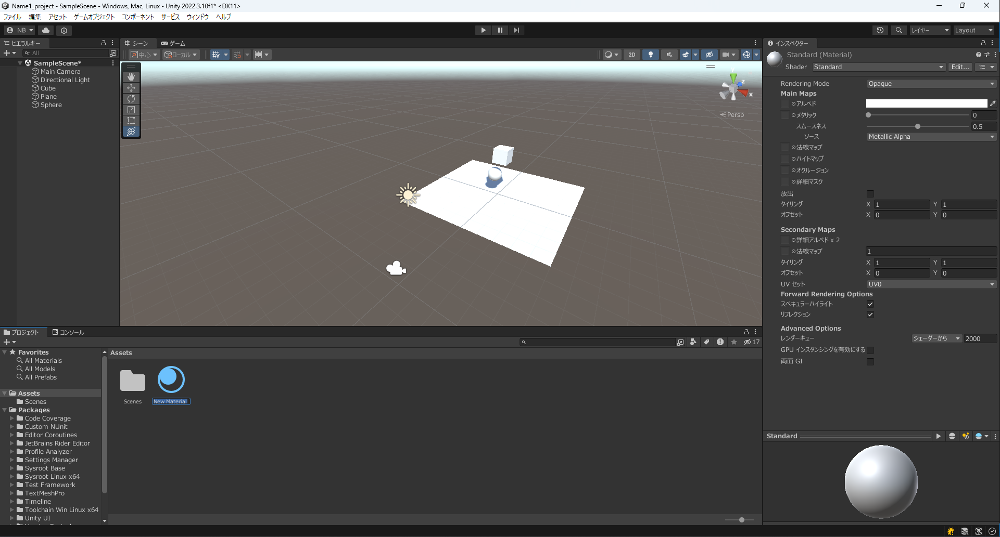

マテリアルを追加できるとMaterial1を選択してください
Material1を選択しインスペクターウインドウを見てください
マテリアルウインドウは以下のようになります。

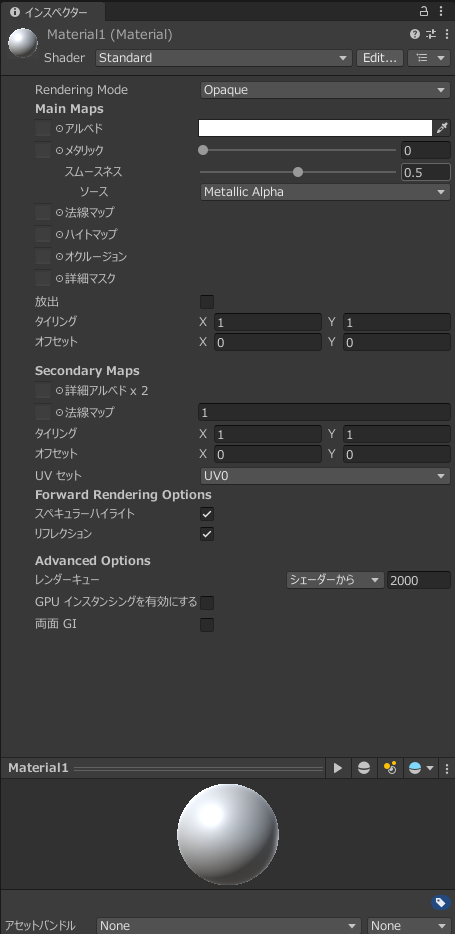

マテリアルの設定を一部説明します。
|パラメータ名|意味|
|------------|---|
|Rendering Mode|透明、半透明などが指定できます。|
|アルベド|マテリアルの色を指定できます|
|メタリック|光の反射の強さを示します。値が大きいほど反射が強くなります。|
|スムーネス|反射の強さを示します。|
|放出|発行させるかどうかを示します|
|タイミング|テクスチャなどを繰り返すことを指定します。|

マテリアルの色の変更

アルベドの横の四角をクリックすると以下のように色を選択することができる画面になるので好きな色に変更してください。

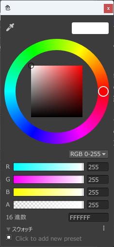

色を選択後、色を変更したいオブジェクトにマテリアルをドラッグアンドドロップしてください。

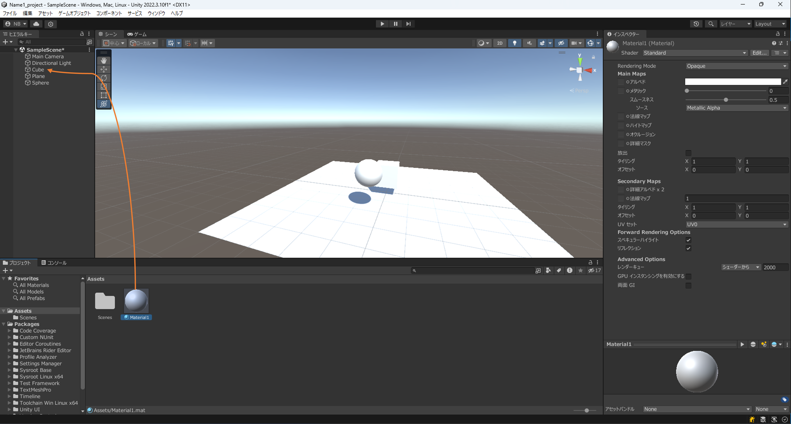

今回はCubeに赤色のマテリアルを指定した結果は以下のようになる。

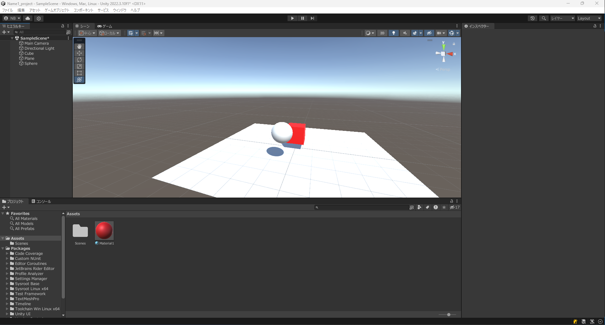

## テクスチャ

Unityではテクスチャはマテリアルに指定する形になっています。
マテリアルにテクスチャを追加する方法について説明していきます。

まず、マテリアルにテクスチャを指定するために画像をアセットに追加する必要があります。

以下の画像を右クリックを押して保存してください。

ダウンロードするとその画像を以下の赤の四角で囲まれた部分にドラッグアンドドロップしてください。

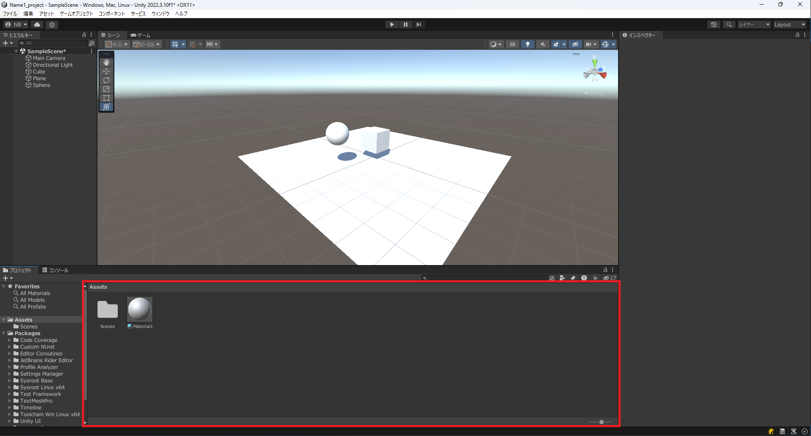

画像を追加すると再度マテリアルを選択し以下の画像の赤の四角で囲んでいる部分をクリックしてください。

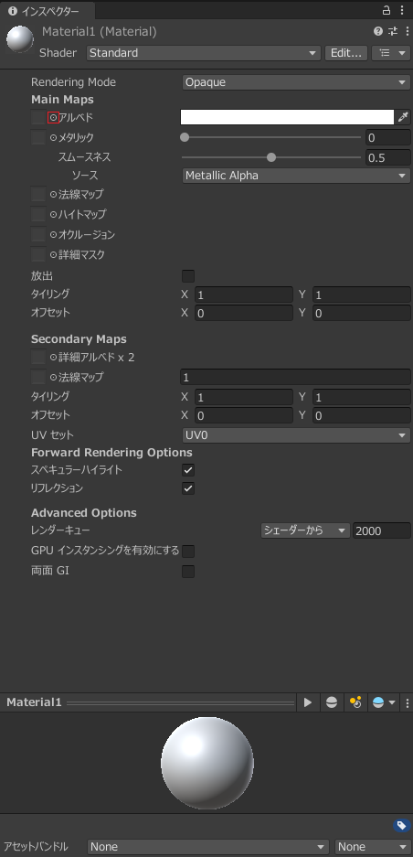

クリックすると以下のようなSelect Textureという画像を選択する画面が開きます。

その中から先ほど追加した画像を選択します。

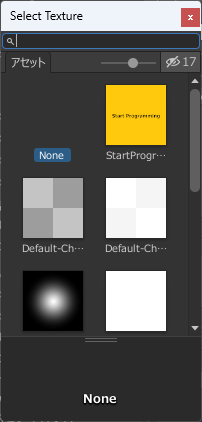

画像を選択するとこのようにマテリアルを設定したゲームオブジェクトの見た目が変わっていることが確認できると思います。

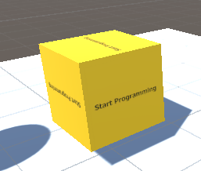