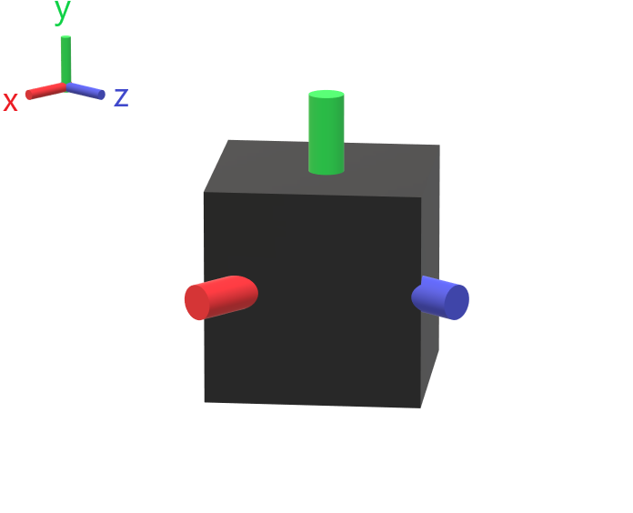

# Unity16:プログラムを使って物体を動かす

今までの学習である程度Unityの使い方を理解できたと思います。
この回からはどのようにプログラムを関連付けるのか、どのようにオブジェクトを動かすのかを学習します。

## Unityの座標関係

Unityの座標は以下の座標のように物体から見てx軸が前、y軸が上、z軸が左のようになっています。


しかし、物体の向きが変わってしまった場合物体から見る座標のワールドの二種類が存在します。


このような場合にはゲームオブジェクトから見た座標をワールド座標や相対座標といいます。

逆にゲームオブジェクトの向きを考えずにワールド座標で考えると以下のような図になります




## Scriptを作成する。

UnityはC#で動きなどを指定します。Unity内ではプログラムのことをスクリプトと呼んでいます。

スクリプトを作成するにはマテリアルと同様Assets内を右クリックし**作成>C# スクリプト**とクリックすることで追加することができます。

では`SampleScript`というファイルを作成してみましょう。

もし、異なる名前で保存された場合はファイルを右クリック>`名前を変更`で変更することができます。

ファイルができたのちファイルをダブルクリックするとVisual Studio(など)が起動します。

新しく作ったファイルには以下のようなコードが記述されています。

```cs
using System.Collections;
using System.Collections.Generic;
using UnityEngine;

public class SampleScript : MonoBehaviour
{
    // Start is called before the first frame update
    void Start()
    {
        
    }

    // Update is called once per frame
    void Update()
    {
        
    }
}

```

Startというメソッドは実行時に一度だけ実行されるメソッドです、

Updateは定期的に呼び出されるメソッドです。

Startは初期化や設定、Updateは更新という使い方が多くされます。

このほかにFixedUpdateというメソッドなどが使用できFixedUpdateは物理エンジンを使用した移動などの際に使用します。
また、FixedUpdateは基本的に一定間隔で実行されるため物体を移動させる時は基本的にFixedUpdate内に書いたほうが良いでしょう。今回はUpdate内に書いていますが、場面に応じて判断してください。

Unityでプログラムを書く上で気を付けることがあります。
それはメソッド内で無限ループや極端に長いループを書かないことです。　
無限ループなどを書くとクラッシュの原因になります。


### ゲームオブジェクトとスクリプトの関係

スクリプトはゲームオブジェクトに紐づけることができるようになっています。
このゲームオブジェクトにスクリプトを紐づけることをアタッチといいます。

アタッチする方法を説明します。

アタッチするにはゲームオブジェクトにスクリプトをドラッグアンドドロップします。

今回はCubeにSampleScriptをアタッチしてみましょう。

画像のようにスクリプトをドラッグアンドドロップします。


ドラッグアンドドロップした後
Cubeのインスペクターウインドウを見てみるとSampleScriptがアタッチされていることがわかります。


ここからスクリプトのアタッチ解除や今後説明するパラメータの設定ができるようになっています。

もし、二つのゲームオブジェクトにアタッチした場合でもそれぞれのプログラムでインスタンスが作成され、独立して動作します。


### 動かしてみよう。

Unityにはゲームオブジェクトを動かす方法が複数あります。

それぞれの動作と使い分けの違いなどを確認していきます。


#### transform.positionを使用する。
物体を動かすには対象のゲームオブジェクトのTransform型の値が必要になります。
Transformは物体の位置や方向などを指定するためのクラスです。
この変数はSampleScriptの派生元クラスに`transform`という変数として設定されています。

これは実行されているゲームオブジェクトの位置情報などを取得することができるようになっています。

この`transform`のメソッドを呼び出すことで位置を移動したり、方向を変えたりすることができます。


物体を動かすには二つの方法がありますが、簡単な`transform.position`の値を変える方法を説明します。

`transform.position`はx,y,z軸の座標Vecter3という型でpositionに保存されています。
これらの数値を変えることで位置を移動することができる。というものです。

では実際に動かしてみましょう。


以下のようにUpddateメソッドを書き換えてください

```cs
void Update()
{
    transform.position = transform.position + new Vector3(0.01f,0,0);
}
```

このプログラムはx軸方向に0.01mづつ一定の速度で移動します。

実行してみるとCubeが移動しているのを確認することができると思います。

しかし、これでは移動というより座標を0.01づつ動かしているだけなので移動というより、瞬間移動を連続で行っている状況に近くなります。
そのため、正しく動作しない可能性があります。
例えば移動速度を上げすぎると瞬間移動ですのであたるはずの壁を通り抜けてしまうなどの不具合が発生するかもしれません。

実際に以下のページより正しく動作しないことが確認できます。

[なぜRigidbodyオブジェクトをTransformで移動させてはいけないのか](https://qiita.com/soutarouzaurusu/items/ea32ed6338f9d1004d42)

##### コラム:transform.forwardとtransform.positionを使用する

`transform.forward`はtransformを持っているオブジェクトの前の向き(ゲームオブジェクトのローカル座標上のZ軸)を絶対座標のVector3型で調べることができます。
以下のように取得することができます。

```cs
Vector3型変数 = transform.forward.forward
```
なのでこのコードを使用すると

```cs
transform.position = transform.position + transform.forward;
```

のように指定することで前に進むことができます。

またtransform.forwardは前に1進むような値を持っているので距離3だけ進みたい場合は以下のように記述することで実現できます。

```cs
transform.position = transform.position + transform.forward * 3;
```

#### transform.Translateメソッドを使用する。

transform.positionは絶対座標を示しています。positionの値を変更することでゲームオブジェクトの場所を移動するようになっています。

transform.Translateメソッドを使用すると現在座標からどれだけ移動するか指定することが可能になっています。

transform.Translateの使用方法は以下のように使用することができます。

```cs
transform.Translate(Vector3の変数,Space);
```

また、以下のようにx,y,zを独立して指定することも可能です。

```cs
transform.Translate(x方向の移動量,y方向の移動量,z方向の移動量,Space);

```
Vector3の変数の値は現在の位置からどれだけ移動させるかの値を示します。
Spaceに指定できる値は以下の二種類になっています。

|値|指定する意味|
|--|------------|
|Space.Self|ゲームオブジェクトが向いている方向を基準に移動します。|
|Space.World|絶対座標を基準に移動します。|

このようにどこを基準にどれだけ動かすか指定できます。

ではUpdateメソッドを以下のように書き換え先ほどと同様に動作することが確認できると思います。

```cs
void Update()
{
    transform.Translate(new Vector3(0,0,0.01f),Space.World);
}
```

先ほどの通りx軸方向に移動することができるようになります。

また、以下のような記述も可能です

```cs
void Update()
{
    transform.Translate(0,0,0.01f,Space.World);
}
```

しかしながらtransform.positionと同様で瞬間移動を繰り返しているような動作なので正しく動作しない場合があります。

#### Rigidbody.positionを使用する

Trasformを使用すると移動することはできましたが、前述したように瞬間移動を繰り返していることになるので物理演算を適応させた場合正しく動かない可能性がありますので基本的にはRigidbody(物理演算)を追加しているゲームオブジェクトはTransformを使用してはいけません。

これを解決するのにRigidbody.positionを使用することで解決できます。


##### Rigidbodyを取得する。

Rigidbody.positionを使用するにはRigidbodyを取得する必要があります。

以下のようにRigidbodyを取得することができます。

```cs
Rigidbody 変数名 = GetComponent<Rigidbody>();
```

rigidbodyは一度取得すると何度も取得しなおす必要はないのでStartメソッドで取得するのが望ましいでしょう。

SampleScript.csを以下のように書くことでメンバ変数として値を取得することができるようになっています。

```cs
using System.Collections;
using System.Collections.Generic;
using UnityEngine;

public class SampleScript : MonoBehaviour
{

    Rigidbody rb; // 取得したStartメソッドで取得したRigidBodyを保存しておくための変数

    // Start is called before the first frame update
    void Start()
    {
        rb = GetComponent<Rigidbody>()
    }

    // Update is called once per frame
    void Update()
    {

    }
}

```

##### Rigidbody.positionで移動する。

Rigidbody.positionは以下のように動作させることが可能です。

```cs
Rigidbodyの変数.position = new Vector3(新しいx座標の位置,新しいy座標の位置,新しいz座標の位置);
```


以下のコードをコードを実行してみましょう

```cs
using System.Collections;
using System.Collections.Generic;
using UnityEngine;

public class SampleScript : MonoBehaviour
{

    Rigidbody rb; // 取得したStartメソッドで取得したRigidBodyを保存しておくための変数

    // Start is called before the first frame update
    void Start()
    {
        rb = GetComponent<Rigidbody>();
    }

    // Update is called once per frame
    void Update()
    {

    }

    void FixedUpdate(){
        rb.position = rb.position + new Vector3(0.05f,0,0); 
    }
}
```

このコードを実行すると先ほどほぼ同様の動きをしますが、よく見ると少し摩擦を受けたような動きをすると思います。このように物理演算をしていることがわかると思います。

このプログラムが先ほどと大きく異なる点はUpdate内ではなくFixedUpdate内で処理を書いていることが大きな違いの一つだと思います。
FixedUpdateは物理演算をする際に呼び出されるメソッドです。Updateでも動作はしますが、正しく動作しない可能性がありますのでRigidbodyを使用する際はFixedUpdateを使用してください。

#### Rigidbody.AddForceメソッドを使用する

AddForceメソッドは先ほどのpositionのパラメータを変える動作とは異なり、ゲームオブジェクトに力を加えることで動き追加します。

ではAddForceメソッドを実際に使ってみましょう。

AddForceメソッドは以下のように使用することができます

```cs
Rigidbodyの変数.AddForce(Vector3型の各方向への力,力の加え方);
```

第二引数の力の加え方には4つの種類があります。
これはForceModeというEnum型で表現されています。
それぞれ以下のようなプロパティがあります。

|値|意味|
|----|-------------|
|ForceMode.Force|力(N)を与えることをシミュレーションします。|
|ForceMode.Acceleration|加速度($m/s^2$)として力を与えます。|
|ForceMode.Impulse|力積(N/s)として力を与えます。衝突や打撃を与える際に役に立ちます。|
|ForceMode.VelocityChange|入力された値の速度(m/s)を現在の速度に追加します。|

このようにそれぞれのForceModeの使い方で動作が異なるので場面に応じて使い分けてください。

また、AddForceもTranslateと同様x,y,z座標を個別に指定することも可能です。

```cs

Rigidbodyの変数.AddForce(x方向のパラメータ,y方向のパラメータ,z方向のパラメータ,力の加え方);
```

また、Vector3やx,y,zの値は絶対座標で表現されます。
なのでブロックがどの方向を向いていても同じ方向に力を与えます。


今回は動作がどのように変わるかわかりやすくするためにCubeのインスペクターウインドウからY座標4にしてください。
ブロックの動きがわかりやすいようにPlaneのスケールをx=5,y=5,z=5にしてください。

今回は物体を一定の速度で動かすために、FoceModeはvelocityChangeを使用します。

実際の動きのように最初はゆっくりと動かしたい場合はForceMode.Forceなどを使用するようにしましょう。

その後以下のようにコードを書き換えてください。

```cs
using System.Collections;
using System.Collections.Generic;
using UnityEngine;

public class SampleScript : MonoBehaviour
{

    Rigidbody rb; // 取得したStartメソッドで取得したRigidBodyを保存しておくための変数
    // Start is called before the first frame update
    void Start()
    {
        rb = GetComponent<Rigidbody>()
        
    }

    // Update is called once per frame
    void Update()
    {

    }

    void FixedUpdate()
    {
        float targetSpeed = 3.5f; 
        float speed = rb.velocity.x;
        rb.Force(targetSpeed - speed, 0, 0, ForceMode.VelocityChange);
    }
}
```

実際に動かしてみると先ほどと異なりCubeが転がるようにして動作すると思います。

このように物理演算を加味した上で動作させることができました。

FixedUpdate内では速度の指定のプログラムが記述されています。

`targetSpeed`で目標とする速度を指定します。

次の行の

```
speed = rb.velocity.x
```

でx軸方向の現在の速度を取得することができます。

その後`targetSpeed - speed`で追加する速度を計算し`rb.Force()`で力を与えます。

このように力を加えることで移動することができるようになっています。

また、ForceのForceModeがImpulseであった場合は瞬間的な処理のため、Updateメソッドで呼び出しても他の物理演算に影響しないため大丈夫です。

#### Rigidbody.AddRelativeForceメソッドを使用する

Rigidbody.AddRelativeForceの使用方法はRigidbody.AddForceの使用方法と基本的に同じですが、AddRelativeForceはローカル座標(相対座標)なのに対しRigidbody.AddForceは絶対座標(ワールド座標)です。

その他に大きな違いはありません。

### 回転してみよう

回転させる方法も移動と同様に複数あります。
複数あるのでよく使われると思うものに絞って紹介します。

今回はy軸を軸として回転させてみます。

回転する前に重力などが働くと動作がわかりにくいのでCubeのRigidbodyの`重力を使用`のチェックを外してください。


#### transform.localEulerAngles

transform.localEulerAnglesは現在のゲームオブジェクトの向きを保存したプロパティです。transform.localEulerAnglesを取得・再設定することでゲームオブジェクトを回転することができます。
transform.localEulerAnglesはVector3型で指定することができます。

ゲームオブジェクトから見てのy軸を軸に45度に回転させるには以下のようになコードで実現可能です。

```cs
transform.localEulerAngles = new Vector(0,45,0);
```

何かの条件を満たした際に向きを変えるなどに使用可能です。

1度ずつ回転させるには以下のようなコードで実行可能です。

```cs
using System.Collections;
using System.Collections.Generic;
using UnityEngine;

public class SampleScript : MonoBehaviour
{
    // Start is called before the first frame update
    void Start()
    {
        
    }

    // Update is called once per frame
    void Update()
    {
        transform.localEulerAngles = transform.localEulerAngles + new Vector3(0,5,0);
    }
}
```

transform.localEulerAnglesで取得された値にさらに1度回転させる値を追加させることで回転し続けることができます。


#### transform.rotation

transform.rotationはQuaternion型のプロパティになっています。
Quaternionは現在のゲームオブジェクトの向きや回転に関する情報を一元に管理しています。

多くのことが可能ですが、難しいので今回は角度を指定した向きの変え方を説明します。

以下に先ほどと同様にy軸を軸に45度に向けるプログラムです。

```cs
Quaternion moveQuaternion = Quaternion.Euler(0,45,0);
transform.rotation = moveQuaternion;
```

また、一度づつ回転するプログラムは以下の通りなります。

1度ずつ回転させるには以下のようなコードで実行可能です。

```cs
using System.Collections;
using System.Collections.Generic;
using UnityEngine;

public class SampleScript : MonoBehaviour
{
    // Start is called before the first frame update
    void Start()
    {
        
    }

    // Update is called once per frame
    void Update()
    {
        transform.rotation = transform.rotation * Quaternion.Euler(0,1,0);
    }
}
```

transform.localEulerAnglesとほぼ同じように見えますが`+`であった部分は`*`になります。


Quaternion型では今までの角度に新しい角度を追加するときは行列の掛け算として扱われるため注意してください。
行列については詳しく記述しませんが、**掛け算する順番で意味が変わってきます。**
```
現在の座標 * 移動させた量
```
であればローカル座標となります。

逆に
```
移動させたい量 * 現在の座標
```
であればワールド座標となります。
回転させる際はしっかりと確認するようにしてください。

#### Rigidbody.rotation

RigidbodyはlocalEulerAnglesに当たるものがありません。
そのため、transform.rotationと同じようにRigidbodyでも指定する必要があります。

以下のように回転することができます。


```cs
Quaternion moveQuaternion = Quaternion.Euler(0,45,0);
rigidbodyの変数.rotation = moveQuaternion;
```

当然ですがrigidbodyの変数は先に取得しておく必要があります。


```cs
using System.Collections;
using System.Collections.Generic;
using UnityEngine;

public class SampleScript : MonoBehaviour
{
    Rigidbody rb;
    // Start is called before the first frame update
    void Start()
    {
        rb =  GetComponent<Rigidbody>();
    }

    // Update is called once per frame
    void Update()
    {
        
    }
    
    void FixedUpdate(){
        rb.rotation = rb.rotation * Quaternion.Euler(0,4,0);
    }
}
```

基本的に使い方は同様です。


#### Rigidbody.AddTorqueメソッドを使用する。

回転も移動と同様にRigidbodyを適応していると力を加えることが可能になっています。

使用方法は基本的にRigidbody.AddForceと同様でワールド座標(絶対座標)を基準に回転させる力を与えます。

メソッドのパラメータも基本的にはAddForceメソッドと同じ形になっています。

以下のように記述可能です。

```cs
Rigidbodyの変数.AddToraue(Vector3型の各方向への力,力の加え方);
```

力の与え方についてもAddForceのForceModeと同様になっています。

また、AddForce同様x,y,z軸を軸にする力を個別に指定することも可能です。

```cs
Rigidbodyの変数.AddToraue(x軸のパラメータ,y軸のパラメータ,z軸のパラメータ,力の加え方);
```


では以下のコードを記述し動作を確認してみましょう。

```cs
using System.Collections;
using System.Collections.Generic;
using UnityEngine;

public class SampleScript : MonoBehaviour
{
    Rigidbody rb;
    // Start is called before the first frame update
    void Start()
    {
        rb = GetComponent<Rigidbody>();
    }

    // Update is called once per frame
    void Update()
    {

    }

    void FixedUpdate()
    {
        float targetSpeed = 3.5f;
        float speed = rb.angularVelocity.y;
        rb.AddTorque(0, targetSpeed - speed, 0, ForceMode.VelocityChange);
        
    }
}
```

このコードについてもAddForceのコードとほぼ同様でRigidbody.angularVelocityでワールド座標基準で各軸の回転する速度が取得できるのでその速度になるように速度を与えるという挙動になっています。

またAddForce同様に相対座標で回転する力を与えるAddRelativeTorqueというメソッドもあります。
これはAddForceとAddRelativeFoceの関係性と同じで、使用方法もAddTorqueと同様です。

