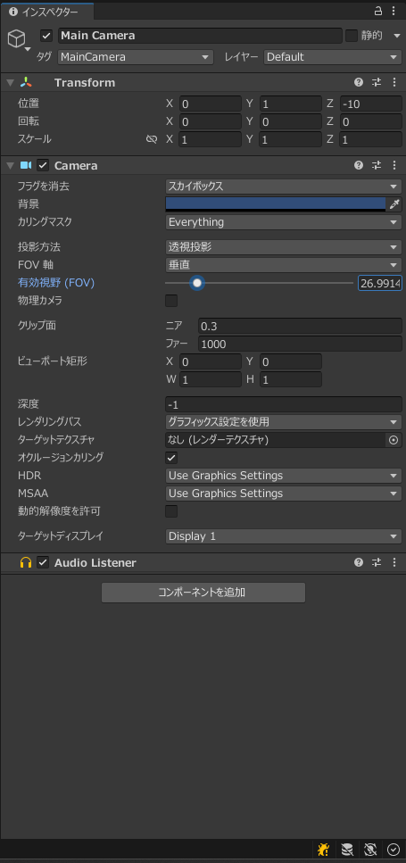

# Unity17:カメラの動作とキー入力を理解しよう

Unityにはカリキュラム14の説明にもあったようにカメラというゲームオブジェクトがあったと思います。
今回はそのカメラとキー入力について説明していきます。
## キー入力

Unityはキーボードからの入力を受け取りその入力に応じて処理を変えることが可能です。

### キー入力の状態

まずキーボードには3つの状態があります。

1. キーが押された瞬間
2. キーが押されている間
3. キーが離された瞬間

これらの3つの状態を取得しそれらの状況に応じて処理を変えたりすることができます。

Unityではこれら3つの状態であるかを確認するメソッドが存在します。

#### キーが押された瞬間

キーが押された瞬間はInputクラスのstaticメソッドであるGetKeyDownメソッドで取得することができます。
このメソッドはキーが押されて最初に呼び出されたUpdate内だけでTrueを返しそれ以外の場合にはFalseを返すというメソッドです。
そのため基本的にUpdateメソッド内で使用してください。
```cs
Input.GetKeyDown(KeyCode);
```

KeyCodeで指定されたキーが入力された場合にtrue、それ以外の場合にfalseを返します。そのため以下のようにif文内に直接記述可能です。

```cs
if(Input.GetKeyDown(KeyCode.W))
{
    // Wキーが押された瞬間の処理
}
```

KeyCodeについては以下のリンクより確認可能です

[KeyCode](https://docs.unity3d.com/ja/2023.2/ScriptReference/KeyCode.html)


#### キーが押されている間

UnityではKeyが押されていることを確認するメソッドとしてInputクラスのGetKeyメソッドで調べることが可能です。

使用方法はほとんどInput.GetKeyDownメソッドと変わりませんが、このメソッドは押されているかどうかの確認をするメソッドなのでUpdateメソッド以外でも使用可能です。

以下のように記述することで現在KeyCodeのキーが押されているかをbool型で取得することができるようになっています。

```cs
Input.GetKey(KeyCode);
```

KeyCodeについてもキーが押された瞬間のKeyCodeと同様です。

#### キーが離された瞬間

Unityでキーが押された瞬間を確認する方法はInputクラスのstaticメソッドであるInput.GetKeyUpメソッドを使用することで確認できます。
このメソッドについてもGetKeyDownメソッドとは逆にキーが離された瞬間trueを返し、それ以外の場合にfalseを返すメソッドです。GetKeyDownと同様Updateメソッドで使用するようにしてください。

書き方については以下のようになっています

```cs
Input.GetKeyUp(KeyCode);
```

KeyCodeについてはGetKeyUpとGetKeyと同様となっています。

## カメラ

カメラはUnityのワールドをユーザ目線の役割を果たしています。
カメラの動きなどによってユーザに見える物体が変わってきます。

今回はそのカメラの設定及び動きについて確認していきます。

### カメラの設定

カメラのインスペクターウインドウを開くと以下のようになっています。



多くの設定がありますが、今回は中でもわかりやすく使うことが多い部分について説明します。

|項目|意味|
|----|----|
|フラグを消去|物体がない背景の部分の描画方法を指定します。標準ではスカイボックスになっていますが、単色に指定したい場合はソリッドカラーを指定します。|
|背景|背景はUnityが描画する前に一番最初に指定される色です。フラグを消去をソリッドカラーに指定していた場合にこの色の背景になります。|
|FOV軸|有効視野を指定する際に基準にする画面の大きさを垂直にするか水平にするか指定できます。ただし、水平に指定しても画面の大きさが変わると変わってしまうので垂直にするか専用のスクリプトを記述する必要があります。|
|有効視野|視野の角度を示します。大きいほど広い範囲が見えます。|
|物理カメラ|この項目をチェックすると物理カメラのような設定が表示され物理カメラのように細かい設定をすることができ量になります。|
|グリップ面 ニア|カメラに写る一番近い距離を指定しています。この値よりも近い位置にある物体はカメラに写りません|
|グリップ面 ファー|カメラに写る最長の距離を示しています。この距離よりも遠い位置にある物体はカメラに移りません|


### カメラを操作できるようにする。

カメラはカリキュラム16で説明した通りGameObjectです。
そのためスクリプトを指定して動きを作成することができます。

では今回は`MoveCamera`というスクリプトを作成し、MainCameraにアタッチしましょう。

その後このコードを記述し実際にカメラを動かせることを確認してください。

```cs


```


## 問題

カリキュラム15と今回の内容を使用してキーを押している間にそれぞれ以下の表に書かれた通りにMainCameraが動作をするようにMoveCameraスクリプトを記述してください。
また、カメラを移動する際には`Transform.Translate`メソッドを使用し、向きを変える場合には`Transform.rotation`を使用してください。
今回はUpdate内ではなくFixedUpdate内に記述するようにしてください。


|キー名|KeyCode|動作|
|-----|-------|-----|
|Wキー|KeyCode.W|カメラから見て前に0.1進む|
|Aキー|KeyCode.A|カメラから見て左に0.1進む|
|Dキー|KeyCode.D|カメラから見て右に0.1進む|
|Sキー|KeyCode.S|カメラから見て後ろに0.1進む|
|左シフトキー|KeyCode.LeftShift|カメラから見て下に0.1下がる|
|スペースキー|KeyCode.Space|カメラから見て上に0.1上がる|
|左矢印キー|KeyCode.LeftArrow|ワールドから見て左に2度回る|
|右矢印キー|KeyCode.RightArrow|ワールドから見て右に2度回る|
|上矢印キー|KeyCode.UpArrow|カメラから見て上に2度回る|
|下矢印キー|KeyCode.UpArrow|カメラから見て下に2度回る|

<details><summary>解答例</summary>

MoveCameraのソースコード
```cs
using System.Collections;
using System.Collections.Generic;
using System.Diagnostics.Tracing;
using UnityEngine;

public class MoveCamera : MonoBehaviour
{
    // Start is called before the first frame update
    void Start()
    {
        
    }

    // Update is called once per frame
    void FixedUpdate()
    {
        if (Input.GetKey(KeyCode.W))
        {
            transform.Translate(new Vector3(0, 0, 0.1f),Space.Self);
        }
        if (Input.GetKey(KeyCode.A))
        {
            transform.Translate(new Vector3(-0.1f, 0, 0), Space.Self);
        }
        if (Input.GetKey(KeyCode.D))
        {
            transform.Translate(new Vector3(0.1f, 0, 0), Space.Self);
        }
        if (Input.GetKey(KeyCode.S))
        {
            transform.Translate(new Vector3(0, 0, -0.1f), Space.Self);

        }
        if (Input.GetKey(KeyCode.Space))
        {
            transform.Translate(new Vector3(0, 0.1f, 0), Space.Self);

        }

        if (Input.GetKey(KeyCode.LeftShift))
        {
            transform.Translate(new Vector3(0, -0.1f, 0), Space.Self);

        }

        if (Input.GetKey(KeyCode.LeftArrow))
        {
            transform.rotation = Quaternion.Euler(0, -2, 0) * transform.rotation ;

        }
        if (Input.GetKey(KeyCode.RightArrow))
        {
            transform.rotation = Quaternion.Euler(0, 2, 0) * transform.rotation ;

        }
        if (Input.GetKey(KeyCode.UpArrow))
        {
            transform.rotation = transform.rotation * Quaternion.Euler(-2, 0, 0) ;

        }
        if (Input.GetKey(KeyCode.DownArrow))
        {
            transform.rotation = transform.rotation * Quaternion.Euler(2, 0, 0);

        }
    }
}

```

</details>
