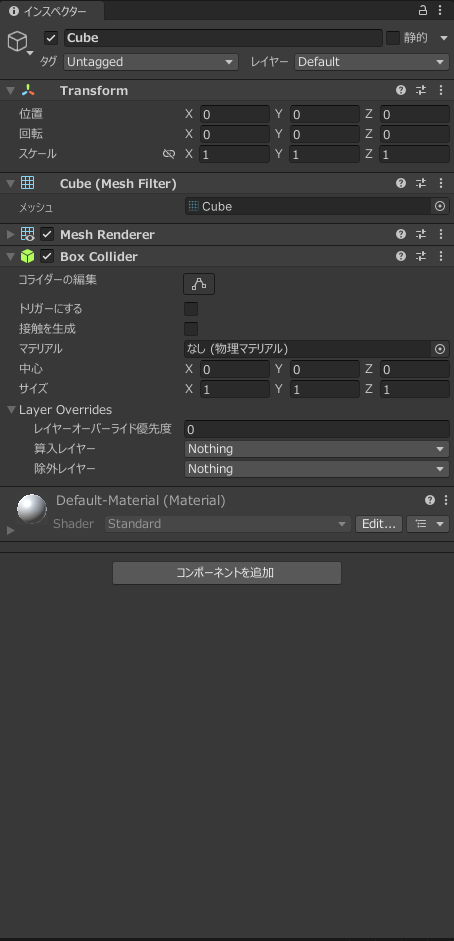
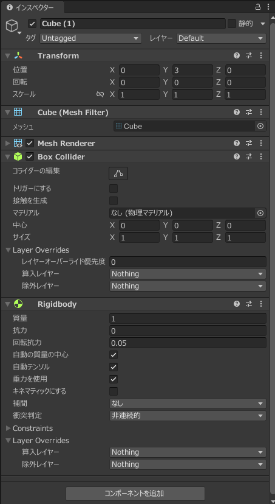
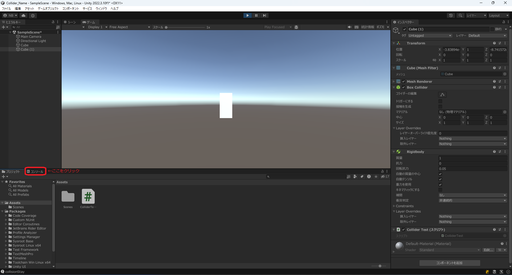
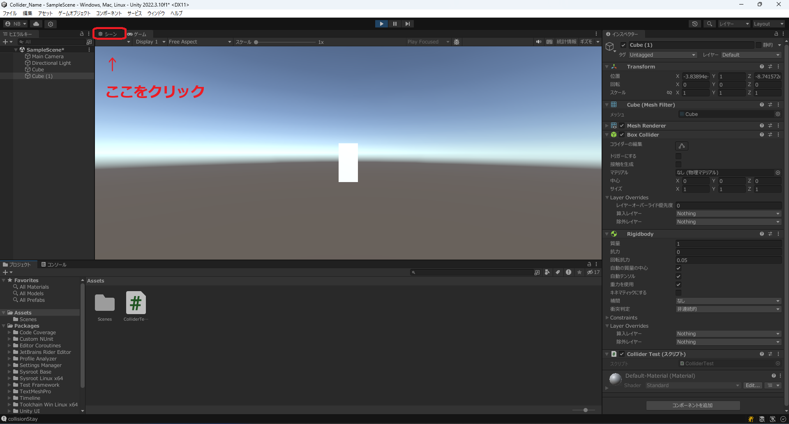
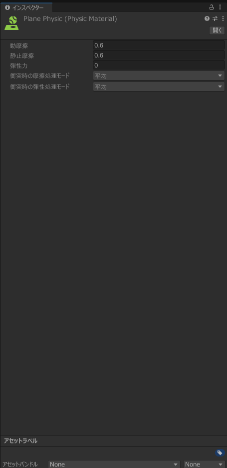

# Unity18:物に当たったときに処理をさせよう

今までUnityでは物体とぶつかると当然のように当たり判定がありましたが、
どのように当たり判定を付けるのか、物体が接触及び通過したの処理について説明します。

## 当たり判定を付ける

CubeやSphereなどのゲームオブジェクトにはもともと当たり判定があったので意識することがありませんでしたが、実は`〇〇 Collider`というコンポーネントが追加されています。〇〇の部分には物体の形を示します。

Colliderには以下のような種類があります。

|種類|意味|
|----|----|
|Cube Collider|四角形の当たり判定|
|Capsule Collider|カプセル型の当たり判定|
|Mesh Collider|メッシュという形状を示すデータから当たり判定を作る|
|Sphere Collider|球体の|
|Terrain Collider|地形に使用する当たり判定|
|Wheel Collider|車などのタイヤに使用する当たり判定|

Mesh Colliderは基本的にどんな形でも作成できますがメッシュというデータが必要です。

今回は最もシンプルなCube Colliderのコンポーネントを確認してみます。


それぞれの要素について以下のようになっています

|要素|意味|
|----|----|
|トリガーにする|チェックすると物体が通り抜けるようになり、通り抜けるときにプログラムに通知することができます。|
|マテリアル|物理的な特性(摩擦や弾性力など)を指定できます|
|中心|当たり判定の中心を示します|
|サイズ|ゲームオブジェクトのサイズを1としたときの各方向のサイズ|

また、物体に当たり判定を付けるときにはぶつかる物体が両方ともColliderが追加してある必要があります。

## 物体が当たったことを調べる。

今回は新しいプロジェクトを`Collider_名前`という名前で作成しましょう。
作成方法についてカリキュラム14の作成方法を確認してください。

その後Cubeを二つ設置しそれぞれ以下のように設定してください。

Cubeは0,0,0の位置に大きさはそのままで配置します。
詳しい設定は以下の画像の通りです。



Cube (1)は0,3,0の位置に大きさはそのままでRigidbodyを付け重力を有効にしてください。詳しい設定は以下の画像の通りです。




それぞれColliderの設定のトリガーにするのチェックが入ってないことを確認してください。

Colliderで検知できる接触の状態は接触した瞬間と接触中と接触されなくなった瞬間の三種類です。

それぞれ指定されたメソッドを書くことでその状態になった際にそれぞれのメソッドが呼び出されます。

|メソッド|意味|
|--------|----|
|void OnCollisionEnter(Collision collision)|接触した瞬間に呼び出されるメソッド|
|void OnCollisionStay(Collision collision)|接触している間に呼び出されるメソッド|
|void OnCollisionExit(Collision collision)|接触しなくなった瞬間に呼び出されるメソッド|

実際に動作を確認するためにColliderTestというスクリプトを作成し以下のようにコードを記述してください。

```cs
using System.Collections;
using System.Collections.Generic;
using Unity.VisualScripting;
using UnityEngine;

public class ColliderTest : MonoBehaviour
{
    // Start is called before the first frame update
    void Start()
    {
        
    }

    // Update is called once per frame
    void Update()
    {
        
    }

    void OnCollisionEnter(Collision collision)
    {
        Debug.Log("collisionEnter");
    }
    void OnCollisionStay(Collision collision)
    {
        Debug.Log("collisionStay");
    }
    void OnCollisionExit(Collision collision)
    {
        Debug.Log("collisionExit");
    }
}
```

コードが記述できたらCube(1)にアタッチしてください

アタッチできたら画像で赤い四角で囲ったコンソールというところをクリックしログの出力を見えるようにします。



その後実行してみてください

すると
```
collisionEnter
collisionStay
collisionStay
collisionStay
collisionStay
・
・
・
```

のように一度だけcollisionEnterが呼ばれていることがわかります。

その後離れた時の挙動を確認するために赤い四角で囲ったシーンというところをクリックしてください。



クリックするとシーンウインドウに移動するのでCube(1)を選択しY座標を10に動かしてみるとcollisionExitが呼び出されていることがわかると思います。


### コードの説明

```
Debug.Log(変数や定数);
```

を使用することでコンソールに値を出力することができます。

それぞれのメソッドの引数になっているCollision型の変数については、衝突したもう一つのオブジェクトについての情報を取得することができるようになっています。

詳しい内容は以下のリンクにありますが、相手のrigidbodyやtransformを取得することができるようになっています。

[Collision](https://docs.unity3d.com/ja/2020.3/ScriptReference/Collision.html)

## 物体が通過したとき

物体が通過したことを感知するには**トリガーにする**をチェックしてください。

これをすることで物体が通り抜けるようになります。


triggerで検知できる接触の状態は接触した瞬間と重なってる間と接触されなくなった瞬間の三種類です。

それぞれ指定されたメソッドを書くことでその状態になった際にそれぞれのメソッドが呼び出されます。

|メソッド|意味|
|--------|----|
|void OnTriggerEnter(Collider collider)|接触した瞬間に呼び出されるメソッド|
|void OnTriggerStay(Collider collider)|重なっている間に呼び出されるメソッド|
|void OnCollisionExit(Collision collision)|接触しなくなった瞬間に呼び出されるメソッド|

では実際の動作を確かめるために、先ほどのCollisionTestのコードを以下のように書き換えてください

```cs
using System.Collections;
using System.Collections.Generic;
using Unity.VisualScripting;
using UnityEngine;

public class ColliderTest : MonoBehaviour
{
    // Start is called before the first frame update
    void Start()
    {
        
    }

    // Update is called once per frame
    void Update()
    {
        
    }
    void OnTriggerEnter(Collider collider)
    {
        Debug.Log("triggerEnter");
    }
    void OnTriggerStay(Collider collider)
    {
        Debug.Log("triggerStay");
    }
    private void OnTriggerExit(Collider other)
    {
        Debug.Log("triggerExit");

    }
}
```

コードを書き換えるとプロジェクトウインドウをコンソールに変更し、実行してみてください。
実際に動かしてみると上のCube(1)が下のCubeを貫通していることが確認できます。

そして以下のような出力がコンソールにされると思います。

```
triggerEnter
triggerStay
triggerStay
・
・
・
triggerStay
triggerStay
triggerExit
```

このように現在の状態を調べることができるようになっています。

triggerの使用用途としてはチェックポイントの作成や、回復ポイントの作成、水の再現といった使用用途があると思います。

## 物理的な特性を変更する

### 各種ゲームオブジェクトの設定

摩擦について確認するために平面(Plane)を追加してください。
位置は0,-0.5,0でスケールは5,1,5にしてください。
その後BlackMaterialというマテリアルを作成しアルベドを黒に設定してPlaneにアタッチしてください。
詳しいやり方の説明はカリキュラム15を確認してください。

先ほどのCubeとCube(1)の位置を変更します。

Cubeの位置は1,0,0に移動しRigidbodyを追加してください。

Cube(1)の位置は-1,0,0に移動しColliderの`トリガーにする`のチェックを外してください。

配置が完了するとゲームウインドウで見ると以下のようになっていると思います。


### コードの作成

その後AddSpeedというスクリプトを追加し以下のようなコードを記述してください。


```cs
using System.Collections;
using System.Collections.Generic;
using UnityEngine;

public class AddSpeed : MonoBehaviour
{
    // Start is called before the first frame update
    void Start()
    {
        Rigidbody rb = GetComponent<Rigidbody>();
        rb.AddForce(new Vector3(100, 0, 0), ForceMode.Acceleration);
    }

    // Update is called once per frame
    void Update()
    {
        
    }
}
```

このコードは最初にx方向位に100の加速度を与えるというコードになっています。

このAddSpeedスクリプトはそれぞれCubeとCube(1)にアタッチしてください。


### 物理マテリアルの追加

物理マテリアルは摩擦や弾性力などを定義しているファイルです。
マテリアルは見た目を指定するものでしたが、今回は物理的な特性を指定するものになります。

まず、初めにPlaneの物理マテリアルの作成を行います。

Assetsの部分を右クリックしメニューを表示します。


メニューの作成をクリックすると以下のように表示されるので赤い四角で囲まれた物理マテリアルという部分をクリックしてください。


すると物理マテリアルの名前を設定できるようになるので`PlanePhysics`と名前を変更してください。

その後PlanePysicsをクリックするとインスペクターウインドウは以下のように表示されます。



それぞれの項目については以下のようになっています

|項目|意味|
|----|----|
|動摩擦|動いているときに働く摩擦|
|静止摩擦|止まっている状態から動きだすのにかかる摩擦|
|弾性力|物がぶつかった際にどれだけ反発するか|

このようになっています。

静止摩擦力と動摩擦力については接している物体との合計になるので今回はCube自体にかける摩擦の違いを確認しておきたいので、動摩擦と静止摩擦を0.05にしてください。

その後作成したPlanePhysicという物理マテリアルを適応させる必要があります。
ドラッグアンドドロップでスクリプトと同じようにアタッチできるのですが今回は丁寧に説明していきます。

まず、対象の物理マテリアルを適応したいゲームオブジェクトをクリックしインスペクターウインドウを表示します。今回はPlaneなのでPlaneのインスペクターを表示します。

物理マテリアルはColliderに適応します。
Coliderのマテリアルの部分に物理マテリアルを追加します。Sのマテリアルの部分に物理マテリアルを追加します。


赤い四角で囲んだ部分をクリックすると追加できる物理マテリアルの一覧が表示されます。
この中から適応したい物理マテリアルを追加します。


今回はPlanePhysicを選択します。

このような手順で物理マテリアルを適応することができます。

#### Cubeにも適応する

Cubeにも同様の手順で物理マテリアルを適応します。

まずCubeに対しては
CubePhysicという物理マテリアルを作成し、動摩擦・静止摩擦それぞれを0.3にしてCubeにアタッチしてください。

Cube(1)に対しては
CubePhysic1という物理マテリアルを作成し、動摩擦・静止摩擦をそれぞれ0.6にしてCube(1)にアタッチしてください。

実行すると以下のように移動する距離が異なることがわかると思います。
このように摩擦を再現することが可能です。


## やってみよう

弾性力については反発する力を表しているのでAddSpeedスクリプトを無効化したのちCubeとCube(1)にそれぞれ異なる弾性力を与え高さ3から落とすとどうなるかを試し弾性力について確認しよう。