# Unity19:prefabとゲームオブジェクトのコピー

今までのカリキュラムではゲームオブジェクトの追加は基本的に人の手で行ってきましたが、今回は元あるゲームオブジェクトを任意のタイミングでコピーする方法について学習する。

prefabを使用するとprefabから作成したオブジェクトを一緒に編集することが可能である。

## ゲームオブジェクトをまとめて扱う

prefabを使用する前に複数のゲームオブジェクトを一つにまとめる方法を説明します。

ゲームオブジェクトは親子関係を持たせることができます。

今回は空のオブジェクトを追加して確認していきます。

ヒエラルキーウインドウを右クリックし空のオブジェクトを追加してください。
名前はObjects1にしてください。

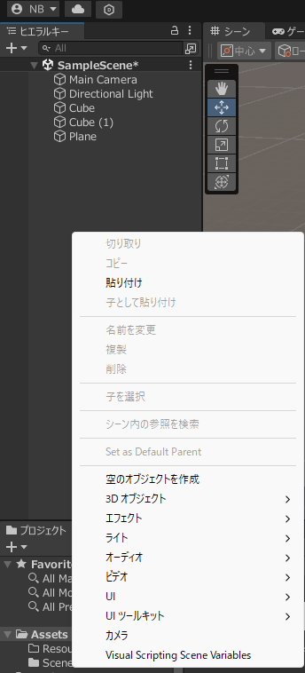


その後Objects1を右クリックし、Cubeを追加してください。

すると画像のようにObjects1にCubeが入った状態になると思います。


この状態はObjects1にCubeが含まれている状態であり
Objects1のCubeから見るとObjectsが親要素になっています。
この関係はパソコンのファイルやフォルダと近い関係になっています。

Objects1にさらにSphereを追加してみましょう。

Sphereを追加した状態では以下のようになります。

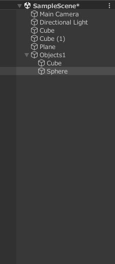

ゲームオブジェクトに親がある状態だと子要素の位置の情報は親の要素の中心位置とした相対位置になります。

今回はCubeの位置を1,0,0にSphereの位置を-1,0,0に指定してください。

設定ができるとObjects1の座標を0,0,-3に設定してみてください。
そうすると子要素のCubeとSphereが一緒に移動していることがわかると思います。

正しく移動できると以下の画像のようになると思います。

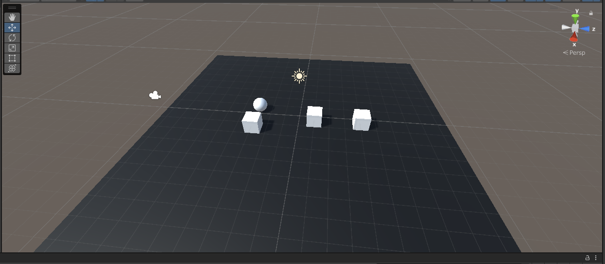

## prefabとは

prefabには大きく分けて二つの機能があります。

一つ目はGameObjectの状態を複数のGameObjectで共有できる機能になっています。

二つ目はワールド中にないゲームオブジェクトを動的(プログラム実行中に)追加することが可能にするという機能です。


### prefabの作成

prefabを使用するにはprefabを作成する必要です。
作り方はヒエラルキーウィンドウにあるprefabにしたいゲームオブジェクトをプロジェクトウインドウのAssetsにドラッグアンドドロップすることで作成することができます。

今回はObject1なのでObject1をAssetsにドラッグアンドドロップします。

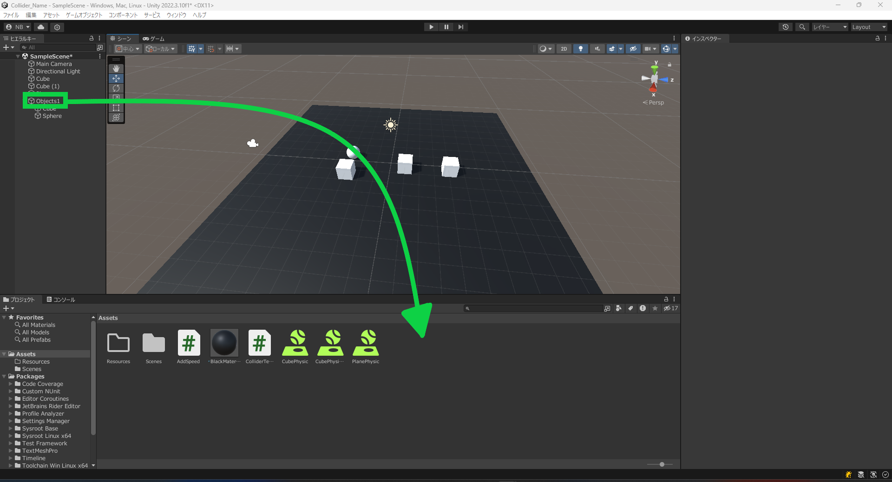

ドラッグアンドドロップしprefabが作成されると以下のようになります。

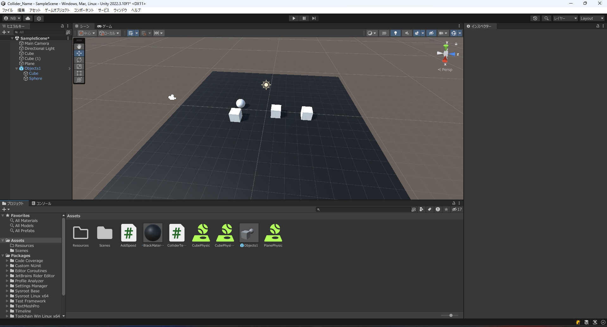

AssetsにObjects1ができていることがわかります。
これがprefabになります。

一方でヒエラルキーウィンドウのObject1は水色になっているのがわかります。

これはprefab インスタンスと呼ばれるものでprefabによって作られたものという使いになります。


#### prefabインスタンスの作成

prefabインスタンスを作成するにはObjects1のprefabをヒエラルキーウィンドウにドラッグアンドドロップすることで作成できます。

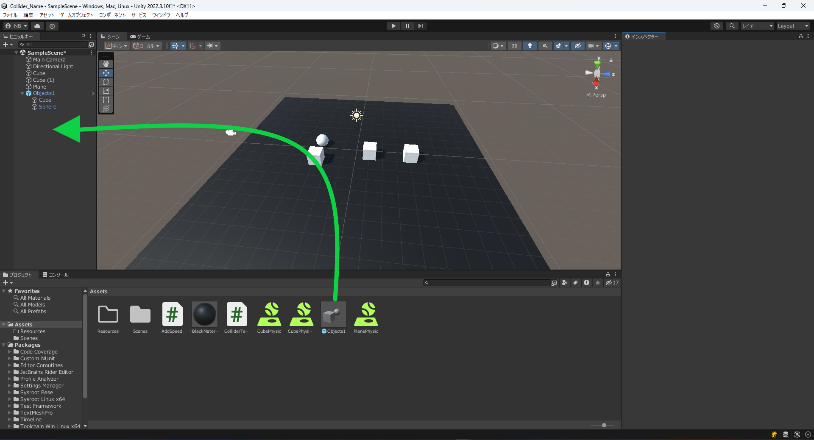

ドラッグアンドドロップできると以下のようにObjects1 (1)というprefabインスタンスが作成されているのが確認できます。

このままだと重なってしまっているのでGameObject1 (1)を選択し位置を0,1.5,-3に移動してください。

### prefabの状態共有機能

この機能を使用することでコピーでゲームオブジェクトを作成した場合と異なり一つ編集するとほかのものも一緒に編集するといったことが可能です。

先ほど作成したprefabインスタンスで実際に試してみましょう。

prefabインスタンスを一気に変更するにはprefabを編集することでprefabインスタンスも編集することができます。

GameObjects1のprefabをダブルクリックすると以下のように表示されます。

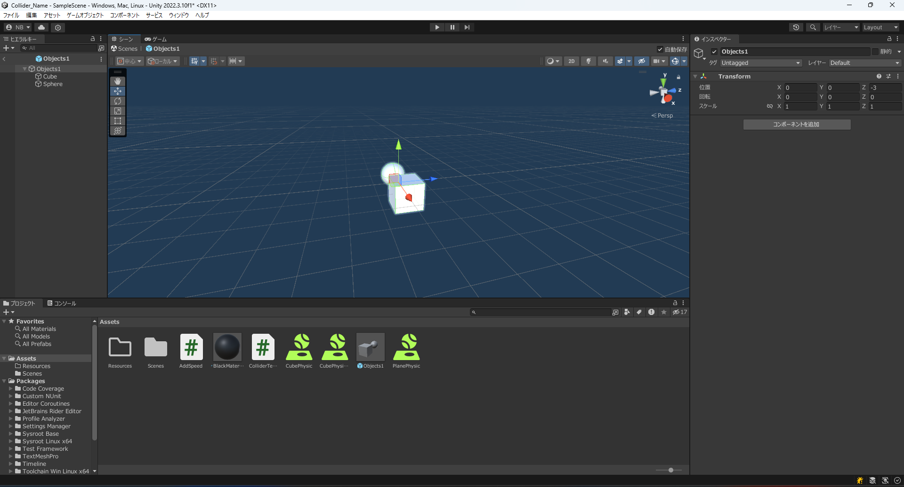

他のオブジェクトは表示されずprefabのゲームオブジェクトのみ表示されるようになっています。

この画面で変更した設定は他のprefabインスタンスにも引き継がれます。
設定にはコンポーネントの追加やスクリプトの追加も含まれるので一気に変更することが可能です。

今回はCubeの位置を1,1,0に変更します。
Cubeを選択しいつも通りインスペクターウインドウから位置を変更します。

変更できると以下の画像のようになります。


変更できていることを確認しヒエラルキーウィンドウ左上での`<`で元の画面に戻ります。

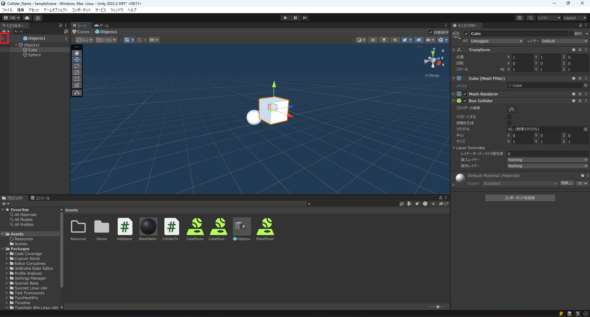

元の画面に戻るとObjects1のprefabインスタンスは両方ともCubeの位置が以下の画像のように変わっていることがわかります。

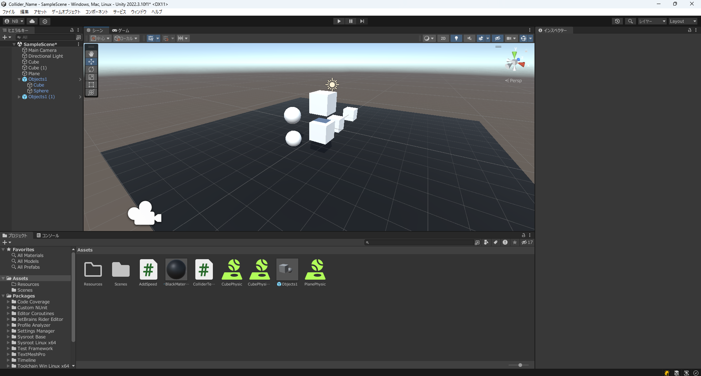

このように同期して変更することが可能になっています。

### prefabによるゲームオブジェクトの動的生成

prefabにすることでゲームオブジェクトをコードから生成することができるようになっています。

<!-- 実際にprefabインスタンスを作成するコードを記述していきます。

prefabにスクリプトをアタッチすると新しく作成したprefabインスタンスからも新しくprefabインスタンスを作成しようとしてしまうため別のオブジェクトにスクリプトをアタッチする必要があります。
なので今回は新しく空のオブジェクトを作成しましょう。

ヒエラルキーウィンドウを右クリックし`空のオブジェクト`をクリックし空のゲームオブジェクトを作成します。
名前はデフォルトの`GameObject`で大丈夫です。 -->

現在の状態からではprefabをプログラムから見つけることができませんので、Assetsを右クリックし作成>フォルダーをクリックして`Resources`というフォルダを作成してください。

ResourcesフォルダにObjects1を移動してください。

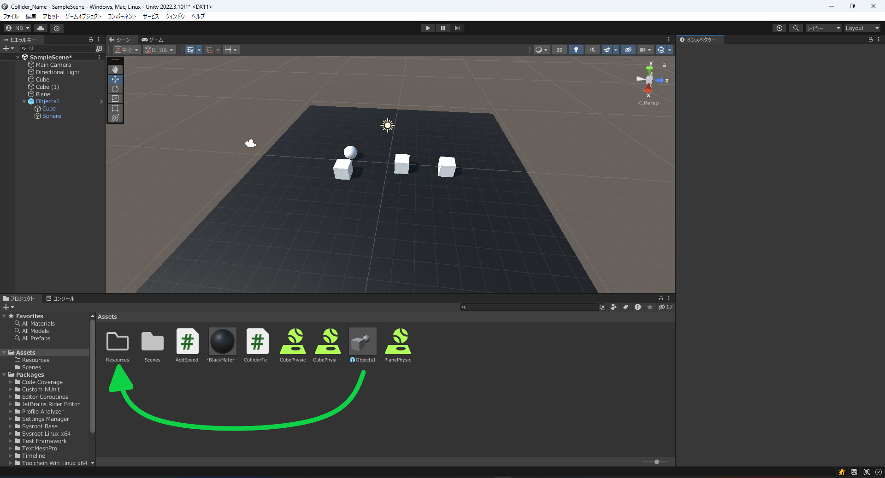


今回はAddObjectというスクリプトを作成してください。

コードは以下のようになっています。


```cs
using System.Collections;
using System.Collections.Generic;
using UnityEngine;

public class AddObject : MonoBehaviour
{
    // Start is called before the first frame update
    void Start()
    {
        // prefabをResourceフォルダーから取得する。Loadの引数は探したいファイルがあるパス
        GameObject prefab = (GameObject)Resources.Load("Objects1");
        // prefabインスタンスをx = 5,y = 0,z = -3に追加する。Quaternion.identityは初期状態を示す。
        Instantiate(prefab,new Vector3(5,0,-3), Quaternion.identity);
    }

    // Update is called once per frame
    void Update()
    {
        
    }
}

```


このコードをヒエラルキーウィンドウにあるprefabインスタンスのObjects1にアタッチしてください。

prefabは前述の通り設定を共有することができますが、一つのprefabインスタンスだけを編集することが可能になっています。

実際に動かしてみると以下の画像のように右側の赤い四角で囲った部分に新しく追加されていることがわかります。


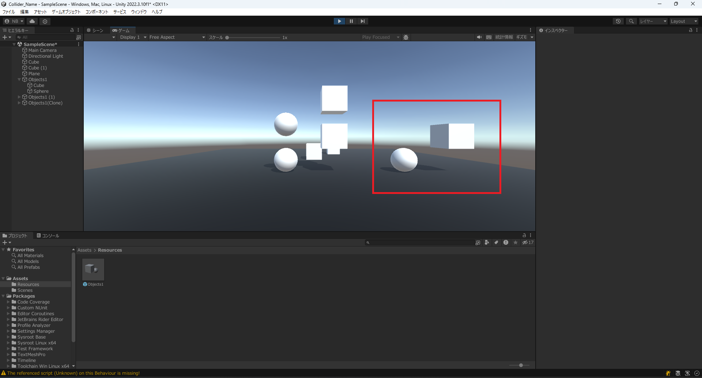

このようにコードによってprefabインスタンスを作成することができるとわかりました。


## 練習問題

Sphereを作成し、Sphereからprefabを作成しSphereが0,8,0から連続で降ってくるようなプログラムを作成し実行しなさい。
なお、RigidbodyをSphereに適応しているものとする。

<details><summary>解答例</summary>

スクリプト名がAddSphereだった場合

```cs
using System.Collections;
using System.Collections.Generic;
using UnityEngine;

public class AddSphere : MonoBehaviour
{
    // Start is called before the first frame update
    GameObject prefab;
    void Start()
    {
        prefab = (GameObject)Resources.Load("Sphere");
    }

    // Update is called once per frame
    void Update()
    {
        Instantiate(prefab,new Vector3(0,8,0), Quaternion.identity);
    }
}
```

</details>
