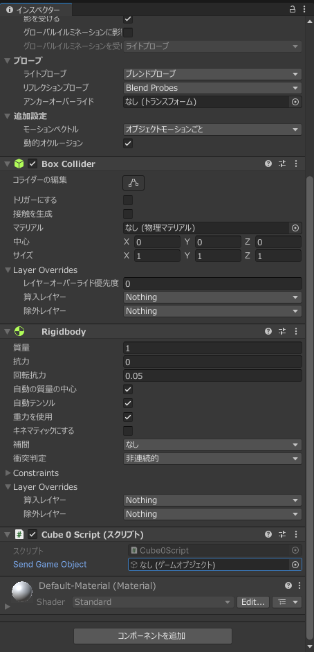
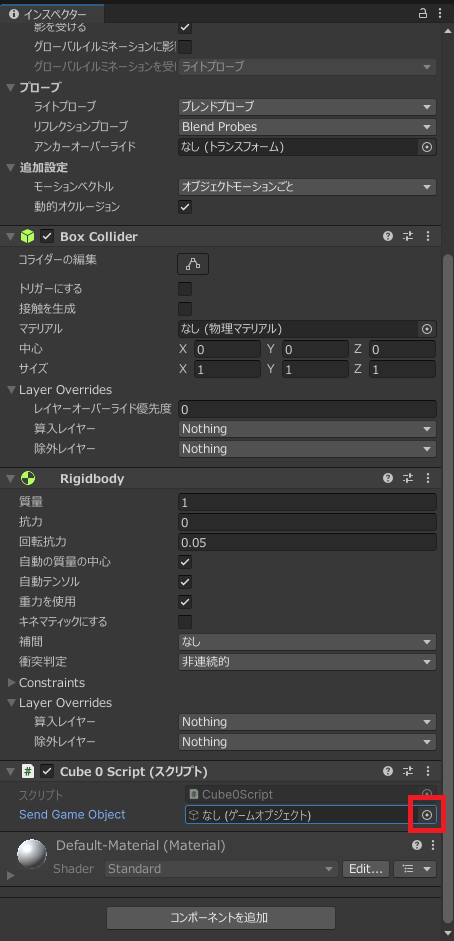
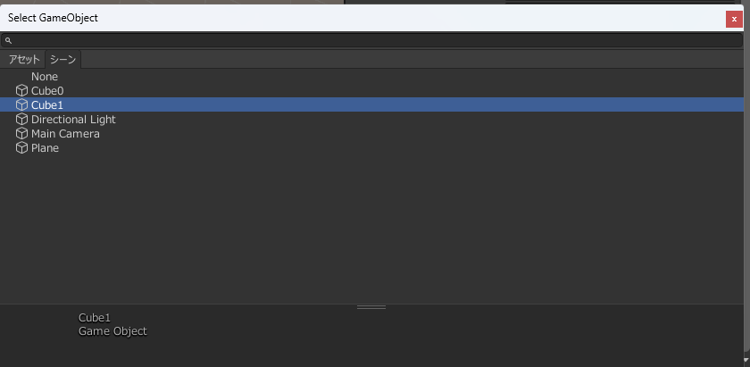

# Unity20:他のゲームオブジェクトとの連携

今までUnityではアタッチされたオブジェクトに対してスクリプトで操作することが多かったですが、アタッチされていないオブジェクトを操作する方法や他のスクリプトオブジェクトにアタッチされたスクリプトの命令を呼び出す方法について学習する。

## 新しいプロジェクトの作成

今回は新しいプロジェクト`Send_名前`という名前で作成してください。

その後Cubeを二つとPlane(平面)を作成します。
一つ目のCubeは以下のような設定にしてください
|項目|値|
|----|--|
|名前|Cube0|
|位置|1,3,0|
|コンポーネント|Rigidbodyを追加(重力あり)|


二つ目のCubeは以下のような設定にしてください
|項目|値|
|----|--|
|名前|Cube1|
|位置|-1,5,0|


Planeは以下のような設定にしてください

|項目|値|
|----|--|
|名前|Plane|
|スケール|4,4,4|
|位置|0,-0.5,0|

## 初期値としてGameObjectを渡す方法

Unityではインスペクターウインドウから値を設定することが可能です。
この機能を用いて他のゲームオブジェクトを取得することが可能です。
このゲームオブジェクトにはtransformなどの今まで操作してきたクラスが含まれているので今までの通り移動することも可能です。

### GameObjectを直接操作する。

今回は他のゲームオブジェクト(Cube1)を初期値として設定しアタッチゲームオブジェクト(Cube0)物体に接触した瞬間に初期値として設定したゲームオブジェクトをCube0と同じ高さ(y)座標に移動するというプログラムを作成します。

Cube0Scriptを以下のように記述しCube0にアタッチしてください。
```cs
using System.Collections;
using System.Collections.Generic;
using UnityEngine;

public class Cube0Script : MonoBehaviour
{
    [SerializeField]
    public GameObject SendGameObject;
    // Start is called before the first frame update
    void Start()
    {
     

    }

    // Update is called once per frame
    void Update()
    {
    }

    private void OnCollisionEnter(Collision collision)
    {
        SendGameObject.transform.position = new Vector3(SendGameObject.transform.position.x,transform.position.y, SendGameObject.transform.position.z);

    }
}
```
コードが記述できても**まだ実行しないでください**

コードの説明をしていきます。

以下のような記述が7,8行目にあります。
```cs
[SerializeField]
public GameObject SendGameObject;
```

7行目の
```cs
[SerializeField]
```

属性(attribute)といいその下に宣言されたメソッドや変数がどのような使い方が可能かを示しています。
今回はSerializeFieldという属性がついています。この属性はUnity Editor上で値を設定できるということを示しています。

8行目の
```cs
public GameObject SendGameObject;
```
の部分については今までの説明通り外からアクセスできるGameObject型のSendGameObject変数を宣言しいることを示しています。
また、アクセス修飾子についてはpublicである必要はありません。

OnCollisionEnterメソッドが呼び出されたときにSendGameObject.transform.positionの値を変えることでSendGameObjectのゲームオブジェクトをアタッチしたゲームオブジェクトと同じ高さに移動するようになっています。


#### アタッチと値の指定

Cube0に先ほど作成したCube0Scriptをアタッチしてください。

アタッチするとインスペクターウインドウには以下のようにGameObjectを設定できるようになっています。



ここにゲームオブジェクトを設定してきます。

他の設定と同様赤い四角で囲まれた部分をクリックします。




すると今までと同様に選択画面が表示されるのでCube1を選択します。



これで設定は完了したので実際に実行してみましょう。

### GameObjectからスクリプトを取り出す。

GameObjectからScriptを取り出し、そのスクリプトのメソッドを呼び出す方法法を説明します。

Scriptを取得する構文は以下のようになっています。
```
取得したいスクリプトの型の変数 = スクリプトがアタッチされたGameObject.GetComponent<取得したいスクリプトの型>();
```
GetComponentメソッドはジェネリックで指定した型のインスタンスをゲームオブジェクトから取得するというメソッドになっています。

もし取得したいスクリプトが同じ型で複数ある場合は以下のように取得可能です。


```
取得したいスクリプトの型の配列 = スクリプトがアタッチされたGameObject.GetComponents<取得したいスクリプトの型>();
```

GetComponentというメソッドは過去にも使ったことがあると思います。
Rigidbodyの取得の際に使用しました。

これが何を示すのかというとスクリプトはコンポーネントの一つであると言えます。

先ほどと同様の動作をするプログラムをGetComponentを使用して作成していきます。

まずCube1Script作成し以下のように記述してください。

```cs
using System.Collections;
using System.Collections.Generic;
using UnityEngine;

public class Cube1Script : MonoBehaviour
{
    
    // Start is called before the first frame update
    void Start()
    {
        
    }

    // Update is called once per frame
    void Update()
    {
        
    }

    public void MoveY(float y)
    {
         transform.position = new Vector3(transform.position.x, y, transform.position.z);
    }
}

```

このプログラムはMoveYというメソッドで現在のゲームオブジェクトをy座標だけ変更することができます。
また、このプログラムの重要な点としてMoveYというメソッドは他のプログラムから呼び出されることを前提で考えているのでアクセス修飾子はpublicにする必要があります。

このプログラムはCube1にアタッチしてください。

その後Cube0Scriptを以下のように変更します。

```cs
using System.Collections;
using System.Collections.Generic;
using UnityEngine;

public class Cube0Script : MonoBehaviour
{
    [SerializeField]
    public GameObject SendGameObject;

    Cube1Script Cube1Script;
    // Start is called before the first frame update
    void Start()
    {
        Cube1Script =  SendGameObject.GetComponent<Cube1Script>();

    }

    // Update is called once per frame
    void Update()
    {
    }

    private void OnCollisionEnter(Collision collision)
    {
        Cube1Script.MoveY(transform.position.y);

    }
}
```

このプログラムでは`Start`の部分でCube1Scriptを取得しメンバ変数に代入しています。

その後OnCollisionEnterが呼ばれた際にはCube1ScriptのMoveYメソッドを呼び出しています。

このようにすることでCube1ScriptではCube1を基準にしたプログラムがかけたの要素との連携がしやすくなります。

## GameObjectを動的に取得する。

ゲームオブジェクトを動的に取得する方法を説明します。
先ほどはゲームオブジェクトを初期値として与えましたが、今回はプログラム実行中に取得する方法について説明します。


名前でGameObjectを取得するには以下のように取得することが可能です。

```cs
GameObject型の変数 = GameObject.Find("ゲームオブジェクトの名前");
```

GameObject.Findメソッドはゲームオブジェクトを名前で取得できる便利なメソッドですが、ゲームオブジェクトの数が多くなると動作が重たくなってしまうので連続で呼び出すことのないように変数に入れておくなどしておきましょう。

変数などにおいておく処理のことを**キャッシング**といいます。
先ほどのプログラムでもCube1Scriptをメンバ変数に代入していましたがあの動作もキャッシングと言えます。


実際に先ほどのプログラムを書き換えてみましょう。

Cube0Scriptのみ書き換えます。

```cs
using System.Collections;
using System.Collections.Generic;
using UnityEngine;

public class Cube0Script : MonoBehaviour
{
    GameObject SendGameObject;

    Cube1Script Cube1Script;
    // Start is called before the first frame update
    void Start()
    {
        SendGameObject = GameObject.Find("Cube1");
        Cube1Script =  SendGameObject.GetComponent<Cube1Script>();
    }

    // Update is called once per frame
    void Update()
    {
    }

    private void OnCollisionEnter(Collision collision)
    {
        Cube1Script.MoveY(transform.position.y);

    }
}
```

プログラムは以上となります。

Startメソッドの
```cs
SendGameObject = GameObject.Find("Cube1");
```
の部分でCube1というGameObjectを取得し、SendGameObjectにキャッシングしています。
その後SendGameObjectからCube1Scriptを取得するという流れになっています。
その他の部分についてはほとんど同様です。

実行すると先ほどと同様の処理をすると思います。

## コラム:ゲームオブジェクトの名前

ゲームオブジェクトの名前は静的に設定しましたが、動的に名前を変更することも可能です。

名前を変更するには

```cs
GameObject型の変数.name = "新しい名前";
```

といった形で名前を指定することができます。

この名前変更を工夫することでFindで検索する際に検索しやすくなります。

また、prefabや動的なコピーで作成したゲームオブジェクトの名前は実際にはどうなっているかわからない場合

```cs
string型変数 = GameObject型の変数.name;
```

で取得することも可能です。

