# Unity22:uGUIについて理解する

UnityのUI作成についてはuGUIというボタンやテキストなどをドラッグアンドドロップすることでUIを作成する方法と、UITool Kit といいUXMLというHTMLに似た言語とUSSというCSSに似た言語でUIを作る方法があります。

今回は昔からあり情報も多いuGUIの基本的な使い方について説明します。

## プロジェクトの作成

今回はプロジェクト名を**uGUI_名前**で作成してください。

詳しい作成方法についてはカリキュラム14を確認してください。


その後Cubeを0,0,0に配置し、scaleは1,1,1に設定してください。


## uGUIの使い方

uGUIは基本的に基本的にCanvasというゲームオブジェクト内にボタンやテキストを追加するという形になっています。

そのため初めにCanvasを追加する必要があります。

まず、以下の画像のようにヒエラルキーウィンドウを右クリックするとゲームオブジェクトを追加するポップアップが表示されるので、**UI**をクリックしてください。


**UI**をクリックすると以下の画像のように追加できるものの一覧が表示されるのでCanvasをクリックします。


Canvasをクリックするとヒエラルキーウインドウは以下のようにCanvasとEventSystemが追加されます。

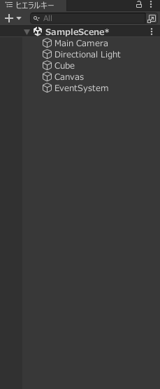


EventSystemはゲームオブジェクトなどがクリックされたときなどに動作する処理を指定することができるようになります。

今回は使用しないので無視してもらって大丈夫です。

Canvasを追加するとシーンウインドウ画面に枠線が表示されるかもしくは追加前とあまり変わらないと思います。
それはCanvasが大きすぎて見えないことが原因です。

これを解消するために、以下の画像の赤色で囲った2Dと表示されているところをクリックします。(シーンウインドウの右上)
これをクリックすることでz軸のプラス方向を向く平面として表示されます。


クリックすると以下のようになります。

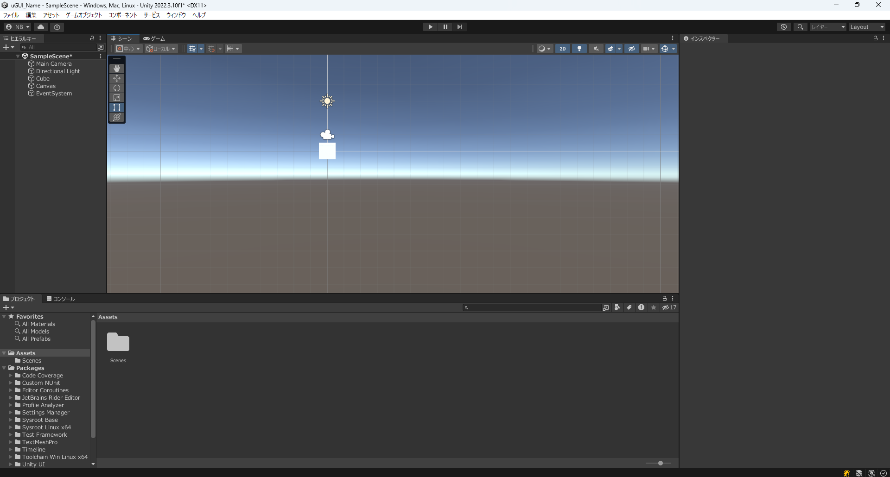

これでもまだ小さいためヒエラルキーウインドウのCanvasをダブルクリックしてください。

すると以下の画像のようにCanvasの全体が表示されます。

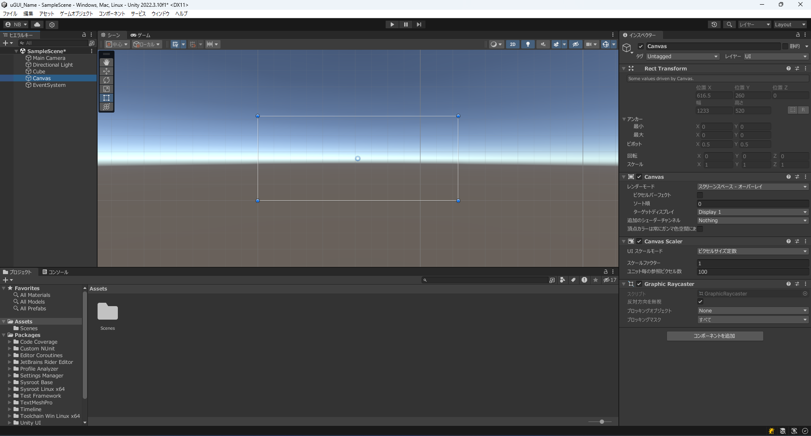

適宜ズームなどをして調整をしてください。

なお、**2Dボタンはを一度クリックすると元に戻るので3Dのゲームオブジェクトを移動させる際は再度クリックしてください**

では追加したCanvasをクリックしインスペクターウインドウを表示すると以下のようになっています。

中でも大切な設定について説明します。


### 二種類のUI部品

uGUIにはボタンやLegacyとTextMeshProの二種類があります。

Legacyのほうが簡単ですぐに実装できますが、一方で機能が少ないというデメリットがあります。

対してTextMeshProは配置までの手間が多い一方で機能が多くカスタマイズが容易というメリットがあります。

今回は将来性を加味しTextMeshProを使用します。


### テキストを追加する。

まずCanvasを右クリックして以下の画像のように`UI>テキスト - TextMeshPro`をクリックします。


クリックすると以下の画像のようにポップアップウインドウが表示されるので`Import TMP Essentials`をクリックしてください。

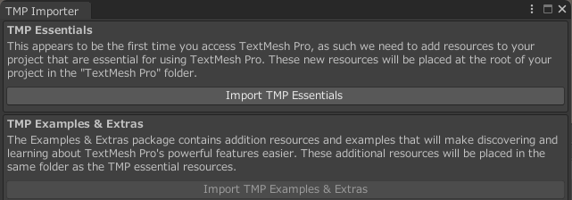

クリックして処理が終わるとバツボタンをクリックしてください。

その後シーンウインドウを確認すると以下の画像のように文字が表示されていることが確認できます。


ではテキストをクリックして設定項目を確認してみましょう。


確認してみるとTransformの代わりに`RectTransform`というゲームオブジェクトになっていることがわかります。
ほかにも`TextMeshPro - Text(UI)`というのもあるのがわかります。

今回は`RectTransform`と`TextMeshPro - Text(UI)`について詳しく説明していきます。

#### RectTransformの使い方

RectTransformはTransformとは異なり、位置やscale、回転のほかにアンカーやがあることがわかります。

これらの設定について詳しく説明します。

まず、以下の画像の赤色で囲んだ部分をクリックしてください


クリックすると以下のようなアンカープリセットと呼ばれる画面が表示されます。

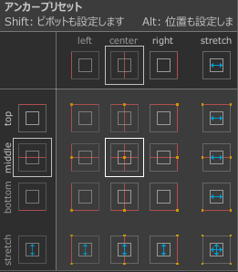

これは位置を指定する際にCanvasのどこを基準に移動するかを示してます。
この基準を設定することで画面の大きさが変わった際にボタンなどを相対的な位置で指定することができるようになります。
では今回は左上に設置すると考えて以下の画像の緑色の四角で囲んだ部分をクリックして下さい。


このほかに右と下にあるstretchという項目を選択すると画面の大きさに応じて要素の大きさも変わることを意味しています。

続いて位置を設定します。
位置はx=120,y=-40に設定します。
この位置は先ほど指定したアンカープリセットの場所からそれぞれどれだけ離れたかを示しています。

幅と高さについてはテキストなどUIの要素の大きさを示しています。
スケールとの違いとしてはスケールは要素を引き伸ばして大きくするのに対してこの幅と高さは引き伸ばさずに大きさを変えるだけになっています。

今回は次のアンカーの項目については設定が多少複雑なので今回は割愛します。
基本的にはアンカープリセットで設定できる内容をさらに詳しく設定できるようになっています。

ピボットはアンカーを設定する際にテキストの座標の基準になる位置を示しています。
テキストの長さを1としてx軸は左側が0右側が1としたときの割合になっています。y軸の長さも同様で下側が0で上側が1とした割合になっています。
今回はx:0.5,y:0.5なので中心が基準となっています。

回転やスケールについては通常のTransformと同様ですが文字を含むUIの要素はスケールを変えると縦横の比が変わってしまうので注意が必要です。

大きな文字を扱いたいときは次に説明するTextMeshPro - Text(UI)の要素で使用できます。


#### TextMeshPro - Text(UI)

TextMeshPro - Text(UI)というコンポーネントが追加されていると思います。
この部分で文字の変更を行います。

最初はこのような上チアになっていると思います。

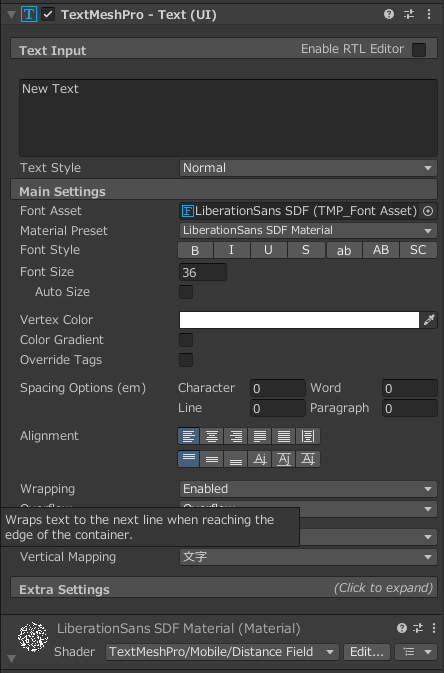

まず赤い四角で囲まれたNew Textと記述された部分があると思います。


この部分にテキストを入力することで表示されている内容を編集することができるようになっています。
では以下のように書き換えてみましょう。

```
Unity Text
```

書き換えるとシーンウインドウのほうも変わっていることがわかると思います。

実はTextMeshProではHTMLのような**タグ**を使用し文字を装飾することができます。

HTMLと近いの使い方ですが使用できるタグの一部を抜粋し以下の表に記述します。

|使用例|説明|
|------|----|
|\<color="red">Text\</color>|Textという文字が赤色になります。色の指定は16進数でも可能です。|
|\<b>Text\</b>|Textという文字が太字になります。|
|\<i>Text\</i>|Textという文字が斜体(斜めな文字)になります。|

ではUnityという文字を赤に変えてみましょう。

```
<color="red">Unity</color> Text
```

このように記述することでUnityの部分だけ赤色になっていることがわかります。

次のText Styleについてはh1,h2,h3といった設定ができます。題名などはh1やh2を使うとよいかもしれません。

Font Assetはフォントを表しています。しかしながら通常のフォントファイルを使用することができないので変換する必要があります。これについては**TextMeshProの日本語対応**で説明します。

FontStyleは以下の画像のような種類があり、左から太字、斜体、下線、打消し線、すべての文字を小文字にする、すべての文字を大文字にする、すべての文字を大文字にして大文字に設定されている文字を大きくするといったことが設定できます。


続いてのFont Sizeはその名の通りFontの大きさを変更することができる項目です。文字の大きさを変更したい場合スケールよりもこちらを変更することをお勧めします。

VertexColorは文字の色の設定が可能です。

次の項目のColor Gradationをチェックするとグラデーションの設定が可能ですが複雑なので今回の説明は省略します。

Override Tagsについてはタグで設定した色をここで指定した色に変更するのかを指定します。この項目をチェックするとタグで指定した色が上書きされます。

次のAligmentについては文字の位置を指定することができる項目です。
よく使うのは赤色で囲まれた項目で上段の左から文字を左に寄せる、中央に寄せる、右に寄せる設定になっています。
下段については文字を上に寄せる、文字を高さの範囲で下に寄せる、中心に寄せるという指定が可能です。


`TextMeshPro - Text(UI)`の部分の基本的な使い方については以上とします。
他の要素については興味がある方は調べてみてください。

#### TextMeshProの日本語対応

TextMeshProでは日本語が使えません。

実際に日本語を先ほどの`TextMeshPro - Textのコンポーネント`で日本語を指定してみてください。

設定しても以下の画像のように文字が四角に置き換わってしまいます。


これはフォントが日本語に対応していないことが原因です。
そのため日本語が使えるように設定する必要があります。


まずフォントファイルをダウンロードする必要があります。

以下のリンクをクリックしてGoogle Fontsを使用します。
今回はGoogle Fontsからダウンロードしますが、他のサイトからDLしたフォントでも問題ありません。

[Google FontsのNoto Sans](https://fonts.google.com/noto/specimen/Noto+Sans+JP)

開くと以下のように表示されると思うので右上の`Get font`をクリックしてください。

もし`Remove font family`と表示されていた場合は一度クリックすると`Get Font`になると思うので`Get Font`をクリックしてください。

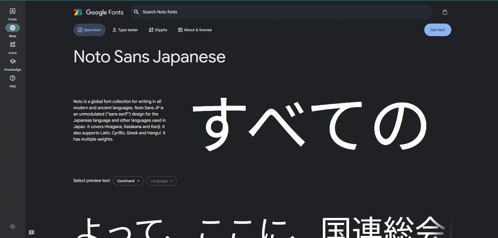

すると以下のような画面に切り替わるので画像中の赤い四角で囲まれた部分をクリックしてください。
クリックすると`Noto_Sans_JP.zip`というファイルがダウンロードされるので解凍してください。

解凍できると中には`static`というフォルダがあると思うので
`static`内にある`NotoSansJP-Medium.ttf`をアセットにドラッグアンドドロップします。

ドラッグアンドドロップしたら以下のようになります。


その後フォントアセットクリエイターという画面を開く必要があります。

WindowsもMacも上部のバーから`ウインドウ>TextMeshPro>フォントアセットクリエーター`をクリックします。

すると以下のような画面が表示されます。


これを使用して通所のフォントファイルからMeshTextProで使用できる形式に変更することができます。

まず
Source Font Fileの項目を設定します。Source Font Fileの行の一番右の丸い部分をクリックすると以下のようにフォントの一覧が表示されるので、先ほど追加したフォントを選択してください。


今回はNoto Sansを追加したのでそれを選択します。


続いて変更を変える部分はAtlas Resolutionの項目です。この項目はフォントの画質にかかわる項目です。
今回は4096と4096に指定しておきます。

その次の項目であるCharacter Setの項目は使用できる文字の選択になります。
今回は`Custom Characters`を選択します。

選択すると以下のような画面に切り替わります。
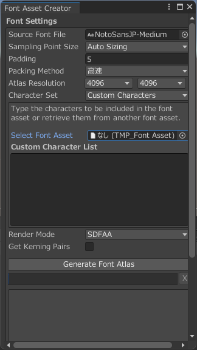

この中の`Custon Character List`の部分に以下のページの内容をコピーアンドペーストしてください。

[japanese_full.txt](https://gist.githubusercontent.com/kgsi/ed2f1c5696a2211c1fd1e1e198c96ee4/raw/118bb818cffe159eb4e906f82980465cd0b0021e/japanese_full.txt)

その後以下の画像の赤い四角で囲んだ`Generate Font Atlas`ボタンをクリックしてください。


ボタンを押すと以下のような画面に切り替わるので処理が終わるまで待ちます。


終了後スクロールしてSaveボタンを押して任意の場所に保存します。


これでMeshTextPro対応の形式に変換できたので実際にフォントを変更してみましょう。

先ほど変更していたText(TMP)を選択してください。

その後インスペクターウインドウのFont Assetで指定できます。
Font Assetの右側の丸をクリックして今回作成したフォントファイルを選択してください。


今回はNotoSans jP-Mediam SDFを選択します。

その後表示している内容を以下のように書き換え日本語が正しく表示されていることを確認してください。

```
スタプロ
```

正しくできていれば以下のように表示されると思います。

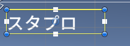


### ボタンを追加する

ボタンもテキストと同様の手順で追加することができます。

まずCanvasを右クリックし`UI>ボタン - TextMeshPro`から追加することができます。

追加すると以下のように表示されます。

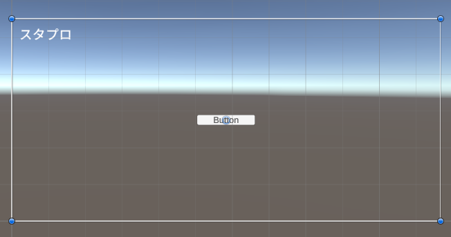

ボタンのヒエラルキーウインドウを確認すると
子要素にText(TMP)があることがわかります。
この部分を編集することで、表示内容を変更することができるようになっています。

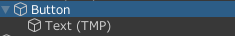

ではボタン本体のインスペクターウインドウについてみていきましょう。

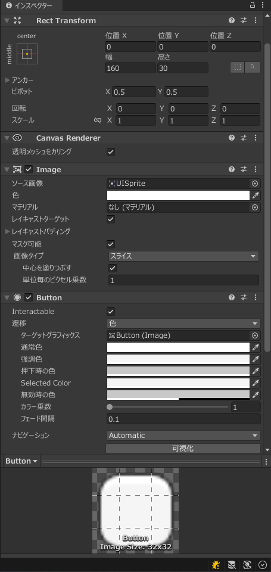


まずRect TransformについてはTextと同様です。
Imageコンポーネントはボタンに画像を指定することができるのですが、今回はボタンの基本的な使用方法を知るのが目的なので詳しい説明は割愛します。

中でも最も重要なのはButtonのコンポーネントです。

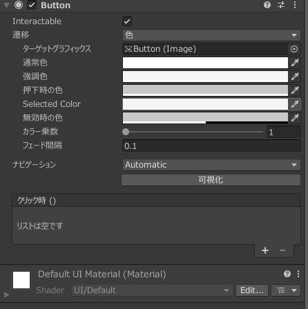

まず初めのInteractableのチェックボックスはチェックされているとボタンが無効状態になります。

遷移部分では4つの項目がありますが今回は色を選択した状態の説明をしていきます。

遷移の部分の説明を以下の表にまとめます。

|項目|説明|
|----|----|
|ターゲットグラフィックス|ボタンの状態によって見た目を変えるUIオブジェクトの指定(デフォルトは自分)|
|通常色|実行したときの最初のボタンの色|
|強調色|マウスにボタンが乗った時の色|
|押下時の色|ボタンが押されている間の色|
|Selected Color|ボタンが選択されている状態の色|
|無効時の色|Interactableにチェックが入った状態の色|

基本的な設定内容は以上のようになっています。

続いて`クリック()`と書かれている部分の説明をします。
この部分でクリック時に呼び出すメソッドを指定することができるようになっています。


#### ボタンのイベント登録

ボタンのイベント登録をするためにまずスクリプトを作成します。

`ClickMove`というスクリプトを作成します。

その後以下のようなコードを記述してください。

```cs
using System.Collections;
using System.Collections.Generic;
using UnityEngine;

public class ClickMove : MonoBehaviour
{
    // Start is called before the first frame update
    void Start()
    {
        
    }

    // Update is called once per frame
    void Update()
    {
        
    }

    public void MoveUp()
    {
        transform.Translate(new Vector3(0,1,0),Space.World);
    }
}
```

このコードを記述し初めに追加したCubeにアタッチしてください。

このプログラムはMoveUpを呼び出すとアタッチしたゲームオブジェクトが上に移動するようになっています。

MoveUpをクリック時に呼び出すようにします。

続いてボタンの設定をしていきます。

動作を追加するにはまず以下の画像の赤い四角で囲まれたクリック時()の`+`ボタンをクリックします。

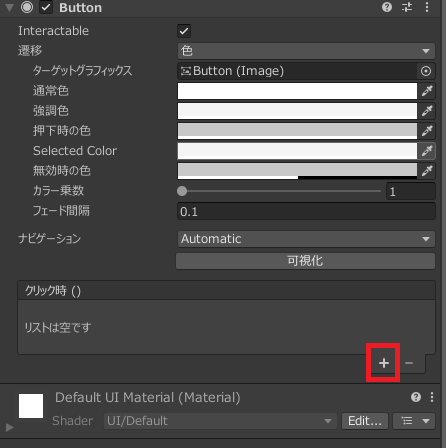

クリックすると以下のように項目が追加されます。

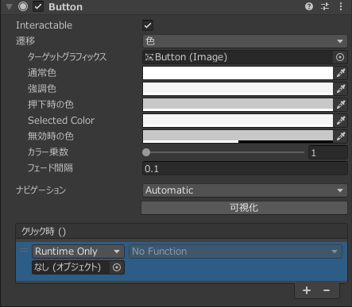


その後以下の画像の赤い四角で囲まれた丸をクリックし選択画面を開きます。


選択ウインドウでシーンのタブを選択します。


シーンを選択するとCubeを選択できるのでCubeを選択します。

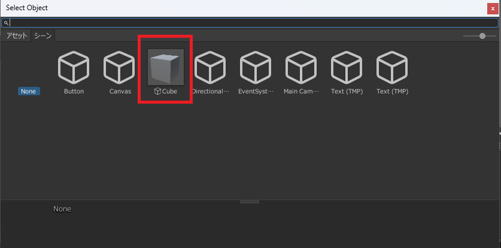

Cubeを選択後No Functionの部分をクリックします。

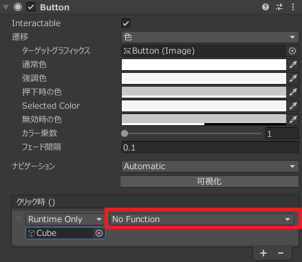

No Functionの部分をクリックすると以下のようなメニューが表示されます。


初めに出てくる一覧はアタッチされているコンポーネントの一覧です。今回はClickMoveというスクリプトをアタッチしたので`ClickMove`を選択します。
選択するとClickMoveで呼び出せるめっど一覧が表示されるので先ほど作成した`MoveUp`を選択します。


これでメソッドの登録が完了しました。

実行後ボタンを押すと上にCubeが動くことがわかると思います。

