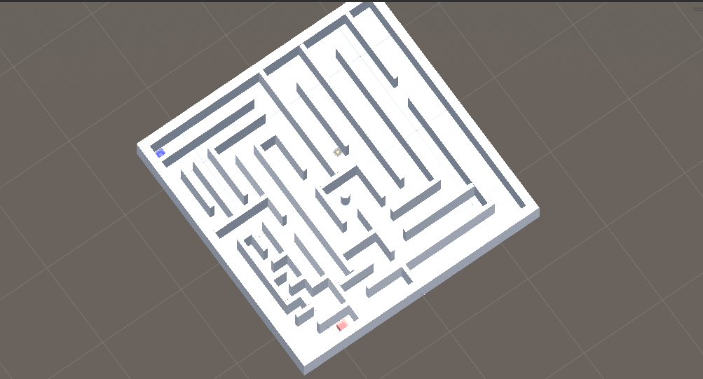
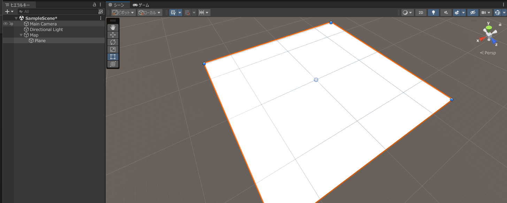
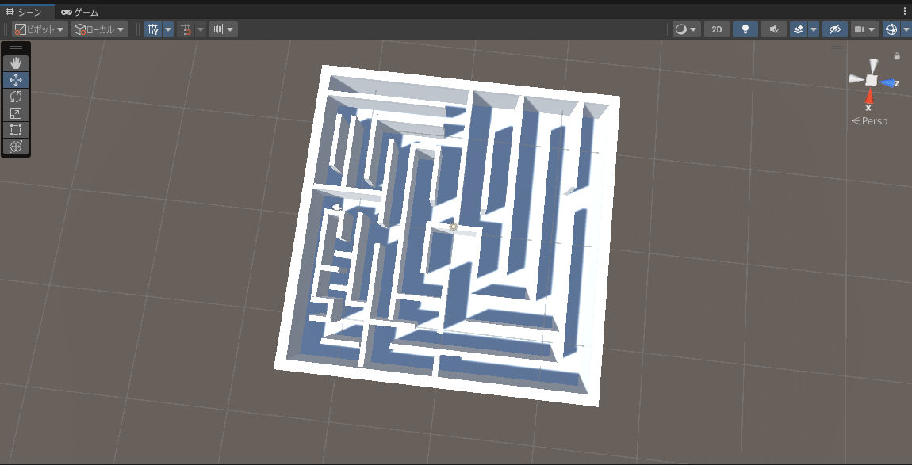

# Unity23:簡単なゲームを作成しよう - ステージの作成

カリキュラム14からカリキュラム22までの間でUnityの基本的な使い方を学びました。
その知識を利用して簡単なゲームの作成を行いましょう。

## 今回作成するゲーム

今回作成するゲームはプレイヤーが球体になっており、球体の向いている方向に速度を加えることで球体の操作ができます。
球体の操作を行い、迷路になっているステージをスタート地点からゴール地点まで移動するというゲームです。

操作説明は以下のようになっています。

- Wを押すと前に速度が加わる。
- Sを押すと後ろに速度が加わる。
- Aを押すと右を見る。
- Dを押すと左を見る。

実際の完成したゲームのステージは以下のようになります。

実際の操作画面は以下のようになります。

## プロジェクトの作成

今回は`Maze_名前`というプロジェクト名でプロジェクトを作成します。

## 注意点

今回作成するゲームは二回にわたって作成します。
そのためデータが消えると大変なため画面上部の`ファイル`から`保存`を定期的にクリックしておいてください。

## Mapを作成する。

まず今回使用する迷路を作成していきます。
Blenderなどの3Dモデリングソフトを使用し作成することも可能ですが、今回は学習していないのでUnity上で作成していきます。

まず「`空のオブジェクト`」からゲームオブジェクトを作成しMapという名前にします。

### 平面の作成
そしてそのオブジェクトの子要素に`Plane(平面)`を追加します。
その後Planeの位置を0,-0.5,0の位置にスケールを3,1,3と指定してください。

設定したときのシーンウインドウとヒエラルキーウインドウは以下のようになります。

### 外の壁を作成
外の壁を追加していきます。
壁の元となるゲームオブジェクトはCubeなのでCubeを4つMap内に追加します。
それぞれ、名前が`Wall1`、`Wall2`、`Wall3`、`Wall4`としてください

それぞれの設定は以下の通りです。

Wall1のtransformの設定は以下の通りです

|項目|値|
|----|--|
|位置|0,1,-14.5|
|向き|0,0,0|
|スケール|30,3,1|

Wall2のtransformの設定は以下の通りです。

|項目|値|
|----|--|
|位置|0,1,14.5|
|向き|0,0,0|
|スケール|30,3,1|

Wall3のtransformの設定は以下の通りです。

|項目|値|
|----|--|
|位置|-14.5,1,0|
|向き|0,0,0|
|スケール|1,3,28|

Wall4のtransformの設定は以下の通りです。

|項目|値|
|----|--|
|位置|14.5,1,0|
|向き|0,0,0|
|スケール|1,3,28|

正しく設定できてると以下のようになります。

これですべての辺に高さ3の壁を作ることができました。

### 内の壁を作成

ここからMap内の壁を作っていきます。

Mapの中にMiniWallsという名前で空のゲームオブジェクトを作成します。
その中にCubeを再度追加します。

名前はMiniWallにしておいてください。

MiniWallは以下の通りに設定してください。

|項目|値|
|----|--|
|位置|0,1,0|
|スケール|0.5,3,3|

このゲームオブジェクトをコピーし位置のXとZとの値と向きのyとスケールのZの値を変更して以下のようにマップを作成してください。
注意点としては壁と壁の間を1以上にするように気を付けてください。

### ライトの調整

作成できましたが暗いところがあるのでそれを改善していきます。

Directional Lightがもともとありますがこの位置を変更します。

現在Directional Lightのtransformの設定は以下のようになっています。

真下を向いているわけではなく少し斜め方向を向くようになっているので以下のように変更し真下に向くようにし、高さが少し低いので高さ(y軸)が10になるようにしましょう。

そうすると以下のように影が改善されたことがわかると思います。

### スタート地点とゴール地点の作成

続いてスタート地点とゴール地点を指定していきます。

スタート地点とゴール地点はそれぞれCliderをトリガーにした状態のCubeにします。

ではスタート地点のゲームオブジェクトを作成していきます。

MapのゲームオブジェクトにCubeを追加し名前を`StartPoint`とします。

その後CubeのColliderの設定を以下のように設定してください。

`トリガーにする`の項目を追加することで通り抜けることが可能なようになっています。

その後これをコピーし`GoalPoint`を作成してください。

#### 色の設定

まずAssetsを右クリックし`作成>マテリアル`をクリックしマテリアルを作成してください。なお名前を`StartMaterial`にしてください。

その後インスペクターウインドウを開き値を設定していきます。

今回は半透明にしたいので`Rendering Mode`の項目を<b>`Transparent`</b>に設定します。
その後アルベドの値を以下のように設定します。

中でも重要な点はAの値です。
Aの値は不透明度を表しており255に近づくほど不透明に0に近づくほど透明になります。今回は**180**に設定しています。

この設定が完了するとStartPointにアタッチします。

この手順と同様に`GoalMaterial`を作成します。
アルベドの設定のみ以下のように設定してください。

materialの設定が完了すると`GoalPoint`にアタッチしてください。

#### 位置の設定

それぞれ`StartPoint`と`GoalPoint`のスケールを1,1,1に設定し、位置はyを0としxとyは適当な位置に設定してください。
なお、ゴールとスタートは確実につながっている位置に置くようにしてください。

設定できると以下のようになります。

