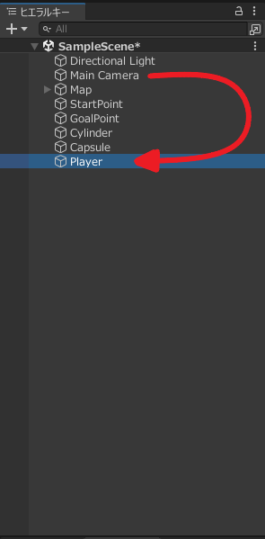
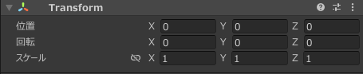
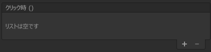
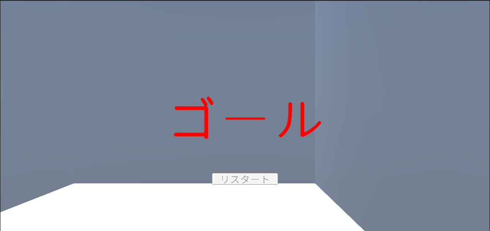

# Unity24:簡単なゲームを作成しよう - プログラムの作成

カリキュラム24でステージの作成が完了したのでここから動作を作成していきます。

## プレイヤーの作成

まずプレイヤーとなる球体を作成します。
この球体に力を加えることで動かしていきます。


では初めにSphere(球体)をヒエラルキーウインドウに追加し、名前をPlayerとしてください。
**なお、この球体はMapの外に作成してください**

その後今回はRigidbodyによる物理演算を用いて球体を移動させるので、Rididbodyを追加します。設定については初期状態のままで構いません。


Rididbodyの設定ができたら今回はPlayer視点(一人称視点)にしたいので`Main Camera`をPlayer内に設定するようにします。
`Main Camera`が元からあると思うので`Player`の子要素するためにドラッグアンドドロップを行います。



ドラッグアンドドロップを行うと以下のようになります。


しかし、追加したではカメラの位置が正しい位置になりません。
今回は球体の中にカメラがあるという状態にしたいのでMainCameraのTransformの設定を以下のように設定してください。




### 動作の作成

では初めにPlayerを動作させるためのスクリプトを作成します。
今回は`MovePlayer`というスクリプトを作成します。

#### スタート地点への移動
まず初めにスタート地点にPlayerを移動したいので以下の条件を満たすコードをMovePlayerに記述してください。

- SerializeField属性を適用したGameObject型変数をStartObjectという名前で作成する。
- Rigidbody型のメンバ変数rbを作成しStartメソッド内でrbにGameObjectのRigidbodyを代入する。
- rb変数のpositionをStartObject.Transform.positionに変更するようにしてください。

作成例は以下に示しています。
わからない場合は確認してみてください。


<details><summary>作成例</summary>

`MovePlayer`のコード
```cs
using System.Collections;
using System.Collections.Generic;
using UnityEngine;

public class MovePlayer : MonoBehaviour
{
    [SerializeField] GameObject StartObject;
    Rigidbody rb;
    // Start is called before the first frame update
    void Start()
    {
        rb = GetComponent<Rigidbody>();
        rb.position = StartObject.transform.position;
    }

    // Update is called once per frame
    void Update()
    {
        
    }
}

```

</details>


スクリプトを作成できたらMovePlayerにアタッチし、以下のようにStartObjectに前回作成したStartPointを指定してください。


この状態で実行する前回指定したスタート地点に移動していることがわかります。
実行中シーンウインドウを確認するとスタート地点に移動していることが確認できると思います。


#### カメラの向きの変更

今回のゲームはカメラの向きの方向にプレイヤーに速度を与えるようなプログラムなのでカメラの向きを変更すようなスクリプトを作成します。

ではMoveCameraという名前のスクリプトを作成し、以下の条件を満たすコードを作成してください。

- Updateメソッド内でDキーが押されていたらtransform.rotationを使用しy軸を中心に1だけ回る。
- Updateメソッド内でAキーが押されていたらtransform.rotationを使用しy軸を中心に-1だけ回る。

作成例は以下に示しています。
わからない場合は確認してみてください。

<details><summary>作成例</summary>

`MoveCamera`のコード
```cs
using System.Collections;
using System.Collections.Generic;
using UnityEngine;

public class MoveCamera : MonoBehaviour
{
    // Start is called before the first frame update
    void Start()
    {
        
    }

    // Update is called once per frame
    void Update()
    {
        if (Input.GetKey(KeyCode.D))
        {
            transform.rotation = transform.rotation * Quaternion.Euler(0, 1, 0);
        }
        if (Input.GetKey(KeyCode.A))
        {
            transform.rotation = transform.rotation * Quaternion.Euler(0, -1, 0);
        }
    }
}
```

</details>


完成したら`Main Camera`にこのスクリプトをアタッチしてください。

その後実行してAキーとSキーを押してみましょう
Aキーを押すと左に向いて、Sキーを押すと右を向くと思います。

#### 球体を動かす

続いてCameraの向いている方向に力を加えるように`MovePlayer`のプログラムを修正していきます。

以下の条件を満たすようにコードを変更してください。

- 変更前の機能を有している(スタート地点に移動)
- SerializeField属性を適用したGameObject型変数を`CameraObject`という名前で作成する。
- Transform型のメンバ変数CameraTransformを作成する。
- Startメソッド内でCameraTransformにCameraObject.transformを代入する
- Fixedupdateメソッドを作成する。
- 作成したFixedUpdate内でWキーが押されたらCameraTransform.forward方向に0.1fだけ`VelocityChange`モードで力を与える。
- 作成したFixedUpdate内でSキーが押されたらCameraTransform.forward方向に-0.1fだけ`VelocityChange`モードで力を与える。

<details><summary>作成例</summary>

`MovePlayer`のコード
```cs
using System.Collections;
using System.Collections.Generic;
using UnityEngine;

public class MovePlayer : MonoBehaviour
{
    [SerializeField] GameObject StartObject;
    [SerializeField] GameObject CameraObject;
    Rigidbody rb;
    Transform CameraTransform;

    // Start is called before the first frame update
    void Start()
    {
        rb = GetComponent<Rigidbody>();
        rb.position = StartObject.transform.position;
        CameraTransform = CameraObject.transform;
    }

    // Update is called once per frame
    void Update()
    {
        
    }
    void FixedUpdate()
    {
        if (Input.GetKey(KeyCode.W))
        {
            rb.AddForce(CameraTransform.forward * 0.02f, ForceMode.VelocityChange);
        }
        if (Input.GetKey(KeyCode.S))
        {
            rb.AddForce(CameraTransform.forward * -0.02f, ForceMode.VelocityChange);
        }
    }
}
```

</details>

ではコードを保存して実際に動かしてみましょう。
動かすためにはCamera Objectの設定をしないといけないので以下のようにMovePlayerのCamera Objectに`Main Camera`を設定してください。


Wを押すと前に少しだけ進んでカメラが下を向いてしまうと思います。
これは球体の動きがカメラの動きとが同じため球体に力を加えると下を向いたときに下方向に移動しようとするため止まってしまいます。

これを修正する必要があります。

##### MoveCameraを修正する

今回正しく動作しなかった原因はカメラが、球体と一緒に動いているのでカメラが意図しない方向に固定しておく必要があります。

固定しておくために`MoveCamera`を修正していきます。

以下の考え方基づいて修正していきます。

- 最初に角度情報(Quaternion)を取得し変数に代入する
- AキーもしくはDキーが押されたとき変数に代入された角度情報をAキーとDキーが押されたことを加味した値にする。
- Updateのたびに変数に代入した角度情報を現在のrotationに代入する

実際に以下のように修正すると想定通りの動きになると思います。

- Quaternion型のメンバ変数CameraRotationを宣言する
- Startメソッドでtransform.rotationの値をCameraRotationにする
- Aキーが押されているときの処理をCameraRotationを使用しy軸を中心に-0.2だけ回るように変える。
- Dキーが押されているときの処理をCameraRotationを使用しy軸を中心に0.2だけ回るように変える。
- CameraRotationの値をtransform.rotationに代入する。

<details><summary>作成例</summary>

`MoveCamera`のコード
```cs
using System.Collections;
using System.Collections.Generic;
using UnityEngine;

public class MoveCamera : MonoBehaviour
{
    // Start is called before the first frame update
    Quaternion CameraRotation;
    void Start()
    {
        CameraRotation = transform.rotation;
    }

    // Update is called once per frame
    void Update()
    {
        if (Input.GetKey(KeyCode.D))
        {
            CameraRotation = CameraRotation * Quaternion.Euler(0, 0.3, 0);

        }
        if (Input.GetKey(KeyCode.A))
        {
            CameraRotation = CameraRotation * Quaternion.Euler(0, -0.3, 0);
        }
        transform.rotation = CameraRotation;

    }
}
```

</details>

<br>


保存して実際に実行してみるとWキーを押すと前にSキーを押すと後ろにAキーを押すと左に向きDキーを押すと右に向くような正しい挙動をすることを確認できます。

ボールなのでWキーを離してもそのまま真っすぐ進み続けることがわかると思います。今回はそういうゲームなのでこのままいきます。

## ゴールの処理を作る

ゴールしたことを検知するプログラムを作成していきます。

では`GoalScript`を作成してください。

その後GoalScriptをGoalPointにアタッチして下さい。

その後以下の条件でコードを記述してください。

- OnCollisionEnterメソッドを作成しOnCollisionEnterが呼ばれたらLogにゴールと表示する

作成例は以下の通りです

<details><summary>作成例</summary>

`GoalScript`のコード
```cs
using System.Collections;
using System.Collections.Generic;
using UnityEngine;

public class GoalScript : MonoBehaviour
{
    // Start is called before the first frame update
    void Start()
    {
        
    }

    // Update is called once per frame
    void Update()
    {
        
    }
    void OnTriggerEnter(Collider other)
    {
        Debug.Log("ゴール");
    }
}

```

</details>

<br>


これで実行してみるとゴールした瞬間にゴールとログに表示されることが確認できると思います。
<!-- 
続いてゴール後5秒経つと元の位置に戻るようにプログラムを修正していきます。

まず、MovePlayerのプログラムを以下の条件で修正してください

- publicなMoveStartPointというメソッドを作成してください
- 作成したMoveStartPointというメソッドにStartPointの位置に移動するプロフラムを移動(切り取り・貼り付け)してください
- MoveStartPointメソッドをStartメソッドで呼び出すようにして下さい

作成例は以下の通りです

<details><summary>作成例</summary>
`MovePlayer`のコード

```cs
using System.Collections;
using System.Collections.Generic;
using UnityEngine;

public class MovePlayer : MonoBehaviour
{
    [SerializeField] GameObject StartObject;
    [SerializeField] GameObject CameraObject;
    Rigidbody rb;
    Transform CameraTransform;

    // Start is called before the first frame update
    void Start()
    {
        rb = GetComponent<Rigidbody>();
        CameraTransform = CameraObject.transform;
        MoveStartPoint();
    }
    public void MoveStartPoint()
    {
        rb.position = StartObject.transform.position;

    }
    // Update is called once per frame
    void Update()
    {
        
    }
    void FixedUpdate()
    {
        if (Input.GetKey(KeyCode.W))
        {
            rb.AddForce(CameraTransform.forward * 0.1f, ForceMode.VelocityChange);
        }
        if (Input.GetKey(KeyCode.S))
        {
            rb.AddForce(CameraTransform.forward * -0.1f, ForceMode.VelocityChange);
        }
    }
}

```
</details>


<br>

その後ゴールの処理を以下のように書き換えます。
```cs
using System.Collections;
using System.Collections.Generic;
using System.Threading;
using System.Threading.Tasks;
using UnityEngine;

public class GoalScript : MonoBehaviour
{
    [SerializeField] GameObject Player;
    // Start is called before the first frame update
    void Start()
    {
        
    }
    // Update is called once per frame
    void Update()
    {
        
    }
    async void OnTriggerEnter(Collider other)
    {
        Debug.Log("ゴール");
        await Task.Delay(5000);
        Player.GetComponent<MovePlayer>().MoveStartPoint();
    }
}

```

変わった部分についてですが

```cs
[SerializeField] GameObject Player;
```
を追加することでプレイヤーのゲームオブジェクトを取得できるようにしています。

また、以下のような見たことのないコードがあると思います。
```cs
await Task.Delay(5000); 
```

このコードの意味は5000ミリ秒(5秒)待って次の処理をするというコードになっています。
また`void OnTriggerEnter`の前に`async`と`Task.Delay`の前に`await`がありますが、今回はとりあえず`Task.Deley`の前には`await`が必要で`await`を含むメソッドは戻り値の型とアクセス修飾子の間に`async`が必要ということだけ覚えておいてください。

続いて以下のようにPlayer内にあるMovePlayerクラスのインスタンスを取得しそのMoveStartPointメソッドを呼び出すことでスタート地点に移動できます。
```cs
Player.GetComponent<MovePlayer>().MoveStartPoint();
```

では実際に動かしていましょう。
動かす前にGoalPointのGoalScriptのプレイヤーの項目をPlayerのゲームオブジェクトにすることを忘れないようにしてください。
ゴールにつくと5秒経ったのちにスタート地点に戻ることが確認できたと思います。 -->

## UIの作成

今回はUIといってもあまり複雑なものは作りません。
ゴール時にゴールと表示され再度スタートボタンがあるだけのUIです。


まず、カリキュラム22のTextMeshProの日本語対応を確認して日本語フォントを使える状態にしてください。

その後Canvasを作成し、その子要素として`UI`>`Text - TextMeshPro`を追加してください。

追加したTextには以下のようにゴールと文字を追加してください。


その後インスペクターウインドウの内容は以下のように設定してください。


主に編集したところは`幅`と`高さ`、`Font Assets`、`Font Style`、`Font Size`、`Vertex Color`、`Alignment`です。
`Vertex Color`についてはなんでも大丈夫ですが白いマップなのでできるだけ異なる色のほうが良いと思います。

正しく設定できると以下のようになると思います。


続いてボタンを追加していきます。

先ほどのCanvasの子要素として`Button - TextMeshPro`を追加してください。
ボタンを追加すると以下のようになります。


ボタンが追加できていることを確認したらボタンのインスペクターウインドウから位置Yの値を-150にしてください。

位置Yの値が正しく設定できると以下のようになります。


続いてボタンの子要素になっているTextを編集します。

基本的に表示されている文字を`リスタート`と変更しそれに伴ってフォントを変えてください。
正しく設定できると以下のようになります。


UIの設定は完了しました。

### プログラムと連携させる。

最後にこれらのUIをプログラムと関連付けていきます。

まず、MovePlayerのプログラムを修正していきます。
現在はスタート地点に戻るのは最初だけの処理ですが今後ボタンが押された際に同じようにスタート地点に戻る必要があります。
なのでスタート地点に戻る処理をメソッド化していきます。
`MovePlayer`のプログラムを以下の手順で修正してください。


- publicなMoveStartPointというメソッドを作成してください
- 作成したMoveStartPointというメソッドにStartPointの位置に移動するプロフラムを移動(切り取り・貼り付け)してください
- MoveStartPointメソッドをStartメソッドで呼び出すようにして下さい

作成例は以下の通りです

<details><summary>作成例</summary>
`MovePlayer`のコード

```cs
using System.Collections;
using System.Collections.Generic;
using UnityEngine;

public class MovePlayer : MonoBehaviour
{
    [SerializeField] GameObject StartObject;
    [SerializeField] GameObject CameraObject;
    Rigidbody rb;
    Transform CameraTransform;

    // Start is called before the first frame update
    void Start()
    {
        rb = GetComponent<Rigidbody>();
        CameraTransform = CameraObject.transform;
        MoveStartPoint();
    }
    public void MoveStartPoint()
    {
        rb.position = StartObject.transform.position;

    }
    // Update is called once per frame
    void Update()
    {
        
    }
    void FixedUpdate()
    {
        if (Input.GetKey(KeyCode.W))
        {
            rb.AddForce(CameraTransform.forward * 0.1f, ForceMode.VelocityChange);
        }
        if (Input.GetKey(KeyCode.S))
        {
            rb.AddForce(CameraTransform.forward * -0.1f, ForceMode.VelocityChange);
        }
    }
}

```
</details>

<br>

続いてボタンのクリック時()の設定です。



ここには`Player`の`MovePlayer`のスクリプト内にある先ほど作成した`MoveStartPoint`メソッドを呼び出すように設定してください。

正しく設定できると以下のようになります。

これで実行してみてください。

すると最初から**ゴール**とは表示されますが、実際にリスタートボタンを押すとスタート地点に戻ることがわかります。

しかしながら初めからリスタートやゴールと表示される必要はありません。
なのでリスタートされたタイミングでCanvasが無効になることが望ましいです。

なので`MovePlayer`を修正していきます。
次の手順でプログラムを修正してください。

- SerializeField属性を適用したGameObject型変数をCanvasObjectという名前で作成する。
- MoveStartPointが呼び出されるとCanvasObjectが無効になるようにする。

作成例は以下の通りになります。

<details><summary>作成例</summary>

`MovePlayer`のプログラムを以下のように書き換えます。

```cs
using System.Collections;
using System.Collections.Generic;
using UnityEngine;

public class MovePlayer : MonoBehaviour
{
    [SerializeField] GameObject StartObject;
    [SerializeField] GameObject CameraObject;
    [SerializeField] GameObject CanvasObject;

    Rigidbody rb;
    Transform CameraTransform;
    
    // Start is called before the first frame update
    void Start()
    {
        rb = GetComponent<Rigidbody>();
        CameraTransform = CameraObject.transform;
        MoveStartPoint();
    }
    public void MoveStartPoint()
    {
        rb.position = StartObject.transform.position;
        CanvasObject.SetActive(false);

    }
    // Update is called once per frame
    void Update()
    {
        
    }
    void FixedUpdate()
    {
        if (Input.GetKey(KeyCode.W))
        {
            rb.AddForce(CameraTransform.forward * 0.1f, ForceMode.VelocityChange);
        }
        if (Input.GetKey(KeyCode.S))
        {
            rb.AddForce(CameraTransform.forward * -0.1f, ForceMode.VelocityChange);
        }
    }
}

```

</details>

<br>

Playerのゲームオブジェクトの`MovePlayer`内の`Canvas Object`にCanvasを設定して実行してみてください。

実行してみるとゴールやリスタートボタンは消えています。

しかし、ゴールしてもこれらのUIは表示されません。なので`GoalScript`のプログラムも修正する必要があります。

以下の条件で`GoalScript`を修正してください。

- SerializeField属性を適用したGameObject型変数をCanvasObjectという名前で作成する。
- OnCollisionEnterメソッドが呼ばれたらCanvasObjectを有効にする


作成例は以下のようになっています。

<details><summary>作成例</summary>

`GoalScript`のプログラムを以下のように書き換えます。

```cs
using System.Collections;
using System.Collections.Generic;
using System.Threading;
using System.Threading.Tasks;
using UnityEngine;

public class GoalScript : MonoBehaviour
{
    [SerializeField] GameObject CanvasObject;
    // Start is called before the first frame update
    void Start()
    {
        
    }
    // Update is called once per frame
    void Update()
    {
        
    }
    void OnTriggerEnter(Collider other)
    {
        Debug.Log("ゴール");
        CanvasObject.SetActive(true);

    }
}

```

</details>

<br>

コードの修正ができると先ほどのようにGoalPointのGoal ScriptのCanvas ObjectにCanvasを指定してください。

その後実行すると最初はUIが表示されませんがゴールすると以下のように表示されます。



リスタートを押すとUIは消え初期地点に戻ることができたと思います。

## 今後について

このゲームは改造の余地を多々残しています。
簡単に考えるだけでも以下のような改造が思いつきます。

- 例えば、スタートからゴールまでの時間を測る。
- ゲームのメニューを作る
- 速度が速くなるなどのアイテムを追加する。
- マップにギミックを付ける。

興味がある方はこれらの改造を行い遊んでみてください。

