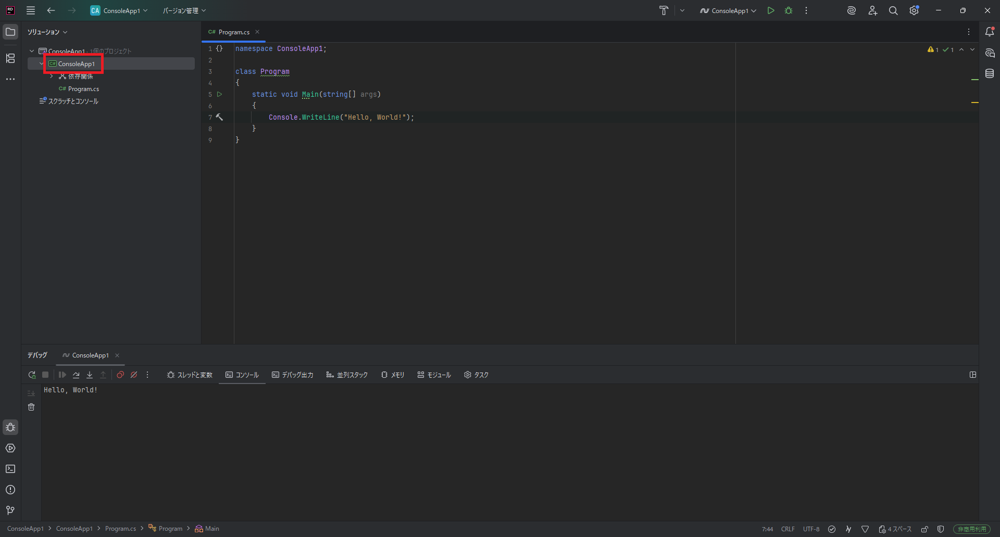
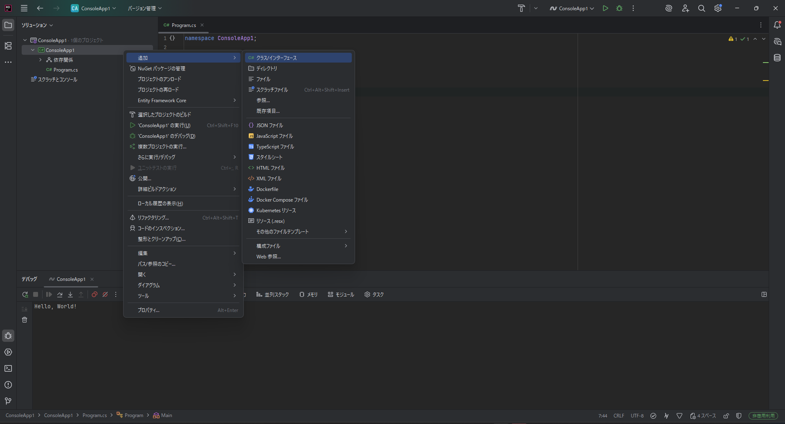
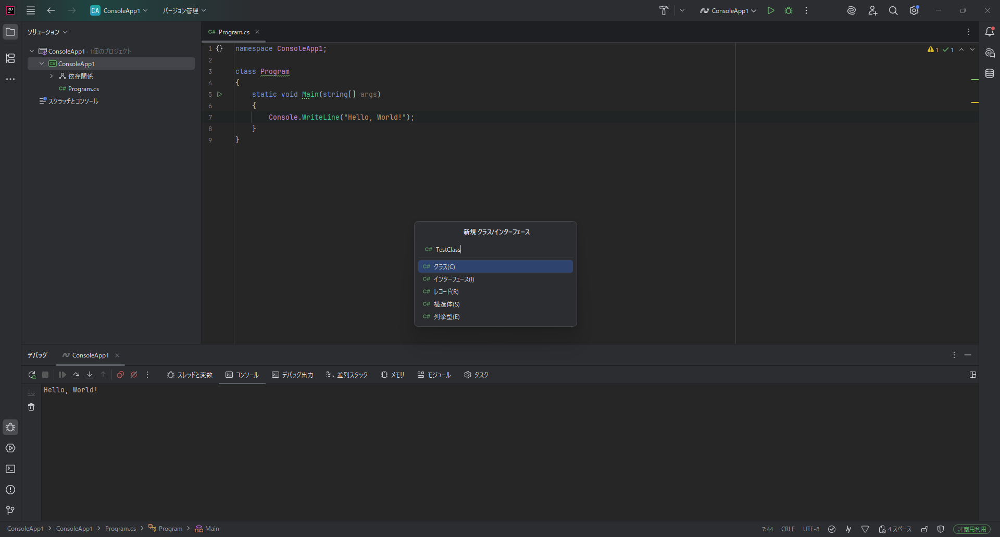

# Unity5:オブジェクト指向とクラスを理解する

## オブジェクト指向

最近のプログラミング言語はオブジェクト指向という考え方の元言語が作られています。
そのため、きちんとプログラミング言語を学ぶためにはオブジェクト指向の概念を理解しておく必要があります。

### オブジェクト指向とは

ではオブジェクト指向とはどのようなものなのかについて説明します。
オブジェクト指向とはその名の通りものの中心のプログラミング言語です。

物の中に変数やメソッドなどの要素があるという考え方です。

イメージをしやすくするため車という例で考えてみます。
車には以下のような機能があると考えられます。

- アクセルをかける
- ハンドルを右に向ける
- ハンドルを左に向ける 
- ブレーキをかける
- ウィンカーを出す

などなど

そして車は以下のような要素を持っていると考えられます。

- ガソリンの残量
- 乗っている人
- 燃費
- 走行可能距離
- 速度

などなど

これらの機能はメソッド、要素は変数と考えることができ、車はこれらの要素をまとめた塊であると考えることができます。

図に表すとこのようになります。


黄色の四角がメソッドであり、緑色の四角が変数です。
このように車という要素の中にメソッドや変数を持っていることで車を一つの要素として見ることができ、管理することが簡単になります。

## クラスとは

オブジェクト指向についてある程度理解することができたと思います。
C#ではこのオブジェクトを表現する手段として **class(クラス)** という要素を取り入れています。
C#ではすべての変数とメソッドはclassに属す必要があります。
また、classは型と考えることができるようになっています。

では実際に今まで書いていたコードからclassの要素を探してみましょう。

以下のコードはカリキュラム1のコードです。


```cs
namespace ConsoleApp1;
class Program //Programというまとまりを作る
{
    static void Main(string[] args) //Mainというメソッド作成する。
    {
        Console.WriteLine("Hello, World");//Hello, Worldと表示する。
    }
}
```

3行目の
```cs
class Program
```

という部分がありますが、この部分は今までProgramというまとまりを作ると説明していましたが、
実査にはProgramというclassを作るということになっていました。
Programというclassの中にMainというメソッドがあるということになります。

ではカリキュラム4のコードも見てみましょう
```cs
namespace ConsoleApp1;//ConsoleApp1という名前は異なるかもしれませんが問題ないです。
class Program
{
    static int num1;
    static int num2;
    static void Main(string[] args) //Mainという関数作成する。
    {
        num1 = 10;
        num2 = 15;
        Print();

    }
    static void Print()//Printという引数がvoidで戻り値がvoidの型を宣言します。
    {
        string output = "num1 + num2 = "+(num1+num2);
        Console.WriteLine(output);
    }

}
```
こちらのコードでは
Programというclass内にMainとPrintというメソッドとnum1とnum2という変数がProgramというclass内に存在しているということになります。

### Classを作ってみよう

C#では1つのファイルに複数のclassを書くことが可能ですが、
少しわかりづらくなってしまうためファイルをわけることにします。


まずVisual Studioのソリューションの欄の上から2番目のプロジェクト名を右クリックします。
(この画像はConsoleApp1ですが違っても大丈夫です)



以下の画像のようにポップアップが表示されるので
`追加>クラス/インターフェース`をクリックしてください



クリックすると以下のような画面が表示されるので


クラスを選択し
`名前`の所に`TestClass`と入力し、Enterを押してください。



するとこのように`TestClass`が追加されます。


元のファイルを移動したい場合は左のソリューションの欄から移動したいファイル名をダブルクリックすることで移動することができます。


では作成したclassを確認してきましょう
```cs
namespace ConsoleApp1;

public class TestClass
{
    public TestClass()
    {
    }
}

```

2行目の`namespace ConsoleApp1{}` 今でしていたプログラムにあった
`namespace ConsoleApp1;`と同様の意味になります。


ではこのコードを以下のコードに書き換えてください

```cs
namespace ConsoleApp1;

public class TestClass
{
    public TestClass()
    {
    }
    public static int num1;
    public static int num2;

    public static int Add()
    {
        return num1 + num2;
    }
    public static int Sub()
    {
        return num1 - num2;
    }

}

```

そして
Program.csファイルも以下のように書き換えてください。
```cs
namespace ConsoleApp1;
class Program
{
    static void Main(string[] args) //Mainという関数作成する。
    {
        TestClass.num1 = 10;//TestClass.num1に10を代入する
        TestClass.num2 = 15;//TestClass.num2に15を代入する
        int num;
        num = TestClass.Add();//TestClass.Add()を実行し結果をnumに代入する
        Console.WriteLine(num);
        num = TestClass.Sub();//TestClass.Sub()を実行し結果をnumに代入する
        Console.WriteLine(num);
    }
}
```

こちらのコードを実行すると以下のような結果が出力されると思います。

```
25
-5

```

このように`TestClass`に値を格納しその値から結果を得るということができました。
変数とメソッドを一つにまとめることにより引数なしでわかりやすく結果を得ることができるようになりました。
これがメンバ変数の利点であり、classを使うメリットでもあります
しかし、これでは複数のTestClassを扱うことができません。
その理由についてstaticの章で話します。

### static

今までメソッドやメンバ変数を宣言するときにおまじないのように`static`を書いてきましたが、実はこれには大きな意味があります。
staticは日本語で表すと静的という意味になります。
実際はそのままの意味でそのメソッドや変数などは動的なものではありません。
静的と動的の話はカリキュラム2で動的型付け静的型付けの話が出たと思いますが、その時の動的と静的の意味はほとんど変わりません。
動的は実行時にすることで静的は実行前にすることと認識してもらって大丈夫です。
ではこのstaticとはどういう意味なのかというと静的つまり、後で増やしたりできないという意味ととらえることができます。

実はclassは型としての機能がありclassをもとに変数を作ることができます。
その変数を作る必要がないものに`static`という文字をつけているわけです。

ではclassをもとにした変数を作る方法について説明していきます。

今までプリミティブ型の変数は

```cs
int a;
```

のように

```
型名 変数名;
```

で宣言していました。

その点は変わりません
classも同じように作成することができます。

```
class名 変数名;
```

このように作成できるので先ほどの `TestClass` で変数を作る場合

```cs
TestClass testClass;

```

このように変数を宣言することができます。

しかし、このままでは何も入っていないので中のメンバ変数やメソッドも存在していないのでないも使うことができません。
そのため代入する必要があります。
ただ、プリミティブ型は値を入れるだけでよかったのに対してclassで作った変数の値はnewという処理をして新しく作る必要があります。
そのため以下のようなルールになります。

```
変数名 = new class名();
```

testClassの例で示すと以下のようになります

```cs
testClass = new TestClass();
```

この動作は変数に代入する際に`new`をして新しい値を作っている動作になるが、ここで作られた値のことを**インスタンス**と呼ぶ。
つまり`new`はインスタンスを作成しているといえる。

また、実は今まで多く扱ってきたプリミティブ型も同様の方法が可能です

```cs
int a = new int();
```

そのため上記のように書くことも可能です。


では先ほどのコードを書き換えていきましょう

まず`TestClass.cs`は以下のように書き換えてください。

```cs
namespace ConsoleApp1;

public class TestClass
{
    public TestClass()
    {
    }
    public int num1;
    public int num2;

    public int Add()
    {
        return num1 + num2;
    }
    public int Sub()
    {
        return num1 - num2;
    }

}

```

そして
`Program.cs` ファイルも以下のように書き換えてください。
```cs
namespace ConsoleApp1;
class Program
{
    static void Main(string[] args) //Mainという関数作成する。
    {
        TestClass testClass1 = new TestClass();
        TestClass testClass2 = new TestClass();
        testClass1.num1 = 10;//testClass1という変数のnum1というメンバ変数に10を代入する
        testClass1.num2 = 15;//TestClass1という変数のnum2というメンバ変数に15を代入する
        testClass2.num1 = 100;//testClass1という変数のnum1というメンバ変数に10を代入する
        testClass2.num2 = 20;//TestClass1という変数のnum2というメンバ変数に15を代入する
        int num;
        num = testClass1.Add();//testClass1という変数のAdd()を実行し結果をnumに代入する
        Console.WriteLine(num);
        num = testClass1.Sub();//testClass1という変数のSub()を実行し結果をnumに代入する
        Console.WriteLine(num);
        num = testClass2.Add();//testClass2という変数のAdd()を実行し結果をnumに代入する
        Console.WriteLine(num);
        num = testClass2.Sub();//testClass2という変数のSub()を実行し結果をnumに代入する
        Console.WriteLine(num);
    }
}
```


実行結果
```
25
-5
120
80

```
このようにclassから変数を作成し、それぞれ別の値を代入した場合に同じ命令を実行しているのに違う結果を得ることができます。

これを配列と組み合わせることで特に強力にな機能となる。

### コンストラクタ

 `TestClass.cs` 内にある

```cs
public TestClass()
{
}
```

の部分について説明していく。

これはコンストラクタというメソッドである。
メソッドなのでほかのメソッドと同様に()の中に引数を入れることができるが、
戻り値を指定することはできない。
なぜならコンストラクタは`new`する際に呼び出されるメソッドで、
classからインスタンスを作成する際に値の初期化を行うことができる。
そのため戻り値はそのクラスから作成されたインスタンスになり、指定することができなくなっている。

ではコンストラクタの書き方について説明する
以下のようにコンストラクタを宣言することができる。

```
public class名(型名1 変数名1,型名2 変数名2,...)
{

}
```

class名はそのコンストラクタが含まれるclass名である必要がある。そのため`abc`というclassであればコンストラクタのクラス名も`abc`にする必要がある。

では実際に使ってみる

まず`TestClass.cs`は以下のように書き換えてください。

```cs
namespace ConsoleApp1;

public class TestClass
{
    public TestClass(int n1,int n2)
    {
        num1 = n1;
        num2 = n2;
    }
    public int num1;
    public int num2;

    public int Add()
    {
        return num1 + num2;
    }
    public int Sub()
    {
        return num1 - num2;
    }

}

```

そして
`Program.cs` ファイルも以下のように書き換えてください。
```cs
namespace ConsoleApp1;
class Program
{
    static void Main(string[] args) //Mainという関数作成する。
    {
        TestClass testClass1 = new TestClass(10,15);
        TestClass testClass2 = new TestClass(100,20);
        int num;
        num = testClass1.Add();//testClass1という変数のAdd()を実行し結果をnumに代入する
        Console.WriteLine(num);
        num = testClass1.Sub();//testClass1という変数のSub()を実行し結果をnumに代入する
        Console.WriteLine(num);
        num = testClass2.Add();//testClass2という変数のAdd()を実行し結果をnumに代入する
        Console.WriteLine(num);
        num = testClass2.Sub();//testClass2という変数のSub()を実行し結果をnumに代入する
        Console.WriteLine(num);
    }
}
```

結果は同様で、このように書き換えることができる。
newする時に引数を渡すことでコンストラクタに値を渡すことができる。

しかし、これでは、引数がnewする時点ではわかっていない時に対処することができない。
解決するには引数のないコンストラクタを追加してあげればよいので

まず`TestClass.cs`は以下のように書き換えてください。

```cs
namespace ConsoleApp1;

public class TestClass
{
    public TestClass(int n1,int n2)
    {
        num1 = n1;
        num2 = n2;
    }
    public TestClass()
    {
    }
    public int num1;
    public int num2;

    public int Add()
    {
        return num1 + num2;
    }
    public int Sub()
    {
        return num1 - num2;
    }

}

```

そして
`Program.cs` ファイルも以下のように書き換えてください。
```cs
namespace ConsoleApp1;
class Program
{
    static void Main(string[] args) //Mainという関数作成する。
    {
        TestClass testClass1 = new TestClass(10,15);
        TestClass testClass2 = new TestClass();
        testClass2.num1 = 100;//testClass1という変数のnum1というメンバ変数に10を代入する
        testClass2.num2 = 20;//TestClass1という変数のnum2というメンバ変数に15を代入する
        int num;
        num = testClass1.Add();//testClass1という変数のAdd()を実行し結果をnumに代入する
        Console.WriteLine(num);
        num = testClass1.Sub();//testClass1という変数のSub()を実行し結果をnumに代入する
        Console.WriteLine(num);
        num = testClass2.Add();//testClass2という変数のAdd()を実行し結果をnumに代入する
        Console.WriteLine(num);
        num = testClass2.Sub();//testClass2という変数のSub()を実行し結果をnumに代入する
        Console.WriteLine(num);
    }
}
```

このように引数なしでも宣言することが可能になる。

このようなことが可能なのはC#はメソッド名が同じ場合でも引数が異なれば別のメソッドとして扱うことができるので同じ名前のメソッドを複数宣言することも可能である。

## アクセス修飾子

今まで`public`を`class`の前や`static`の前、メソッドの前に書いてきたと思いますが、これにも意味がある。
別のclassからアクセス可能かを示している文字です。

アクセス修飾子には以下の種類があり、それぞれclassに使えるのかメンバ要素(メンバ変数やメソッドなど)に使えるかを示しています

|アクセス修飾子|意味|class|メンバ要素|
|-------------|---|------|--------|
|public|どこからでもアクセス可能|$$\bigcirc$$|$$\bigcirc$$|
|private|同じクラスからのみアクセス可能|$$\times$$|$$\bigcirc$$|
|protected|private+※派生したクラスのみ|$$\times$$|$$\bigcirc$$|
|internal|同じプロジェクト内のみアクセス可能|$$\bigcirc$$|$$\bigcirc$$|
|protected internal|internalかつprotected|$$\times$$|$$\bigcirc$$|
|file|同じファイル内のみアクセス可能|$$\bigcirc$$|$$\times$$|

※派生・・・classの機能を引き継いで別クラスでその機能を活かす仕組み

このようにどこからアクセスできるかを指定することができます。

## 練習問題

先ほどの`TestClass.cs`にvoid Print()というメソッドを追加し、PrintからAddとSubを呼び出しその結果を出力しなさい。また、`Program.cs` のメインメソッド `TestClass`のインスタンスを作成し `Print()` を呼び出しなさい。

また、TestClassのインスタンスのnum1の値を10,num2の値を5としなさい。


<details><summary>解答例</summary>


`TestClass.cs`ファイルは以下の通りになります

```cs
namespace ConsoleApp1;

public class TestClass
{
    public TestClass(int n1,int n2)
    {
        num1 = n1;
        num2 = n2;
    }
    public TestClass()
    {
    }
    public int num1;
    public int num2;

    public int Add()
    {
        return num1 + num2;
    }
    public int Sub()
    {
        return num1 - num2;
    }
    public void Print()
    {
        Console.WriteLine("num1 + num2 = "+Add());
        Console.WriteLine("num1 - num2 = "+Sub());

    }
}

```

`Program.cs` ファイルも以下のように書き換えてください。

```cs
namespace ConsoleApp1;
class Program
{
    static void Main(string[] args) //Mainという関数作成する。
    {
        TestClass testClass = new TestClass(10,5);
        
        testClass.Print();
    }
}
```

</details>
