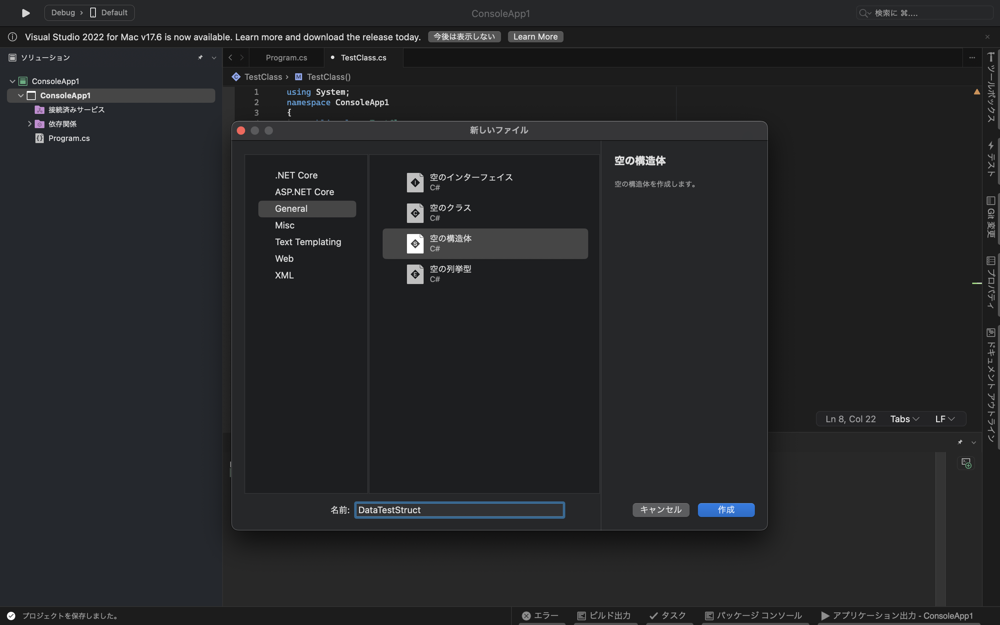
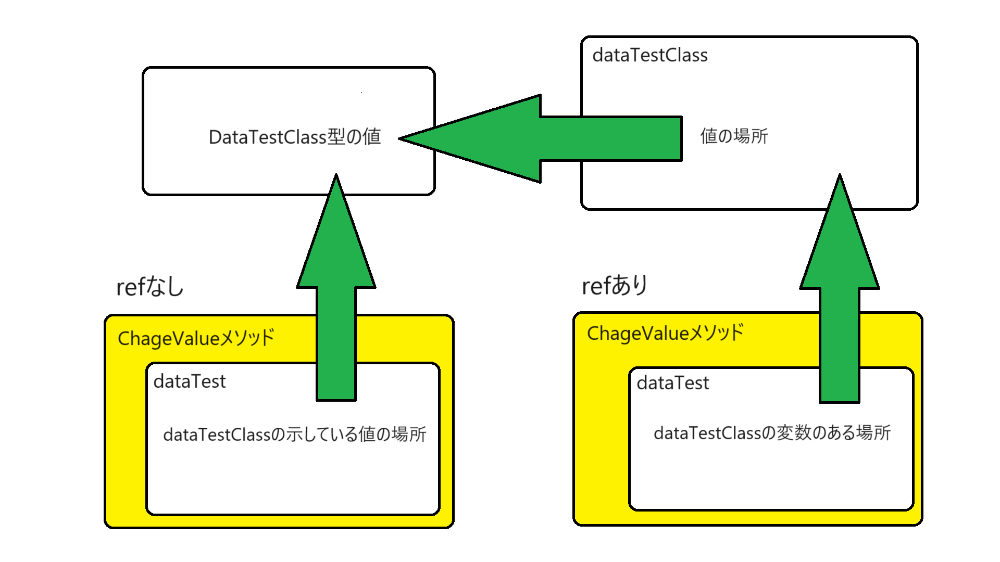

# Unity6:参照型と値型の違い・クラスと構造体の違い

## 値型と参照型

C#には参照型と値型が存在しているその違いについて理解するために以下のプログラムを作成してみる。


DataTestClassというclassを作成する。
DataTestClass.csの中身は以下のように記述する。

```cs
using System;
namespace ConsoleApp1
{
    public class DataTestClass
    {
        public int num;

        public DataTestClass(int n)
        {
            num = n;
        }
    }
}
```

Program.csの中身は以下のようにしてください。
```cs
using System;
namespace ConsoleApp1;
class Program
{
    static void Main(string[] args) //Mainという関数作成する。
    {
        DataTestClass dataTestClass1 = new DataTestClass(10);
        int a1 = 10;
        
        DataTestClass dataTestClass2 = dataTestClass1;
        int a2 = a1;

        a2 = 20;
        dataTestClass2.num = 20;

        Console.WriteLine(a1);
        Console.WriteLine(a2);

        Console.WriteLine(dataTestClass1.num);
        Console.WriteLine(dataTestClass2.num);        
    }
}
```

これを実行すると以下の結果になります。

```
10
20
20
20

```

このように同じような処理をしているのに結果が変わってしまいます。
この理由が参照型にあります。
classなどの参照型の変数がオブジェクトがどこにあるかを記録しておくだけなので、データ本体はコピーされず、オブジェクトがどこにあるかの情報だけコピーすることになります。
感覚的にはHTMLファイルをそのままコピーするのではなくURLをコピーすることになります。
なので `dataTestClass1` の値を `dataTestClass2` にコピーしたつもりでも値をコピーしたのではなく参照をコピーしただけになるので参照先は同じで、同じ値を操作していることになります。
一方intでは値がコピーされるため`a2`を書き換えても`a1`の値は変わりません。

これが参照型と値型の大きな違いです。

なので代入する際は値型なのか参照型なのかしっかりと意識する必要があります。
また、参照型は実質的にコピーを作成することはできないと考えることができ、コピーしたい場合は含まれる値型要素になるまで遡ってコピーする必要があります。

また、メソッドの引数を参照型にしている場合は参照渡し、値型にしている場合は値渡しといいます。

参照型であるメリットとしてはコピーする際に無駄なコピーを作ることがないので容量を圧迫しないというメリットがあります。


## 構造体

クラスのように自分で作成することができる値型はないのかという疑問が発生すると思うが、C#には構造体という機能があり、この機能を使うことでクラスのように自分で宣言する値型を作成することが可能である。

構造体を作成する方法を説明する

初めにclassと同様でソリューションの上から2番目のプロジェクト名を右クリックし


その後
追加>新しいファイル
をクリックします。


すると画面が変わるので「空の構造体」を選択していることを確認してください


`名前:`の欄に構造体の名前を入力します。
今回は`DataTestStruct`という名前にします。



作成ボタンを押すと以下のような画面に切り替わります。


これで構造体を作成することができました。

コードは以下のようになっています。

```cs
using System;
namespace ConsoleApp1
{
    public struct DataTestStruct
    {
    }
}
```

このコードの

```cs
public struct DataTestStruct
{
}
```

の{}内にメンバ要素を書いていく形になります。

では実際に動作の違いについて確認していくために以下のコードを用意してください。

`DataTestClass.cs`は先ほどのコードと同じで以下のように記述してください。

```cs
using System;
namespace ConsoleApp1
{
    public class DataTestClass
    {
        public int num;

        public DataTestClass(int n)
        {
            num = n;
        }
    }
}
```

`DataTestStruct.cs`は以下のように書き換えてください。

```cs
using System;
namespace ConsoleApp1
{
    public struct DataTestStruct
    {
        public DataTestStruct(int n)
        {
            num = n;
        }
        public int num;
    }
}
```

`Program.cs` は以下のように書き換えてください

```cs
using System;
namespace ConsoleApp1;
class Program
{
    static void Main(string[] args) //Mainという関数作成する。
    {
        DataTestClass Class1 = new DataTestClass(10);
        DataTestStruct Struct1 = new DataTestStruct(10);
        
        DataTestClass Class2 = Class1;
        DataTestStruct Struct2 = Struct1;

        Struct2.num = 20;
        Class2.num = 20;

        Console.WriteLine(Class1.num);
        Console.WriteLine(Class2.num);

        Console.WriteLine(Struct1.num);
        Console.WriteLine(Struct2.num);        
    }
}
```

実行結果は以下の通りになると思います。

```
20
20
10
20

```

このように構造体であれば値をコピーして使うことができました。

### 構造体は非推奨

構造体は使う上でデメリットが多くあります。

大きなデメリットとしては代入するたびに新しい値ができてしまうので、メモリを圧迫してしまうという点です。

また、代入するたびに新しいインスタンスができてしまうので変更を加えたつもりが変更されていないといった不具合の原因になることがあります。
そのため使用する際はしっかりと注意する必要があります。

### 構造体を使う場面

構造体を使うときは以下のことを目安として使用するようにしましょう

- 長い期間使用しない
- メンバ要素がすべて構造体である
- コピーを多く作成する必要がある
- 要素の書き換えがない

このような条件を満たした際に構造体を使うとよいでしょう。
あくまで目安なのでこれを遵守する必要はありませんが、参考として考えてください

# out,ref,in

少し話の内容が変わり、メソッドでの参照渡しについて詳しく説明していきたいと思います。

通常参照型を引数とした場合参照先の情報をメソッドに渡しているので、その変数に入るインスタンスを変更しても呼び出し元の変数は変わりません。

実際にコードを作成し、動かして確認してみましょう

DataTestClass.csファイルは以下のように書き換えてください。
```cs
using System;
namespace ConsoleApp1
{
    public class DataTestClass
    {
        public int num;
        public DataTestClass(int n)
        {
            num = n;
        }
    }
}
```


Program.cs

```cs
using System;
namespace ConsoleApp1;
class Program
{
    static void Main(string[] args) //Mainという関数作成する。
    {
        DataTestClass dataTestClass = new DataTestClass(10);      
        Console.WriteLine(dataTestClass.num);
        ChengeValue(dataTestClass.num);
        Console.WriteLine(dataTestClass.num);
    }

    static void ChengeValue(DataTestClass dataTest)
    {
        dataTest = new DataTestClass(20);

    }
}
```

これを実行すると
```
10
10

```

このように変数の中身自体は変わっていないことがわかります。
これは値の参照を引数として渡しているためです。

しかし、通常の場合ではこれでも問題はないですし、意図せず値を変えてしまうことが少ないので危険性も少ないのですが、戻り値のほかに値を2個以上返した場合は不便になってしまいます。

そのために使用されるのが**out**や**ref**というキーワードです。

**out** と **ref** は変数自体の場所を渡すキーワードです。
このキーワードを使用することで、Mainで使用している変数の中身の値を書きかえるということができるようになります。

では先ほどのプログラムの`Program.cs`ファイルを以下のように買い換えます。

```cs
using System;
namespace ConsoleApp1;
class Program
{
    static void Main(string[] args) //Mainという関数作成する。
    {
        DataTestClass dataTestClass = new DataTestClass(10);      
        Console.WriteLine(dataTestClass.num);
        ChengeValue(ref dataTestClass);
        Console.WriteLine(dataTestClass.num);
    }

    static void ChengeValue(ref DataTestClass dataTest)
    {
        dataTest = new DataTestClass(20);
    }
}
```

実行すると以下のような結果になります

```
10
20

```

このようにMain内の変数を書き換えることができました。

**ref** キーワードはメソッドを宣言する際に引数の型名の前に **ref** とつけて使います。
呼び出しの際は 変数名の前にスペースを空け **ref** と書く必要があります。

**out** も同様の使い方で使用できます。

以下にrefと通常の引数の違いを示した図があります。



すぐに理解できなくても大丈夫ですが、refを使うことで呼び出し元の変数の場所を渡します。そのためrefの変数を上書きしたときにはdataTestClassの参照先を書き換えることになります。
対してrefがない場合ハdataTestClassが参照している値の場所だけを取得しているのでdataTestに値を代入してもdataTestの中身が変わるだけになります。
これらの仕様については**C言語のポインタ**という機能を学ぶことで深く理解することができると思います。

現状ではrefやoutを使うことで別のメソッドから書き換えることができるということだけ理解できれば大丈夫です。

refとoutでは仕様に若干の違いがあります。

refは呼び出す前に変数に値を必ず入れなければいけません。
対してoutは呼び出す前に値を入れることは必須ではなく値を入れることもできるという仕様になっています。
また、outはメソッドが終わるまでに値を割り当てる必要がありますが、
一方でrefは値を割り当てることは必須ではありません。

簡単にまとめるとoutは結果を出力する際に使いやすく、refはあくまでも引数として値を渡しつつ、更新も可能なものということになります。

また、inというキーワードがあり、これは引数として値を入れておき受け取ったメソッドではその変数の中身を置き換えることができないようになっており、読み取りに特化した引数を作成したい時はこちらを利用するとよいでしょう。書き方はoutなどと同様になっています。

また、outは呼び出す前に値を割り当てることが必須ではないので以下のような書き方も可能です。

```
関数名(out 型名 変数名);
```

この書き方で書くことでメソッド内で変数を宣言し、その結果を受け取り次の処理につなげるということができます。

## outを使用した基本的なメソッド

文字列から数値などに変換する際にカリキュラム3で使用した`Parse`メソッドを使用すると変換することができます。しかし、この命令だと数値に変換できない文字列が入力された場合にエラーが発生してしまいます。
そこで、`TryParse`メソッドを使用すると変換できるか調べつつ変換することができます。

`TryParse`メソッドは

```
bool型変数 = 変換したい型.TryParse(入力文字列,out 出力先変数);
```

や

```
bool型変数 = 変換したい型.TryParse(入力文字列,out 変換したい型 出力先変数);
```

のように使うことができます。


`TryParse`メソッドを使用した例を以下に示します。
(なおMainメソッド内に書いてあるものとします)

```cs
Console.WriteLine("整数を入力してください。")

string input = Console.ReadLine();

if(int.TryParse(input,out int num))
{
    Console.WriteLine(num+"×"+num+"="+(num*num));
}
else
{
    Console.WriteLine(input+"はintに変換できませんでした");
}
```

`int.Parse`では入力された値の変換した値を戻り値として返していましたが、`int.Parse`では入力された文字列が数値に変換できたかの結果をbool型で返します。また、2つ目の引数を`out`にすることで変換した結果を返すことになっています。

戻り値としてbool型が仕様されている理由としては先ほどの例の通りif文などの中にそのまま入れることができるためだと考えれらます。


## 練習問題

#### 1. 構造体とクラスの違いを説明してください。

<details><summary>解答例</summary>

構造体はコピーするときに変数の中身がコピーされる、対してクラスは参照をコピーする
など

</details>

#### 2. outとrefの違いを説明してください。

<details><summary>解答例</summary>

outは呼び出し時に初期化が不要で、メソッド内で値を絶対に代入しないといけない
refは呼び出し時に初期化が必要で、メソッド内で値を絶対に代入することはできますが、必須ではない

</details>

#### 3. TryParseメソッドを使用し入力された文字列がintに変換できるかを調べ、変換できた場合は入力された数値の2倍の数値を出力し、変換できない場合は「変換できませんでした」と出力するプログラムを作成してください。

<details><summary>解答例</summary>

```cs
using System;
namespace ConsoleApp1;
class Program
{
    static void Main(string[] args) //Mainという関数作成する。
    {
        string s;
        s = Console.WriteLine();
        if(int.TryParse(s,out int num))
        {
            Console.WriteLine(num+"の二倍は"+(num * 2)+"です");
        }
        else
        {
            Console.WriteLine("変換できませんでした");
        }
    }
}
```

</details>
