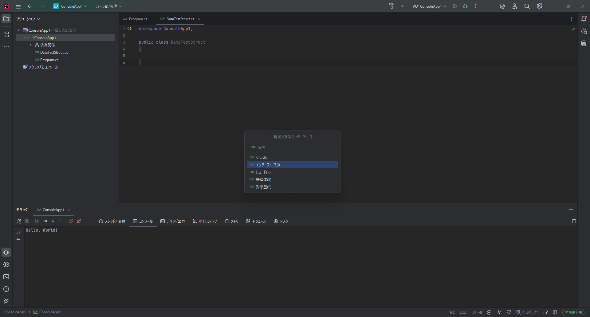
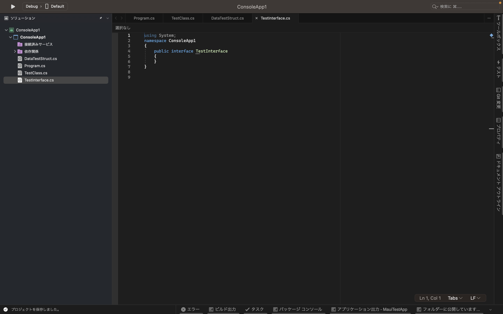

# 抽象クラスとinterface

## 抽象クラス

今までクラスについて学習してきましたが、そのクラス自体のインスタンスを作成させたくない場合があると思います。
例えば、哺乳類というクラスがあり、哺乳類の派生に人間や猫、犬というクラスがあるとします。
哺乳類は以下のような特徴を持っています。

- 背骨がある。
- 恒温動物である。
- 肺で呼吸する。
- 胎生である。

このような特徴を持つクラスから人間や猫、犬などに派生すると考えます。
しかし、哺乳類というのは分類であって動物や物が存在するわけではありません。
そのため、哺乳類という動物や物などに実体があるとおかしなことになってしまいます。
このようなことを防ぐためには、実体(インスタンス)を作成できない派生専用のクラスが必要になります。この派生する専用のクラスのことを **抽象クラス** や **abstractクラス** (アブストラクトクラス)と呼びます。


抽象クラスは派生用のクラスであり、`new` をしてインスタンスを作成することはできませんが、親クラスや基底クラスになることはできます。また、変数として宣言することはできるため、多態性は守られます。

つまり、ジャンルとして哺乳類という変数を作成することができ、その中に人間や犬、猫といったクラスのインスタンス(実体)を保存することができるようになるということです。

### 抽象クラスを作成する

abstractのクラスは以下のように宣言することができます。

```cs
public abstract class クラス名{

} 
```

アクセス修飾子の前に `abstract` という文字をつけることで抽象クラスであることを示しています。

実際に`AbstractClass.cs`というファイルを作成し以下の記述をしてください。

```cs
namespace ConsoleApp1;//「ConsoleApp1」の部分は作成した時点の状態から書き換えないでください。
public abstract class AbstractClass
{
    public int num1;
    public int num2;
    public virtual void Call()
    {
        Console.WriteLine("Called AbstractClass "+(num1+num2));
    }
}
```

また、 `AbstractSub1Class.cs` というファイルを作成し以下を記述してください。

```cs
namespace ConsoleApp1;//「ConsoleApp1」の部分は作成した時点の状態から書き換えないでください。
public class AbstractSub1Class:AbstractClass
{
    public override void Call()
    {
        Console.WriteLine("Called AbstractSub1Class "+(num1+num2));
    }
}
```

また、 `AbstractSub2Class.cs` というファイルを作成し以下を記述してください。

```cs
namespace ConsoleApp1;//「ConsoleApp1」の部分は作成した時点の状態から書き換えないでください。

public class AbstractSub2Class:AbstractClass
{
    public override void Call()
    {
        Console.WriteLine("Called AbstractSub2Class "+(num1+num2));
    }
}
```

`Program.cs` を以下のように書き換えてください。

```cs
namespace ConsoleApp1;//「ConsoleApp1」の部分は作成した時点の状態から書き換えないでください。
class Program
{
    static void Main(string[] args) //Mainという関数作成する。
    {
        //AbstractClass abstractClass = new AbstractClass();//インスタンスが作成できないのでエラーが発生する 
        AbstractClass abstractClass1 = new AbstractSub1Class();
        abstractClass1.num1 = 10;
        abstractClass1.num2 = 15;
        abstractClass1.Call();
        AbstractClass abstractClass2 = new AbstractSub2Class();
        abstractClass2.num1 = 5;
        abstractClass2.num2 = 10;
        abstractClass2.Call();
    }
}
```

このプログラムを実行すると以下のようになります

```
Called AbstractSub1Class 25
Called AbstractSub2Class 15

```

このように多態性を保持していることが理解できる。

7行目のはじめの `//` を削除し実行するとエラーが発生します。このようにインスタンスを作成しようとするとエラーが発生し、インスタンスを作成するができなくなっていることが確認できる。


### 抽象メソッド

抽象メソッドは抽象クラスに作成できるメソッドで抽象クラスでメソッドの内容を指定したくない場合に使うことができます


`AbstractClass.cs` を以下のように書き換えます。

```cs
namespace ConsoleApp1;//「ConsoleApp1」の部分は作成した時点の状態から書き換えないでください。

public abstract class AbstractClass
{
    public int num1;
    public int num2;
    public abstract void Call();
}
```

このように書くことでCallというメソッドがあるということを示すことはできますが、実際に中身はないので派生したクラスでは`void Call()`メソッドを`override`する必要があり、overrideし実装していない場合にエラーが発生します。
このようにメソッドの実装を強制することができます。

また、抽象メソッドの宣言は最後に`;`がいるので忘れないように気を付けてください。

## interface

interfaceは抽象クラスと似た機能を持っていますが、抽象クラスとは異なり、実装を強制するための要素となっています。
interfaceは純粋に多態性を持たせるための要素と考えることもできます。

また、抽象クラスとは異なり、実装を強制することはできますが、メソッドの中を書くなどのことはできなくなっています。
さらにinterfaceはメソッドの実装を強制をしますが変数などを宣言することができません。

### interfaceを作成する

interfaceを作成するにはプロジェクト名の部分を右クリックし
`追加→クラス/インターフェース`をクリックします


クリックすると以下のような画面に切り変わるので「インターフェース」を選択します。



そして名前の部分に`TestInterface`と入力します。

その後作成をクリックすると以下のようなファイルが作成されます。



コードとしては以下のようになっています

```cs
namespace ConsoleApp1;

public interface TestInterface
{

}
```

ほとんどclassと同じようになっていますが、唯一違う部分は`class`と書いてあった部分が`interface`になった点です。
その他の違いはありませんので、クラスとしてファイルを作成したのちコードを書き換えても問題ありません。

### interfaceの使い方

実際にinterfaceをどのように使うか説明します。

まず先ほど作成した`TestInterface`に以下のコードを書いてください。


```cs
namespace ConsoleApp1
{
    public interface TestInterface
    {
        void Hello();
        int Sum(int[] values);
    }
}
```

また、`TestInterface2`というクラスを作成して以下のコードを記述してください。

```cs
namespace ConsoleApp1
{
    public interface TestInterface2
    {
        void Bye();
        double Average(int[] values);
    }
}
```

そして`Sub`というクラスを作成して(ある場合は書き換えて)以下のコードを記述してください。


```cs
namespace ConsoleApp1
{
    public class Sub:TestInterface,TestInterface2
    {
        public void Hello()
        {
            Console.WriteLine("Hello");
        }
        public int Sum(int[] values)
        {

            int sumNum = 0;
            for (int i = 0; i < values.Length; i++)
            {
                sumNum = sumNum + values[i];
            }
            return sumNum;
        }

        public void Bye()
        {
            Console.WriteLine("Bye");
        }


        public double Average(int[] values)
        {

            double sumNum = 0;
            for (int i = 0; i < values.Length; i++)
            {
                sumNum = sumNum + values[i];
            }
            return sumNum / values.Length;
        }
    }
}
```

そして`Program.cs`ファイルも以下のように書き換えてください。

```cs
namespace ConsoleApp1;
class Program
{
    static void Main(string[] args)
    {
        int[] nums = new int[] { 10, 20, 30, 40, 50 };
        Sub sub1 = new Sub();
        sub1.Hello();
        int sum = sub1.Sum(nums);
        Console.WriteLine("合計は" + sum + "です");
        double ave = sub1.Average(nums);
        Console.WriteLine("平均は" + ave + "です");
        sub1.Bye();
        //ここまでは通常通り実行することができる

        //TestInterface型のtest1にsub1代入しており型がSubからTestInterface型として扱われるようになる。
        TestInterface test1 = sub1;

        test1.Hello();
        sum = test1.Sum(nums);
        Console.WriteLine("合計は" + sum + "です");


        test1.Bye();//ここでエラーが出ます。ByeはTestInterfaceから派生した要素ではないのでここからは呼び出せません。


        //TestInterface型のtest1にsub1代入しており型がSubからTestInterface2型として扱われるようになる。
        TestInterface2 test2 = sub1;

        ave = test2.Average(nums);
        test2.Bye();

        test2.Hello();//ここでエラーが出ます。ByeはTestInterfaceから派生した要素ではないのでここからは呼び出せません。
    }
}
```

これらのコードを実行しようとするとエラーが発生すると思います。
これは`sub1`を`test1`や`test2`に代入することで`TestInterface`や`TestInterface2`として扱われるため、それぞれの派生元の要素しか呼び出せないのでエラーが出るようになっている。

`test1.Bye(nums);`と`test2.Hello();`の行をコメント化することでエラーが解消されるはずである。

また、`Sub`クラスの

```cs
public Bye(){
    Console.WriteLine("Bye");
}
```

の部分を削除してみるとエラーが発生すると思う。
これについてはinterfaceから継承しており実装を強制しているためである。

また、interfaceの強みは`Sub`クラスの4行目を見てもらえるとわかる通り、複数継承することができます。

interfaceで強制したい内容を部品のように扱うことができるのでそれぞれ違う内容を実装し複数継承し一つのクラスを作ることが可能になっています。さらにクラスから継承しつつさらにinterfaceを継承することができるので

```
class クラス名:継承元クラス名,継承元interface名1,継承元interface名2
```

のように記述することもできます。ただし、クラスは1つしか継承できず、クラスとinterfaceを混ぜて継承する場合は最初にクラス名を書く必要がある、


## 練習問題

#### 1. 抽象クラスとinterfaceの違いを説明してください。

<details><summary>解答例</summary>

抽象クラスはインスタンスを作成できない派生するためのクラス
interfaceはメソッドの実装を強制し多態性を保持するためのクラス

</details>

#### 2. interfaceを使って簡単なプログラムを作成してください。

<details><summary>解答例</summary>

担当のメンターに確認してもらってください。

<br>
<br>
<br>

以下に例回答を示します。

IInfoというinterfaceを作成しIInfoのInfoOutというメソッドをinterfaceで実装させ、InfoOutを呼び出すとクラスの情報を返すように作成しました。

Program.cs,IInfo.cs,User.cs,Group.csの四つのファイルを作成しました。
IInfoはInfoOutの実装を強制するinterfaceです。
UserはIInfoから派生したクラスです。
GroupはIInfoから派生したクラスです。
ProgramはMainがありUserやGroupを使用するクラスです。

Program.csは以下のようなコードになっています。
```cs
namespace ConsoleApp1
{
    internal class Program
    {
        static void Main(string[] args)
        {
            User user1 = new User("user1", 13);
            User user2 = new User("user2", 14);
            User user3 = new User("user3", 15);
            User user4 = new User("user4", 16);
            List<User> users = new List<User>();
            users.Add(user1);
            users.Add(user3);
            Group group = new Group("group1",users);

            List<IInfo> infos = new List<IInfo>();
            infos.Add(user1);
            infos.Add(user2);
            infos.Add(user3);
            infos.Add(user4);
            infos.Add(group);

            for(int i = 0; i < infos.Count; i++)
            {
                Console.WriteLine(infos[i].InfoOut());
            }
        }
    }
}
```

IInfo.csは以下のようなコードになっています。
```cs
namespace ConsoleApp1
{
    internal interface IInfo
    {
        string InfoOut();
    }
}
```

User.csは以下のようなコードになっています。
```cs
namespace ConsoleApp
{
    public class User:IInfo
    {
        public User(string name, int age)
        {
            Name = name;
            Age = age;
        }
        string Name;
        int Age;
        public string InfoOut()
        {
            return "Name:" + Name + " Age:" + Age;
        }
    }
}
```

Group.csは以下のようなコードになっています。
```cs
namespace ConsoleApp1
{
    internal class Group:IInfo
    {
        public Group(string groupName, List<User> users)
        {
            Name = groupName;
            Users = users;
        }
        string Name;
        public List<User> Users = new List<User>();
        public string InfoOut()
        {
            return "GroupName:" + Name + "UserCount:" + Users.Count;
        }
    }
}
```

</details>

#### 3. interfaceの使える場面を考えてください

<details><summary>解答例</summary>

AとBという要素がありそれぞれの要素を持った型とA,Bのみの要素を持った型を存在させたい場合

あるメソッドの実装を強制したいとき

など

</details>