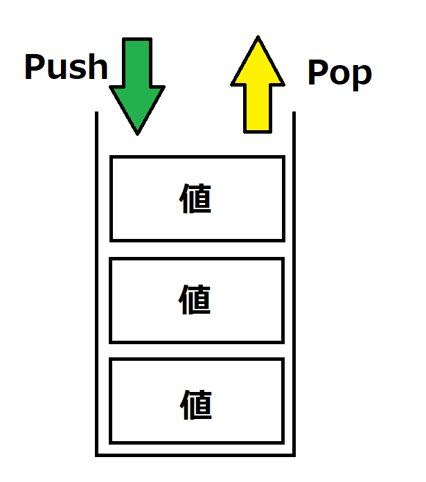

# Unity9:ジェネリックやList・Queue・Stackについて理解する


## ジェネリックとは
今までメソッドの引数などの型や戻り値の型、変数の型は固定ででしたが、ジェネリックという機能を使えば宣言時や呼び出し時に型を指定し任意の型で呼び出しができるようになります。
型を後から変えて使いまわしができる機能になっています。

また、ジェネリックを簡単に説明すると型の変数のような機能になっています。ジェネリックで型を変数のように扱うことができその結果として引数などを変更できる機能です。

### ジェネリックの使い方

ジェネリックはメソッドのジェネリックとクラスのジェネリックがあるのでそれぞれ説明していきます。
基本的な使い方は変わりません。

#### メソッドのジェネリック

メソッドのジェネリックの構文は通常のメソッドの宣言のメソッド名の後ろに`<任意の文字>`を追加することでできます。

実際にルールを記述すると以下のようになります。

```
アクセス修飾子 戻り値の型 メソッド名<T>(型名 変数名,型名)
{

}
```

Tの部分は任意の文字でよくこの文字が型の変数のような働きをします。

実際に`GenericClass`というクラスを作成し以下のコードを記述してください。

```cs
using System;
namespace ConsoleApp1
{
    public class GenericClass
    {
        public T Method<T>(T inputvalue)
        {
            return inputvalue;
        }
    }
}
```

また、`Program.cs`に以下のコードを記述してください。
```cs
using System;
namespace ConsoleApp1;
class Program
{
    static void Main(string[] args) //Mainという関数作成する。
    {
        GenericClass genericClass = new GenericClass();
        int a = 10;
        int b = genericClass.Method<int>(a);
        Console.WriteLine(b);
        double c = 1.5;
        double d = genericClass.Method<double>(c);
        Console.WriteLine(d);
        string s = "Hello";
        string s1 = genericClass.Method<string>(s);
        Console.WriteLine(s1);
    }
}
```

出力は
```
1
1.5
Hello

```
となっています。


このことから`GenericClass`クラスの`Method`は入力をそのまま出力するメソッドとなっていますが、それぞれ異なる型で呼び出すことができるようになっていると言えます。


`<>`の中で指定された文字列は通常の型に近い扱いができるので
例えば`<T>`だった時に以下のように使うことができます。

```cs
T value;//ジェネリックで変数を作成
T a = (T)value;//キャストする
```

また、`<>`の中は複数宣言することができ
複数書く場合`<T1,T2,T3,....>`のように記述できます。


### classのジェネリック

クラスのジェネリックを使うと変数やメソッドに使用する型をインスタンスの作成時に指定できます。

指定方法としてはクラスを宣言する際に
```
アクセス修飾子 class クラス名<任意の文字>
```
と記述することで可能です。


```cs
using System;
namespace ConsoleApp1
{
    public class GenericClass<T>
    {
        public T Method(T invalue)
        {
            return invalue;
        }

        public T Value;
        public T GetValue()
        {
            return Value;
        }
    }
}
```

`Program.cs`ファイルを以下のように書き換えます。

```cs
using System;
namespace ConsoleApp1;
class Program
{
    static void Main(string[] args) //Mainという関数作成する。
    {
        GenericClass<int> genericClass = new GenericClass<int>();
        genericClass.Value = 5;
        int a = 10;
        int b = genericClass.Method(a);
        Console.WriteLine(b);
        int c = genericClass.GetValue();
        Console.WriteLine(c);


        GenericClass<double> genericClass1 = new GenericClass<double>();
        genericClass1.Value = 1.5;
        double ad = 0.5;
        double bd = genericClass1.Method(ad);
        Console.WriteLine(bd);
        double dd = genericClass1.GetValue();
        Console.WriteLine(dd);

        string s1 = "Hello";
        GenericClass<string> genericClass2 = new GenericClass<string>();
        genericClass2.Value = "Bye";
        string s2 = genericClass2.Method(s1);
        Console.WriteLine(s2);
        string s3 = genericClass2.GetValue();
        Console.WriteLine(s3);
    }
}
```

実行すると以下のように出力されます。
```
10
5
0.5
1.5
Bye
Hello
```

コードからクラス単位で型を指定できていることがわかります。

### where制約

ジェネリックとしてはとても便利な機能ですがこのままではあまり実用的な使い方ができません。
その理由としては通常のジェネリックではなんの型でも対応できるようになっており多くの機能が使えないという点です。
そのためジェネリックに入れることができる型を制限する機能があります。
決められた実装をしたものしかジェネリックで指定できないという風に制限を設けることができます。


where制約はメソッドの場合は以下のような構文で書くことが可能です。

```
アクセス修飾子 戻り値の型 メソッド名<T>(型名 変数名,型名):where制約
{

}
```

where制約はクラスの場合は以下のような構文で書くことが可能です。

```
アクセス修飾子 class クラス名<T>:where制約
{

}
```

whereの条件は複数種類があり書き方などを以下の表に示します。
また、ジェネリックは`<T>`と指定されているとします。

|書き方|説明|
|-----|----|
|where T : struct|構造体である|
|where T : class|クラスである|
|where T : 継承したクラス|指定したクラスの派生である|
|where T : 継承したinterface|指定したinterfaceを派生している|
|where T : new()|指定した形のコンストラクタを持つ|

where制約は複数宣言することができます。その場合は

```
where T:struct,class,Object
```

のように記述できます。


## List

ジェネリックを使った要素として一番よく使う要素はListというクラスです。
このクラスは要素を追加削除できる配列とです。Listを使うことで要素を後から書き換えたり追加削除することができます。

### Listの使い方

#### 宣言

Listの変数宣言は以下のようになります

```
List<型名> 変数名 = new List<型名>();
```

型名はListで扱いたい型を指定します。
例えばintであれば
```cs
List<int> nums = new List<int>();
```
のように記述できます。

#### 要素の追加(Add)

要素一番最後に追加する場合は

```
リストの変数名.Add(値);
```

のように記述できます。

なので先ほどのnumsというListに値を追加する場合は

```cs
nums.Add(10);
```

のようになります。


#### 任意の場所への要素追加

任意の場所に値を追加する場合は以下のように記述できます。
```
リストの変数名.Insert(添え字,値);
```

numsで実際に使用した例は以下のようになります。

```cs
nums.Insert(0,15);
```

#### 要素の取得

指定した場所の要素を取得するには
```
変数名 = リストの変数名[添え字];
```
のように記述できる
添え字は要素の番号であり0から始まっています。添え字は変数も使用することが可能です。
また、戻り値の変数の型はリストを宣言する際に指定した型になっています。

numsをつかった例は以下のようになる。
```cs
int num1 = nums[0]
```

#### 添え字から要素の削除

指定した添え字の値を削除するには以下のように記述できます。
```
リストの変数名.RemoveAt(添え字);
```

添え字については0から始まります。

numsを使用した例では以下のようになります。

```cs
nums.RemoveAt(0);
```

#### 要素数の取得

要素数を取得するには以下のように記述できます。

```
変数名 = リストの変数名.Count;
```

numsを使用した例は以下のようになります。
```cs
int c = nums.Count;
```

#### リストから配列の変換

リストを配列に変換するには以下のように記述できます。

```
配列の変数名 = リスト名.ToArray();
```

numsで使用した例は以下のようになります。

```cs
int[] numsArray = nums.ToArray(); 
```


## Queue

Queue(キュー)はプログラミングにおいてよく使われるデータ構造の一つです。
Queueは要素の入出力が一方通行の要素です。

イメージは以下の画像のような形になります。


要素は入力された順に出力することしかできない要素になっています。
またQueueにデータを入れることを`Enqueue(エンキュー)`といいデータを出すことを`Dequeue(デキュー)`といいます。
なのでQueueはEnqueueした順にしかDequeueすることができないといえます。

また、このようなデータの管理方法を先に入れたデータを先に出すので先入れ先出しといい **FIFO(First In First Out)** とも言います。


### Queueの使い方

#### Queueの宣言

実際にQueueを宣言する方法を以下に示します。
```
Queue<型> 変数名 = new Queue<型>();
```

型の部分で扱いたいクラスやinterfaceを指定します。

実際に記述した例は以下の通りです。
```cs
Queue<int> intqueue = new Queue<int>();
```

#### Enqueue

エンキューする方法は以下の通りです。
```
キューの変数名.Enqueue(値);
```

intqueueで使用した例は以下の通りです
```cs
intqueue.Enqueue(10);
```

#### Dequeue

デキューする方法を以下に示します。
```
変数=キューの変数名.Dequeue();
```

intqueueで使用した方法は以下の通りです。
```cs
int num = intqueue.Dequeue();
```

#### 次の要素の確認

次にデキューする値を参照する
```
変数=キューの変数名.Peek();
```

intqueueで使用した場合は以下の通りです。

```cs
int num2 = intqueue.Peek();
```

Peekを使うと値を取り出さずに次に出力される要素を取得できます。


#### 要素数の取得

キューの現在の要素数を取得する方法は以下の通りです。

```
変数名 = キューの変数名.Count;
```

intqueueで使用した場合は以下の通りです。

```cs
int queueCount = intqueue.Count;
```

## Stack

先ほど説明したQueueは先入れ先出しだったのに対しStack(スタック)は後入れ先出しと言われており、後に入れた要素から先に出てくるようになっています。また、後入れ先出しは **LIFO(Last In First Out)** とも呼ばれます。

stackのイメージは以下画像の通りです。



このように要素と同じサイズの箱がありそこに要素が積み上がって行くようなイメージです。
物を取ろうとしても上からしか取り出すことができず、結果として先に入れたデータから取り出すということになります。

また、Stackにデータを入れることを`Push`といいStackからデータを取り出すことを`Pop`といいます。

Stackのよく使われる場面としては例えば作業の戻る機能などで戻る処理がある場合などに便利な構造です。

### Stackの使い方

#### Stackの宣言

Stack変数の宣言方法は以下の通りです。

```
Stack<型> スタックの変数名 = new Stack<型>();
```

型の部分ではStackで扱いたい型を指定できます。

例えばintを扱うStackのintStackという変数を宣言する場合は以下の通りになります。

```cs
Stack<int> intStack = new Stack<int>();
```

#### Push

StackにPushする方法は以下の通りです。
```
スタックの変数名.Push(値);
```

intStackに10をPushする場合は以下の通りになります。

```cs
intStack.Push(10);
```

#### Pop

StackからPopする方法は以下の通りです。

```
変数名 = スタックの変数名.Pop();
```

intStackからPopする方法は以下の通りになります。

```cs
int num1 = intStack.Pop();
```

#### 次の値を参照

Stackにも次に出力する要素の値を参照する方法があります。
使い方はQueueと同様で以下の通りです。
```
変数名=スタックの変数名.Peek();
```

intStackからPeekする場合は以下の通りになります。
```cs
int peekValue = intStack.Peek();
```

#### 要素数の取得

Stackの要素数を取得する方法は以下の通りです。
```
変数名 = スタックの変数名.Count;
```

intStackから要素数を取得する方法は以下の通りになります。
```cs
int stackCount = intStack.Count;
```

## 練習問題

#### 1. 文字列を入力しその値が「Call」ではない場合はその値をQueueにエンキューしその値が「Call」だった場合にデキューしその値を出力するプログラムを作ってください。また「Call」が入力され、値を出力した時点で要素数が0の場合はプログラムを終了してください。

<details><summary>解答例</summary>

```cs
using System;
namespace ConsoleApp1;
class Program
{
    static void Main(string[] args) //Mainという関数作成する。
    {
        string input;
        Queue<string> dataQueue = new Queue<string>();
        do
        {
            input = Console.ReadLine();
            if(input == "Call")
            {
                Console.WriteLine(dataQueue.Dequeue());
            }
            else
            {
               dataQueue.Enqueue(input); 
            }
        }while(dataQueue.Count > 0);
    }
}
```

</details>

#### 2. Endを入力するまで値をListに入れ続けEndが入力されたらEndはリストに入れず、値をすべて出力するプログラムを作成してください。


<details><summary>解答例1</summary>

```cs
using System;
namespace ConsoleApp1;
class Program
{
    static void Main(string[] args) //Mainという関数作成する。
    {
        string input;
        List<string> dataList = new List<string>();
        while(true)
        {
            input = Console.ReadLine();
            if(input=="End"){
                break;
            }
            dataList.Add(input);
        }
        for(int i = 0;i<dataList.Count;i++)
        {
            Console.WriteLine(dataList[i]);
        }
    }
}
```

</details>

<details><summary>解答例2</summary>

```cs
using System;
namespace ConsoleApp1;
class Program
{
    static void Main(string[] args) //Mainという関数作成する。
    {
        string input;
        List<string> dataList = new List<string>();
        for(;;)
        {
            input = Console.ReadLine();
            if(input=="End"){
                break;
            }
            dataList.Add(input);
        }
        for(int i = 0;i<dataList.Count;i++)
        {
            Console.WriteLine(dataList[i]);
        }
    }
}
```

</details>

#### 3. ジェネリックの型がIListから派生しているかを確認する構文を記述しなさい。
   解答の仕方
   ```
   Where T:Object
   ```

<details><summary>解答例</summary>

```cs
where T:IList
```

</details>